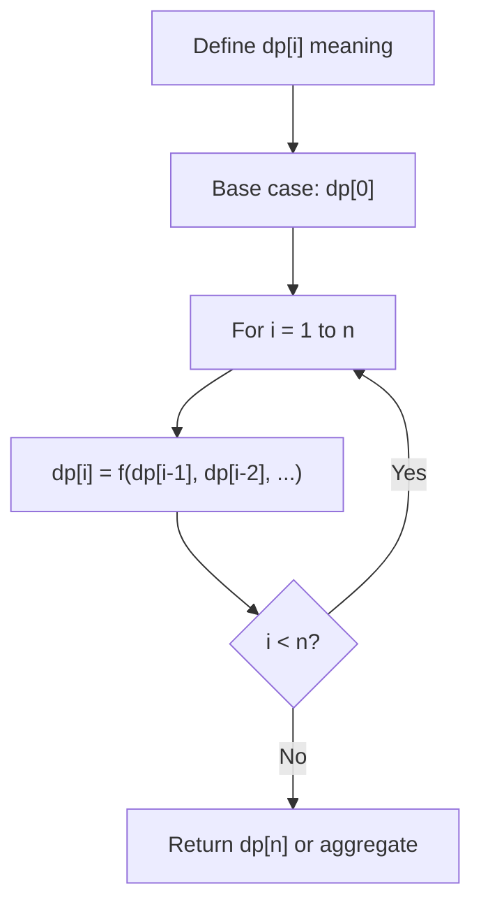
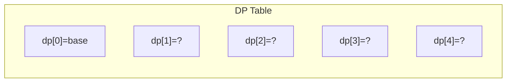
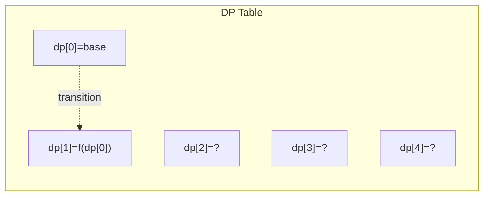
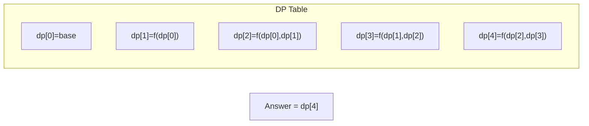

# Problem 879: Profitable Schemes

**Difficulty:** Hard  
**Tags:** Array, Dynamic Programming  
**Pattern:** Dynamic Programming (1D)  
**Link:** [leetcode.com/problems/profitable-schemes](https://leetcode.com/problems/profitable-schemes/)

## Description

There is a group of `n` members, and a list of various crimes they could commit. The `i^th` crime generates a `profit[i]` and requires `group[i]` members to participate in it. If a member participates in one crime, that member can't participate in another crime.

Let's call a **profitable scheme** any subset of these crimes that generates at least `minProfit` profit, and the total number of members participating in that subset of crimes is at most `n`.

Return the number of schemes that can be chosen. Since the answer may be very large, **return it modulo** `10^9 + 7`.

 

Example 1:

```

**Input:** n = 5, minProfit = 3, group = [2,2], profit = [2,3]
**Output:** 2
**Explanation:** To make a profit of at least 3, the group could either commit crimes 0 and 1, or just crime 1.
In total, there are 2 schemes.
```

Example 2:

```

**Input:** n = 10, minProfit = 5, group = [2,3,5], profit = [6,7,8]
**Output:** 7
**Explanation:** To make a profit of at least 5, the group could commit any crimes, as long as they commit one.
There are 7 possible schemes: (0), (1), (2), (0,1), (0,2), (1,2), and (0,1,2).
```

 

**Constraints:**

	- `1 <= n <= 100`
	- `0 <= minProfit <= 100`
	- `1 <= group.length <= 100`
	- `1 <= group[i] <= 100`
	- `profit.length == group.length`
	- `0 <= profit[i] <= 100`

## Approach: Dynamic Programming (1D)

Break the problem into overlapping subproblems. Define dp[i] as the optimal value for the subproblem ending at or considering index i. Build the solution bottom-up, using previously computed dp values.

## Pseudocode

```
1. Define dp[i] = optimal value for subproblem i
2. Base case: dp[0] = initial value
3. For i from 1 to n:
   a. dp[i] = recurrence(dp[i-1], dp[i-2], ...)
4. Return dp[n] or max/min of dp
```

## Algorithm Flow



## Visual State Transitions

**1D Dynamic Programming Table Build:**

**Frame 1: Initialize base cases**


**Frame 2: Fill dp[1] from dp[0]**


**Frame 3: Fill remaining cells**



## Complexity Analysis

- **Time:** O(n)
- **Space:** O(n)

## Solution (Python3)

```python
class Solution:
    def profitableSchemes(self, n: int, minProfit: int, group: List[int], profit: List[int]) -> int:
        # Dynamic programming (1D) - O(n) time, O(n) space
        if not n:
            return 0
        n = len(n) if isinstance(n, list) else n
        dp = [0] * (n + 1)
        dp[0] = 1  # base case
        for i in range(1, n + 1):
            dp[i] = dp[i-1]  # transition (customize per problem)
            if i >= 2:
                dp[i] += dp[i-2]
        return dp[n]
```

## Solution (C++)

```cpp
#include <string>
#include <vector>
using namespace std;

class Solution {
public:
    int profitableSchemes(int n, int minProfit, vector<int>& group, vector<int>& profit) {
        // Dynamic programming (1D) - O(n) time, O(n) space
        int n = n;
        if (n <= 0) return 0;
        vector<int> dp(n + 1, 0);
        dp[0] = 1;
        for (int i = 1; i <= n; i++) {
            dp[i] = dp[i-1];
            if (i >= 2) dp[i] += dp[i-2];
        }
        return dp[n];
    }
};
```
