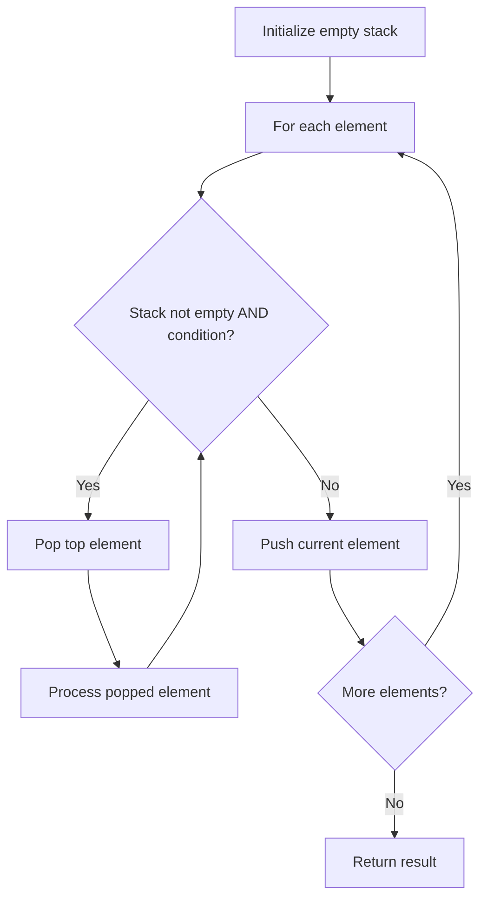

# Problem 880: Decoded String at Index

**Difficulty:** Medium  
**Tags:** String, Stack  
**Pattern:** Stack  
**Link:** [leetcode.com/problems/decoded-string-at-index](https://leetcode.com/problems/decoded-string-at-index/)

## Description

You are given an encoded string `s`. To decode the string to a tape, the encoded string is read one character at a time and the following steps are taken:

	- If the character read is a letter, that letter is written onto the tape.
	- If the character read is a digit `d`, the entire current tape is repeatedly written `d - 1` more times in total.

Given an integer `k`, return *the *`k^th`* letter (**1-indexed)** in the decoded string*.

 

Example 1:

```

**Input:** s = "leet2code3", k = 10
**Output:** "o"
**Explanation:** The decoded string is "leetleetcodeleetleetcodeleetleetcode".
The 10th letter in the string is "o".

```

Example 2:

```

**Input:** s = "ha22", k = 5
**Output:** "h"
**Explanation:** The decoded string is "hahahaha".
The 5th letter is "h".

```

Example 3:

```

**Input:** s = "a2345678999999999999999", k = 1
**Output:** "a"
**Explanation:** The decoded string is "a" repeated 8301530446056247680 times.
The 1st letter is "a".

```

 

**Constraints:**

	- `2 <= s.length <= 100`
	- `s` consists of lowercase English letters and digits `2` through `9`.
	- `s` starts with a letter.
	- `1 <= k <= 10^9`
	- It is guaranteed that `k` is less than or equal to the length of the decoded string.
	- The decoded string is guaranteed to have less than `2^63` letters.

## Approach: Stack

Use a stack (LIFO) to process elements. Push elements when they might be needed later; pop when a matching or resolving condition is found. Common uses: parentheses matching, expression evaluation, next greater element.

## Pseudocode

```
1. Initialize empty stack
2. For each element:
   a. While stack is not empty and condition met:
      - Pop and process top element
   b. Push current element onto stack
3. Process remaining elements in stack if needed
4. Return result
```

## Algorithm Flow



## Complexity Analysis

- **Time:** O(n)
- **Space:** O(n)

## Solution (Python3)

```python
class Solution:
    def decodeAtIndex(self, s: str, k: int) -> str:
        # Stack-based approach - O(n) time
        stack = []
        for ch in s:
            if stack and self._matches(stack[-1], ch):
                stack.pop()
            else:
                stack.append(ch)
        return len(stack) == 0 if isinstance("", bool) else stack

    def _matches(self, a, b):
        pairs = {'(': ')', '[': ']', '{': '}'}
        return pairs.get(a) == b
```

## Solution (C++)

```cpp
#include <stack>
#include <string>
#include <unordered_map>
#include <vector>
using namespace std;

class Solution {
public:
    string decodeAtIndex(string& s, int k) {
        // Stack-based approach - O(n) time
        stack<char> st;
        unordered_map<char, char> pairs = {{'(', ')'}, {'[', ']'}, {'{', '}'}};
        for (char ch : s) {
            if (!st.empty() && pairs.count(st.top()) && pairs[st.top()] == ch) {
                st.pop();
            } else {
                st.push(ch);
            }
        }
        return st.empty();
    }
};
```
