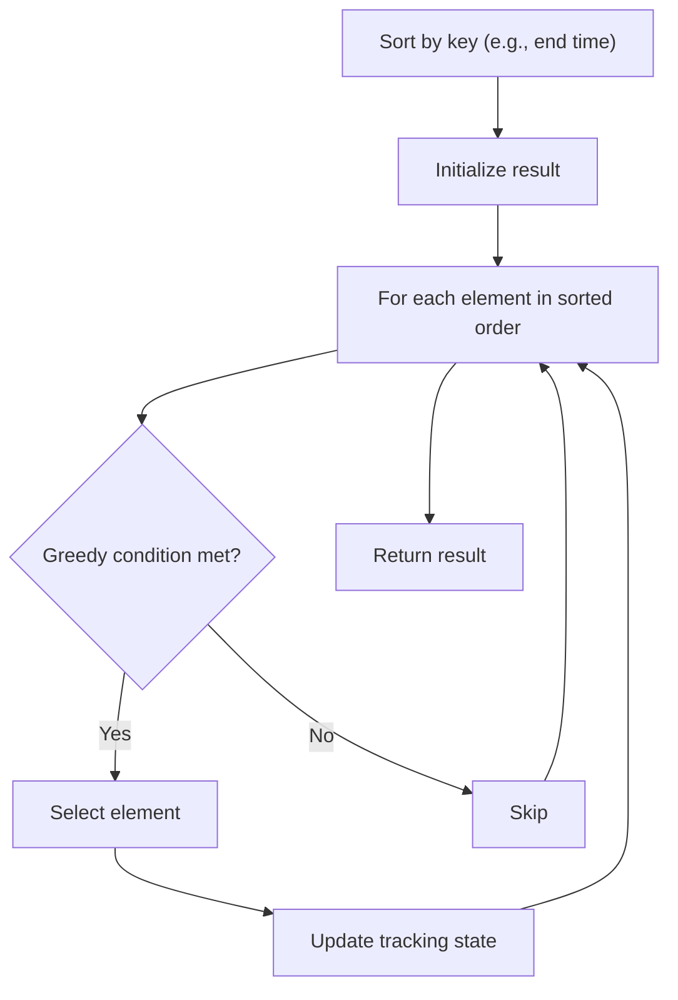

# Problem 881: Boats to Save People

**Difficulty:** Medium  
**Tags:** Array, Two Pointers, Greedy, Sorting  
**Pattern:** Greedy with Sorting  
**Link:** [leetcode.com/problems/boats-to-save-people](https://leetcode.com/problems/boats-to-save-people/)

## Description

You are given an array `people` where `people[i]` is the weight of the `i^th` person, and an **infinite number of boats** where each boat can carry a maximum weight of `limit`. Each boat carries at most two people at the same time, provided the sum of the weight of those people is at most `limit`.

Return *the minimum number of boats to carry every given person*.

 

Example 1:

```

**Input:** people = [1,2], limit = 3
**Output:** 1
**Explanation:** 1 boat (1, 2)

```

Example 2:

```

**Input:** people = [3,2,2,1], limit = 3
**Output:** 3
**Explanation:** 3 boats (1, 2), (2) and (3)

```

Example 3:

```

**Input:** people = [3,5,3,4], limit = 5
**Output:** 4
**Explanation:** 4 boats (3), (3), (4), (5)

```

 

**Constraints:**

	- `1 <= people.length <= 5 * 10^4`
	- `1 <= people[i] <= limit <= 3 * 10^4`

## Approach: Greedy with Sorting

Sort the input by a key criterion, then greedily process elements in sorted order. The sorting ensures the greedy choice is always optimal.

## Pseudocode

```
1. Sort elements by key (start time, weight, etc.)
2. Initialize result, tracking variables
3. For each element in sorted order:
   a. Apply greedy selection rule
   b. Update result
4. Return result
```

## Algorithm Flow



## Complexity Analysis

- **Time:** O(n log n)
- **Space:** O(n)

## Solution (Python3)

```python
class Solution:
    def numRescueBoats(self, people: List[int], limit: int) -> int:
        # Sort + greedy - O(n log n) time
        people.sort()
        result = 0
        curr_end = 0
        for item in people:
            if isinstance(item, (list, tuple)):
                if item[0] >= curr_end:
                    result += 1
                    curr_end = item[1]
            else:
                result += 1
        return result
```

## Solution (C++)

```cpp
#include <algorithm>
#include <string>
#include <vector>
using namespace std;

class Solution {
public:
    int numRescueBoats(vector<int>& people, int limit) {
        // Sort + greedy - O(n log n) time
        sort(people.begin(), people.end());
        int result = 0, curr_end = 0;
        for (auto& item : people) {
            result++;
        }
        return result;
    }
};
```
