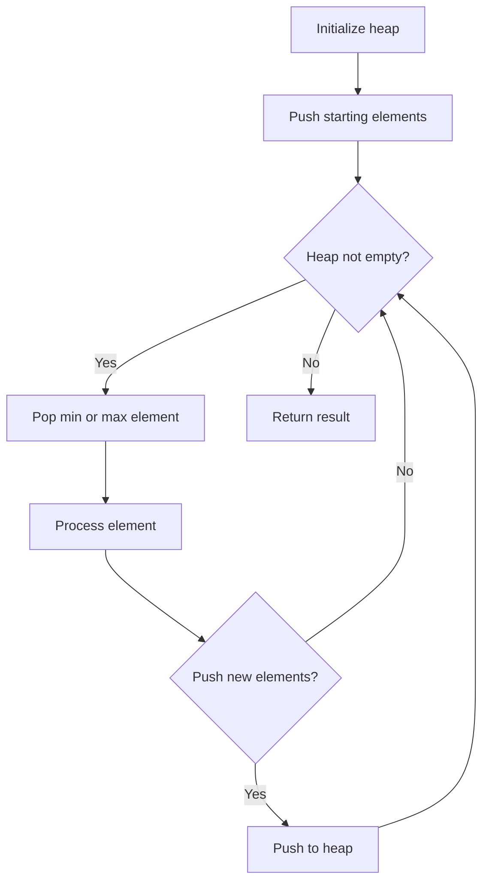
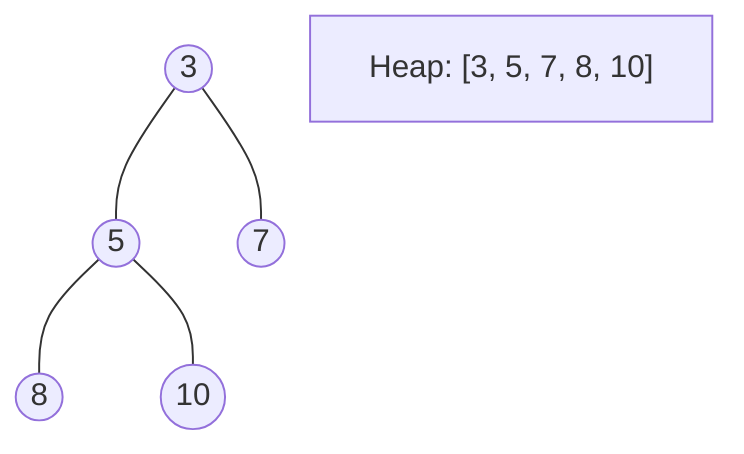
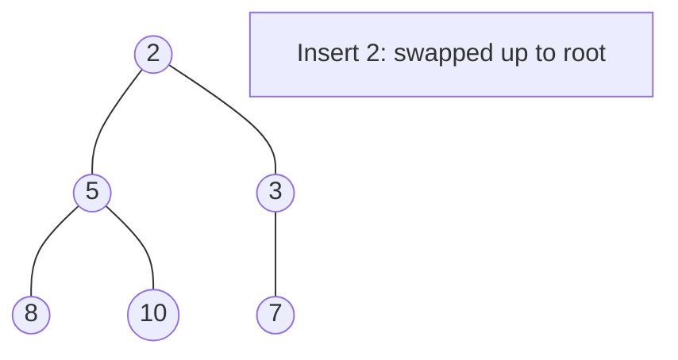
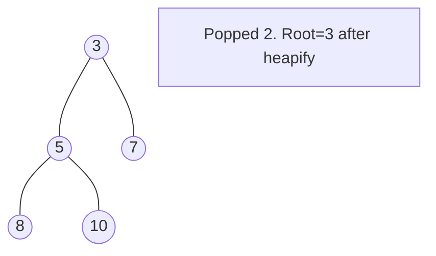

# Problem 882: Reachable Nodes In Subdivided Graph

**Difficulty:** Hard  
**Tags:** Graph Theory, Heap (Priority Queue), Shortest Path  
**Pattern:** Heap / Priority Queue  
**Link:** [leetcode.com/problems/reachable-nodes-in-subdivided-graph](https://leetcode.com/problems/reachable-nodes-in-subdivided-graph/)

## Description

You are given an undirected graph (the **"original graph"**) with `n` nodes labeled from `0` to `n - 1`. You decide to **subdivide** each edge in the graph into a chain of nodes, with the number of new nodes varying between each edge.

The graph is given as a 2D array of `edges` where `edges[i] = [ui, vi, cnti]` indicates that there is an edge between nodes `ui` and `vi` in the original graph, and `cnti` is the total number of new nodes that you will **subdivide** the edge into. Note that `cnti == 0` means you will not subdivide the edge.

To **subdivide** the edge `[ui, vi]`, replace it with `(cnti + 1)` new edges and `cnti` new nodes. The new nodes are `x1`, `x2`, ..., `xcnti`, and the new edges are `[ui, x1]`, `[x1, x2]`, `[x2, x3]`, ..., `[xcnti-1, xcnti]`, `[xcnti, vi]`.

In this **new graph**, you want to know how many nodes are **reachable** from the node `0`, where a node is **reachable** if the distance is `maxMoves` or less.

Given the original graph and `maxMoves`, return *the number of nodes that are **reachable** from node *`0`* in the new graph*.

 

Example 1:

```

**Input:** edges = [[0,1,10],[0,2,1],[1,2,2]], maxMoves = 6, n = 3
**Output:** 13
**Explanation:** The edge subdivisions are shown in the image above.
The nodes that are reachable are highlighted in yellow.

```

Example 2:

```

**Input:** edges = [[0,1,4],[1,2,6],[0,2,8],[1,3,1]], maxMoves = 10, n = 4
**Output:** 23

```

Example 3:

```

**Input:** edges = [[1,2,4],[1,4,5],[1,3,1],[2,3,4],[3,4,5]], maxMoves = 17, n = 5
**Output:** 1
**Explanation:** Node 0 is disconnected from the rest of the graph, so only node 0 is reachable.

```

 

**Constraints:**

	- `0 <= edges.length <= min(n * (n - 1) / 2, 10^4)`
	- `edges[i].length == 3`
	- `0 <= ui < vi < n`
	- There are **no multiple edges** in the graph.
	- `0 <= cnti <= 10^4`
	- `0 <= maxMoves <= 10^9`
	- `1 <= n <= 3000`

## Approach: Heap / Priority Queue

Use a min-heap or max-heap to efficiently access the smallest/largest element. Push elements and pop the top to process in priority order.

## Pseudocode

```
1. Initialize heap (min or max)
2. Push initial elements onto heap
3. While heap not empty and condition:
   a. Pop top element (min or max)
   b. Process element
   c. Push new elements if needed
4. Return result
```

## Algorithm Flow



## Visual State Transitions

**Heap Operations (Min-Heap):**

**Frame 1: Initial heap**


**Frame 2: Insert 2 - bubble up**


**Frame 3: Pop minimum (2) - heapify down**



## Complexity Analysis

- **Time:** O(n log n)
- **Space:** O(n)

## Solution (Python3)

```python
class Solution:
    def reachableNodes(self, edges: List[List[int]], maxMoves: int, n: int) -> int:
        # Heap/Priority Queue - O(n log k) time
        import heapq
        if not edges:
            return 0
        # Min heap (negate for max heap)
        heap = []
        for val in edges:
            heapq.heappush(heap, val)
            if len(heap) > (maxMoves if isinstance(maxMoves, int) else len(edges)):
                heapq.heappop(heap)
        return heap[0] if heap else 0
```

## Solution (C++)

```cpp
#include <queue>
#include <string>
#include <vector>
using namespace std;

class Solution {
public:
    int reachableNodes(vector<vector<int>>& edges, int maxMoves, int n) {
        // Heap/Priority Queue - O(n log k) time
        priority_queue<int, vector<int>, greater<int>> pq;
        for (int val : edges) {
            pq.push(val);
            if ((int)pq.size() > maxMoves)
                pq.pop();
        }
        return pq.empty() ? 0 : pq.top();
    }
};
```
