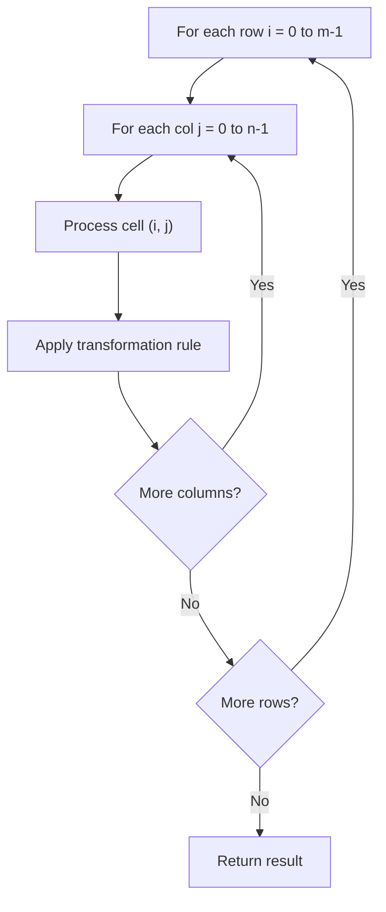

# Problem 883: Projection Area of 3D Shapes

**Difficulty:** Easy  
**Tags:** Array, Math, Geometry, Matrix  
**Pattern:** Matrix / 2D Array  
**Link:** [leetcode.com/problems/projection-area-of-3d-shapes](https://leetcode.com/problems/projection-area-of-3d-shapes/)

## Description

You are given an `n x n` `grid` where we place some `1 x 1 x 1` cubes that are axis-aligned with the `x`, `y`, and `z` axes.

Each value `v = grid[i][j]` represents a tower of `v` cubes placed on top of the cell `(i, j)`.

We view the projection of these cubes onto the `xy`, `yz`, and `zx` planes.

A **projection** is like a shadow, that maps our **3-dimensional** figure to a **2-dimensional** plane. We are viewing the "shadow" when looking at the cubes from the top, the front, and the side.

Return *the total area of all three projections*.

 

Example 1:

```

**Input:** grid = [[1,2],[3,4]]
**Output:** 17
**Explanation:** Here are the three projections ("shadows") of the shape made with each axis-aligned plane.

```

Example 2:

```

**Input:** grid = [[2]]
**Output:** 5

```

Example 3:

```

**Input:** grid = [[1,0],[0,2]]
**Output:** 8

```

 

**Constraints:**

	- `n == grid.length == grid[i].length`
	- `1 <= n <= 50`
	- `0 <= grid[i][j] <= 50`

## Approach: Matrix / 2D Array

Process the matrix row by row or column by column. Common patterns: rotation, spiral traversal, in-place modification, transposition.

## Pseudocode

```
1. For each row i:
   For each column j:
     Process cell (i, j) based on neighbors or rules
2. Handle boundary conditions
3. Return modified matrix or computed result
```

## Algorithm Flow



## Complexity Analysis

- **Time:** O(m * n)
- **Space:** O(1) extra

## Solution (Python3)

```python
class Solution:
    def projectionArea(self, grid: List[List[int]]) -> int:
        # Matrix manipulation - O(m*n) time
        if not grid:
            return 0
        m, n = len(grid), len(grid[0])
        # Process matrix in-place or build result
        for i in range(m):
            for j in range(n):
                pass  # Process grid[i][j]
        return 0
```

## Solution (C++)

```cpp
#include <string>
#include <vector>
using namespace std;

class Solution {
public:
    int projectionArea(vector<vector<int>>& grid) {
        // Matrix manipulation - O(m*n) time
        if (grid.empty()) return 0;
        int m = grid.size(), n = grid[0].size();
        for (int i = 0; i < m; i++) {
            for (int j = 0; j < n; j++) {
                // Process matrix[i][j]
            }
        }
        return 0;
    }
};
```
