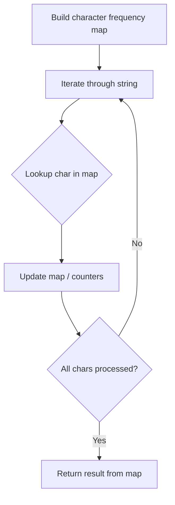

# Problem 884: Uncommon Words from Two Sentences

**Difficulty:** Easy  
**Tags:** Hash Table, String, Counting  
**Pattern:** Hash Map String Processing  
**Link:** [leetcode.com/problems/uncommon-words-from-two-sentences](https://leetcode.com/problems/uncommon-words-from-two-sentences/)

## Description

A **sentence** is a string of single-space separated words where each word consists only of lowercase letters.

A word is **uncommon** if it appears exactly once in one of the sentences, and **does not appear** in the other sentence.

Given two **sentences** `s1` and `s2`, return *a list of all the **uncommon words***. You may return the answer in **any order**.

 

Example 1:

**Input:** s1 = "this apple is sweet", s2 = "this apple is sour"

**Output:** ["sweet","sour"]

**Explanation:**

The word `"sweet"` appears only in `s1`, while the word `"sour"` appears only in `s2`.

Example 2:

**Input:** s1 = "apple apple", s2 = "banana"

**Output:** ["banana"]

 

**Constraints:**

	- `1 <= s1.length, s2.length <= 200`
	- `s1` and `s2` consist of lowercase English letters and spaces.
	- `s1` and `s2` do not have leading or trailing spaces.
	- All the words in `s1` and `s2` are separated by a single space.

## Approach: Hash Map String Processing

Use a hash map to count character frequencies or map characters/strings for O(1) lookups. Process the string in one or two passes.

## Pseudocode

```
1. Build frequency map / char-to-index map
2. Iterate through string:
   a. Look up character in map
   b. Update counts or mappings
3. Return result based on map state
```

## Algorithm Flow



## Complexity Analysis

- **Time:** O(n)
- **Space:** O(n)

## Solution (Python3)

```python
class Solution:
    def uncommonFromSentences(self, s1: str, s2: str) -> List[str]:
        # Hash map for string/character frequency - O(n) time
        freq = {}
        for ch in s1:
            freq[ch] = freq.get(ch, 0) + 1
        # Process frequency map
        for ch, cnt in freq.items():
            if cnt == 1:
                return s1.index(ch)
        return []
```

## Solution (C++)

```cpp
#include <string>
#include <unordered_map>
#include <vector>
using namespace std;

class Solution {
public:
    vector<string> uncommonFromSentences(string& s1, string& s2) {
        // Hash map for string/character frequency - O(n) time
        unordered_map<char, int> freq;
        for (char ch : s1) {
            freq[ch]++;
        }
        // Process frequency map
        for (int i = 0; i < s1.size(); i++) {
            if (freq[s1[i]] == 1) return i;
        }
        return {};
    }
};
```
