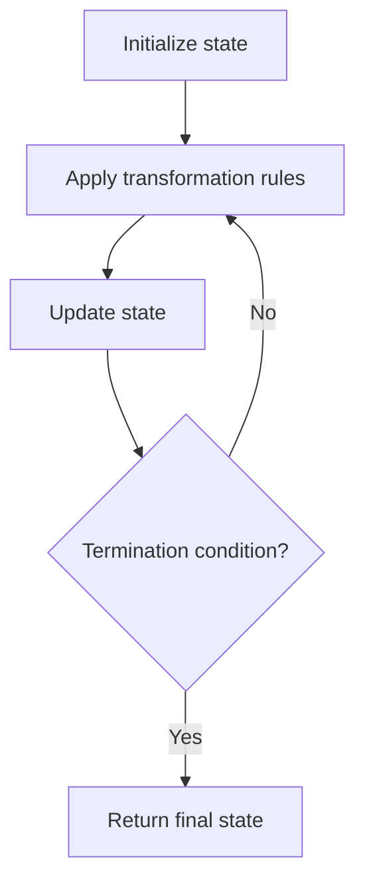

# Problem 885: Spiral Matrix III

**Difficulty:** Medium  
**Tags:** Array, Matrix, Simulation  
**Pattern:** Simulation  
**Link:** [leetcode.com/problems/spiral-matrix-iii](https://leetcode.com/problems/spiral-matrix-iii/)

## Description

You start at the cell `(rStart, cStart)` of an `rows x cols` grid facing east. The northwest corner is at the first row and column in the grid, and the southeast corner is at the last row and column.

You will walk in a clockwise spiral shape to visit every position in this grid. Whenever you move outside the grid's boundary, we continue our walk outside the grid (but may return to the grid boundary later.). Eventually, we reach all `rows * cols` spaces of the grid.

Return *an array of coordinates representing the positions of the grid in the order you visited them*.

 

Example 1:

```

**Input:** rows = 1, cols = 4, rStart = 0, cStart = 0
**Output:** [[0,0],[0,1],[0,2],[0,3]]

```

Example 2:

```

**Input:** rows = 5, cols = 6, rStart = 1, cStart = 4
**Output:** [[1,4],[1,5],[2,5],[2,4],[2,3],[1,3],[0,3],[0,4],[0,5],[3,5],[3,4],[3,3],[3,2],[2,2],[1,2],[0,2],[4,5],[4,4],[4,3],[4,2],[4,1],[3,1],[2,1],[1,1],[0,1],[4,0],[3,0],[2,0],[1,0],[0,0]]

```

 

**Constraints:**

	- `1 <= rows, cols <= 100`
	- `0 <= rStart < rows`
	- `0 <= cStart < cols`

## Approach: Simulation

Simulate the process described in the problem step by step. Follow the rules exactly, tracking state at each step.

## Pseudocode

```
1. Initialize state (grid, pointers, counters)
2. For each step / iteration:
   a. Apply the transformation rules
   b. Update state
   c. Check termination condition
3. Return final state or result
```

## Algorithm Flow



## Complexity Analysis

- **Time:** O(n) or O(n * k)
- **Space:** O(n)

## Solution (Python3)

```python
class Solution:
    def spiralMatrixIII(self, rows: int, cols: int, rStart: int, cStart: int) -> List[List[int]]:
        # Simulation approach - follow the rules step by step
        result = []
        for i in range(len(rows) if isinstance(rows, list) else rows):
            # Simulate each step
            pass
        return result
```

## Solution (C++)

```cpp
#include <string>
#include <vector>
using namespace std;

class Solution {
public:
    vector<vector<int>> spiralMatrixIII(int rows, int cols, int rStart, int cStart) {
        // Simulation approach
        int n = rows.size();
        for (int i = 0; i < n; i++) {
            // Simulate each step
        }
        return {};
    }
};
```
