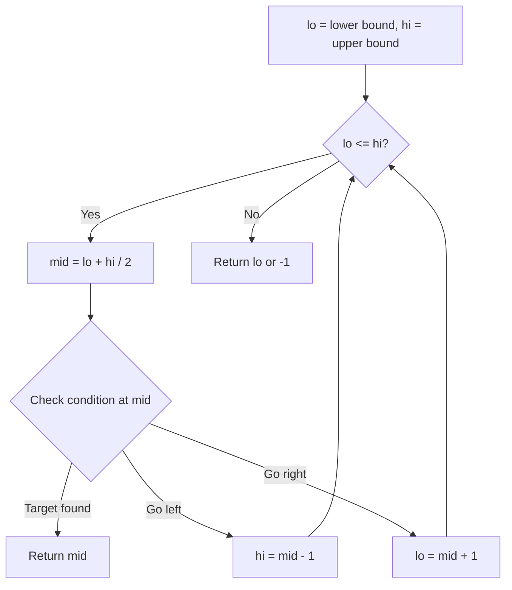
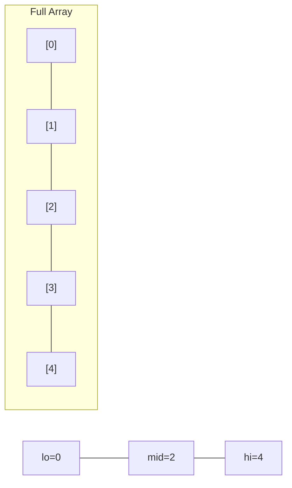
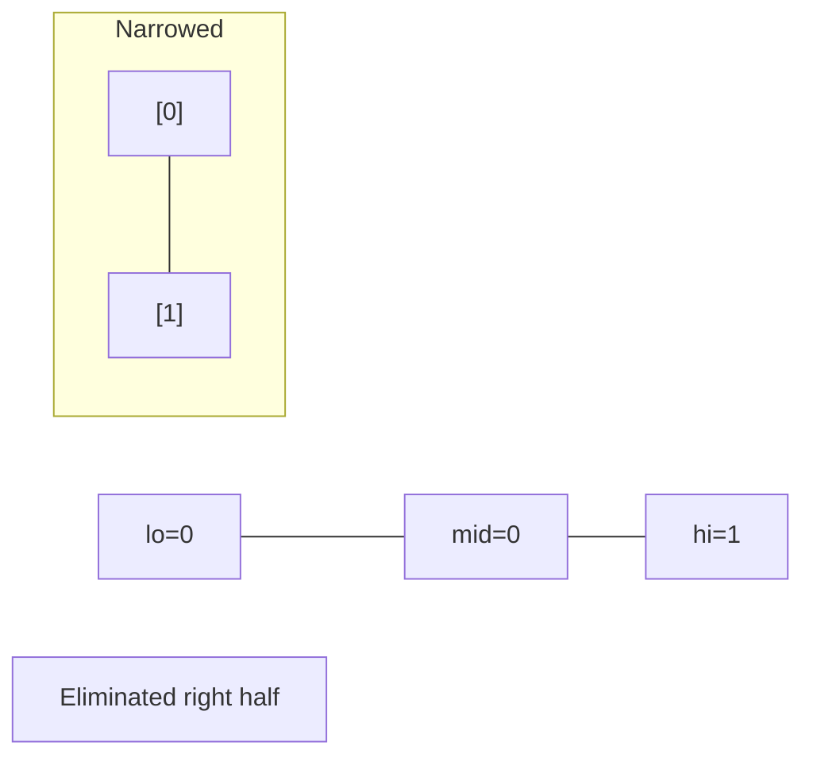
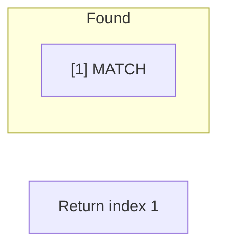

# Problem 887: Super Egg Drop

**Difficulty:** Hard  
**Tags:** Math, Binary Search, Dynamic Programming  
**Pattern:** Binary Search  
**Link:** [leetcode.com/problems/super-egg-drop](https://leetcode.com/problems/super-egg-drop/)

## Description

You are given `k` identical eggs and you have access to a building with `n` floors labeled from `1` to `n`.

You know that there exists a floor `f` where `0 <= f <= n` such that any egg dropped at a floor **higher** than `f` will **break**, and any egg dropped **at or below** floor `f` will **not break**.

Each move, you may take an unbroken egg and drop it from any floor `x` (where `1 <= x <= n`). If the egg breaks, you can no longer use it. However, if the egg does not break, you may **reuse** it in future moves.

Return *the **minimum number of moves** that you need to determine **with certainty** what the value of *`f` is.

 

Example 1:

```

**Input:** k = 1, n = 2
**Output:** 2
**Explanation: **
Drop the egg from floor 1. If it breaks, we know that f = 0.
Otherwise, drop the egg from floor 2. If it breaks, we know that f = 1.
If it does not break, then we know f = 2.
Hence, we need at minimum 2 moves to determine with certainty what the value of f is.

```

Example 2:

```

**Input:** k = 2, n = 6
**Output:** 3

```

Example 3:

```

**Input:** k = 3, n = 14
**Output:** 4

```

 

**Constraints:**

	- `1 <= k <= 100`
	- `1 <= n <= 10^4`

## Approach: Binary Search

Use binary search to halve the search space each iteration. Define the search range [lo, hi], compute mid, and decide which half to keep based on the problem's monotonic condition.

## Pseudocode

```
1. lo = lower_bound, hi = upper_bound
2. While lo <= hi (or lo < hi):
   a. mid = (lo + hi) // 2
   b. If condition(mid) is satisfied: record answer, search left half
   c. Else: search right half
3. Return answer
```

## Algorithm Flow



## Visual State Transitions

**Binary Search Step-by-Step:**

**Frame 1: Initial search space**


**Frame 2: Compare mid, narrow search**


**Frame 3: Found target**



## Complexity Analysis

- **Time:** O(log n)
- **Space:** O(1)

## Solution (Python3)

```python
class Solution:
    def superEggDrop(self, k: int, n: int) -> int:
        # Binary search - O(log n) time, O(1) space
        lo, hi = 0, len(k) - 1
        while lo <= hi:
            mid = lo + (hi - lo) // 2
            if k[mid] == n:
                return mid
            elif k[mid] < n:
                lo = mid + 1
            else:
                hi = mid - 1
        return 0
```

## Solution (C++)

```cpp
#include <string>
#include <vector>
using namespace std;

class Solution {
public:
    int superEggDrop(int k, int n) {
        // Binary search - O(log n) time, O(1) space
        int lo = 0, hi = k.size() - 1;
        while (lo <= hi) {
            int mid = lo + (hi - lo) / 2;
            if (k[mid] == n) {
                return mid;
            } else if (k[mid] < n) {
                lo = mid + 1;
            } else {
                hi = mid - 1;
            }
        }
        return 0;
    }
};
```
