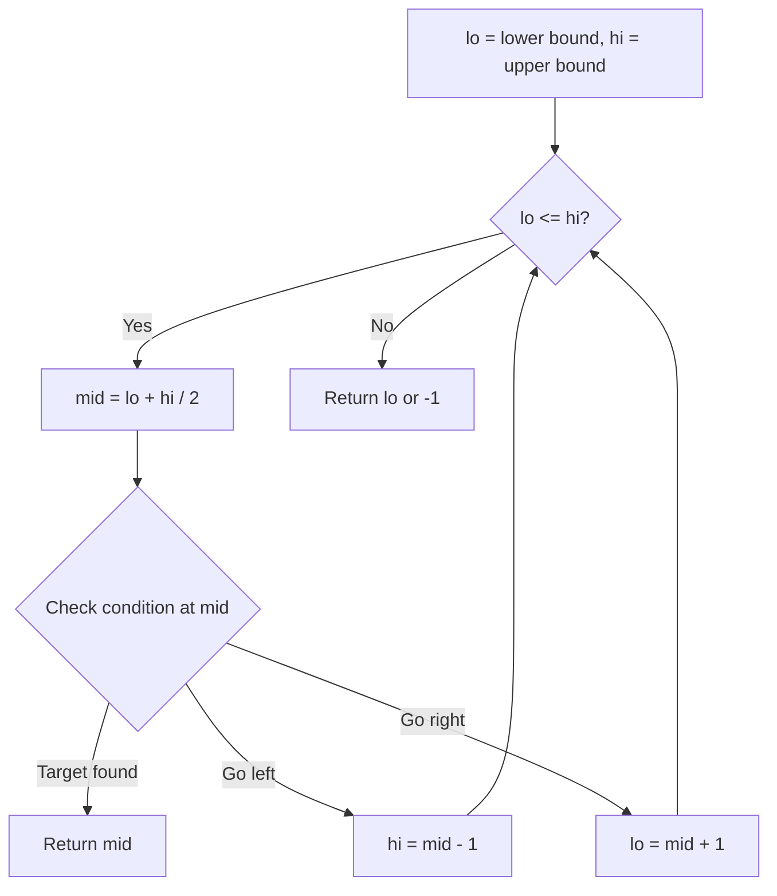
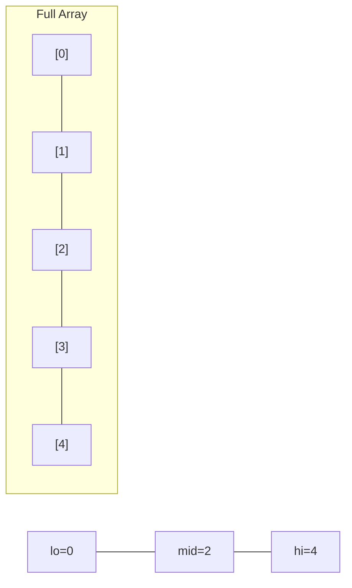
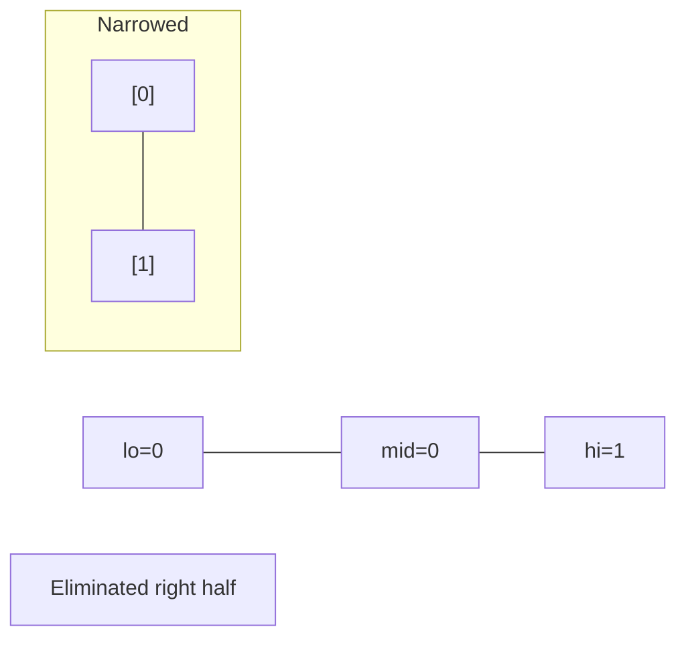
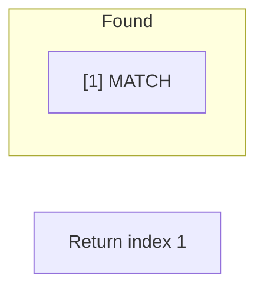

# Problem 888: Fair Candy Swap

**Difficulty:** Easy  
**Tags:** Array, Hash Table, Binary Search, Sorting  
**Pattern:** Binary Search  
**Link:** [leetcode.com/problems/fair-candy-swap](https://leetcode.com/problems/fair-candy-swap/)

## Description

Alice and Bob have a different total number of candies. You are given two integer arrays `aliceSizes` and `bobSizes` where `aliceSizes[i]` is the number of candies of the `i^th` box of candy that Alice has and `bobSizes[j]` is the number of candies of the `j^th` box of candy that Bob has.

Since they are friends, they would like to exchange one candy box each so that after the exchange, they both have the same total amount of candy. The total amount of candy a person has is the sum of the number of candies in each box they have.

Return a*n integer array *`answer`* where *`answer[0]`* is the number of candies in the box that Alice must exchange, and *`answer[1]`* is the number of candies in the box that Bob must exchange*. If there are multiple answers, you may **return any** one of them. It is guaranteed that at least one answer exists.

 

Example 1:

```

**Input:** aliceSizes = [1,1], bobSizes = [2,2]
**Output:** [1,2]

```

Example 2:

```

**Input:** aliceSizes = [1,2], bobSizes = [2,3]
**Output:** [1,2]

```

Example 3:

```

**Input:** aliceSizes = [2], bobSizes = [1,3]
**Output:** [2,3]

```

 

**Constraints:**

	- `1 <= aliceSizes.length, bobSizes.length <= 10^4`
	- `1 <= aliceSizes[i], bobSizes[j] <= 10^5`
	- Alice and Bob have a different total number of candies.
	- There will be at least one valid answer for the given input.

## Approach: Binary Search

Use binary search to halve the search space each iteration. Define the search range [lo, hi], compute mid, and decide which half to keep based on the problem's monotonic condition.

## Pseudocode

```
1. lo = lower_bound, hi = upper_bound
2. While lo <= hi (or lo < hi):
   a. mid = (lo + hi) // 2
   b. If condition(mid) is satisfied: record answer, search left half
   c. Else: search right half
3. Return answer
```

## Algorithm Flow



## Visual State Transitions

**Binary Search Step-by-Step:**

**Frame 1: Initial search space**


**Frame 2: Compare mid, narrow search**


**Frame 3: Found target**



## Complexity Analysis

- **Time:** O(log n)
- **Space:** O(1)

## Solution (Python3)

```python
class Solution:
    def fairCandySwap(self, aliceSizes: List[int], bobSizes: List[int]) -> List[int]:
        # Binary search - O(log n) time, O(1) space
        lo, hi = 0, len(aliceSizes) - 1
        while lo <= hi:
            mid = lo + (hi - lo) // 2
            if aliceSizes[mid] == bobSizes:
                return mid
            elif aliceSizes[mid] < bobSizes:
                lo = mid + 1
            else:
                hi = mid - 1
        return []
```

## Solution (C++)

```cpp
#include <string>
#include <vector>
using namespace std;

class Solution {
public:
    vector<int> fairCandySwap(vector<int>& aliceSizes, vector<int>& bobSizes) {
        // Binary search - O(log n) time, O(1) space
        int lo = 0, hi = aliceSizes.size() - 1;
        while (lo <= hi) {
            int mid = lo + (hi - lo) / 2;
            if (aliceSizes[mid] == bobSizes) {
                return mid;
            } else if (aliceSizes[mid] < bobSizes) {
                lo = mid + 1;
            } else {
                hi = mid - 1;
            }
        }
        return {};
    }
};
```
