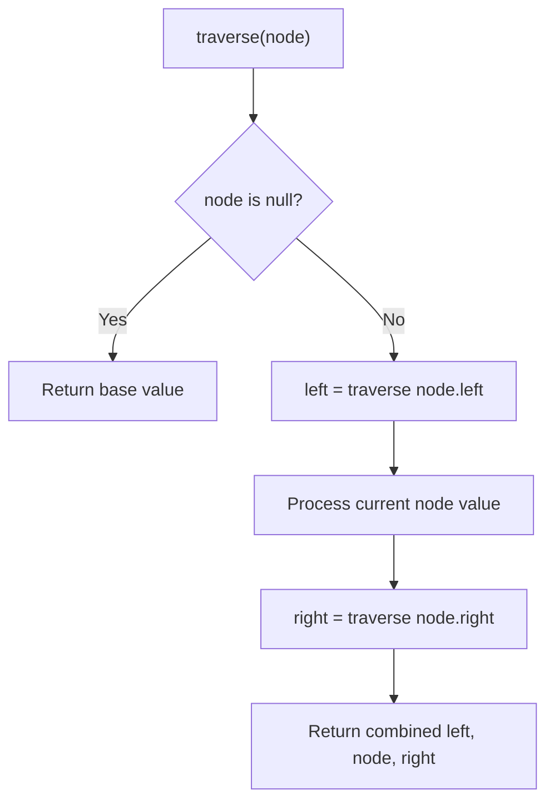

# Problem 889: Construct Binary Tree from Preorder and Postorder Traversal

**Difficulty:** Medium  
**Tags:** Array, Hash Table, Divide and Conquer, Tree, Binary Tree  
**Pattern:** Tree Traversal  
**Link:** [leetcode.com/problems/construct-binary-tree-from-preorder-and-postorder-traversal](https://leetcode.com/problems/construct-binary-tree-from-preorder-and-postorder-traversal/)

## Description

Given two integer arrays, `preorder` and `postorder` where `preorder` is the preorder traversal of a binary tree of **distinct** values and `postorder` is the postorder traversal of the same tree, reconstruct and return *the binary tree*.

If there exist multiple answers, you can **return any** of them.

 

Example 1:

```

**Input:** preorder = [1,2,4,5,3,6,7], postorder = [4,5,2,6,7,3,1]
**Output:** [1,2,3,4,5,6,7]

```

Example 2:

```

**Input:** preorder = [1], postorder = [1]
**Output:** [1]

```

 

**Constraints:**

	- `1 <= preorder.length <= 30`
	- `1 <= preorder[i] <= preorder.length`
	- All the values of `preorder` are **unique**.
	- `postorder.length == preorder.length`
	- `1 <= postorder[i] <= postorder.length`
	- All the values of `postorder` are **unique**.
	- It is guaranteed that `preorder` and `postorder` are the preorder traversal and postorder traversal of the same binary tree.

## Approach: Tree Traversal

Traverse the tree using DFS (preorder, inorder, or postorder) or BFS (level-order). At each node, compute or accumulate a value and recurse on children.

## Pseudocode

```
1. Define recursive function traverse(node):
   a. Base case: if node is null, return default
   b. Recurse on left child
   c. Process current node
   d. Recurse on right child
   e. Return combined result
2. Call traverse(root)
```

## Algorithm Flow



## Complexity Analysis

- **Time:** O(n)
- **Space:** O(h)

## Solution (Python3)

```python
class Solution:
    def constructFromPrePost(self, preorder: List[int], postorder: List[int]) -> Optional[TreeNode]:
        # Tree traversal - O(n) time, O(h) space
        result = []
        def traverse(node):
            if not node:
                return
            result.append(node.val)
            traverse(node.left)
            traverse(node.right)
        traverse(preorder)
        return result if isinstance(None, list) else result[0] if result else None
```

## Solution (C++)

```cpp
#include <functional>
#include <string>
#include <vector>
using namespace std;

class Solution {
public:
    TreeNode* constructFromPrePost(vector<int>& preorder, vector<int>& postorder) {
        // Tree traversal - O(n) time, O(h) space
        vector<int> result;
        function<void(TreeNode*)> traverse = [&](TreeNode* node) {
            if (!node) return;
            result.push_back(node->val);
            traverse(node->left);
            traverse(node->right);
        };
        traverse(preorder);
        return result;
    }
};
```
