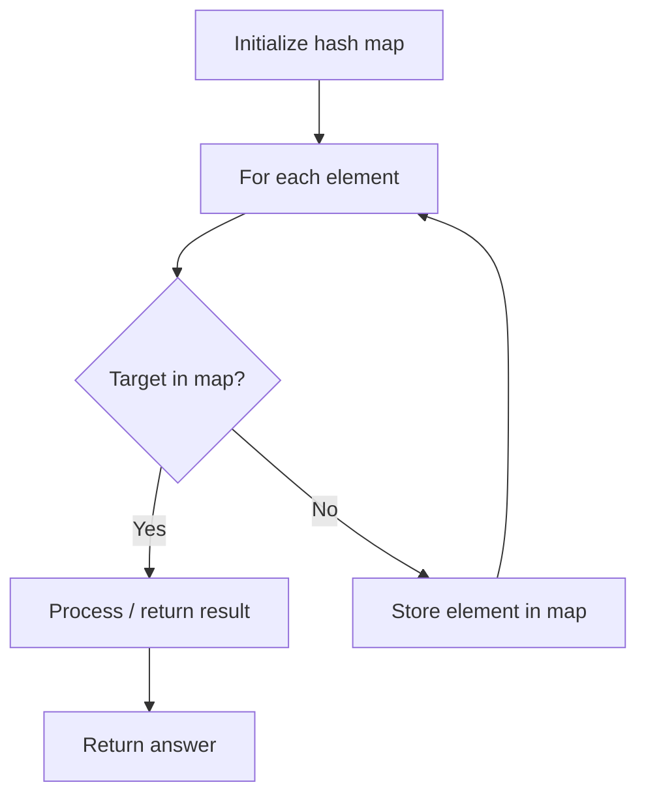

# Problem 890: Find and Replace Pattern

**Difficulty:** Medium  
**Tags:** Array, Hash Table, String  
**Pattern:** Hash Map Lookup  
**Link:** [leetcode.com/problems/find-and-replace-pattern](https://leetcode.com/problems/find-and-replace-pattern/)

## Description

Given a list of strings `words` and a string `pattern`, return *a list of* `words[i]` *that match* `pattern`. You may return the answer in **any order**.

A word matches the pattern if there exists a permutation of letters `p` so that after replacing every letter `x` in the pattern with `p(x)`, we get the desired word.

Recall that a permutation of letters is a bijection from letters to letters: every letter maps to another letter, and no two letters map to the same letter.

 

Example 1:

```

**Input:** words = ["abc","deq","mee","aqq","dkd","ccc"], pattern = "abb"
**Output:** ["mee","aqq"]
**Explanation:** "mee" matches the pattern because there is a permutation {a -> m, b -> e, ...}. 
"ccc" does not match the pattern because {a -> c, b -> c, ...} is not a permutation, since a and b map to the same letter.

```

Example 2:

```

**Input:** words = ["a","b","c"], pattern = "a"
**Output:** ["a","b","c"]

```

 

**Constraints:**

	- `1 <= pattern.length <= 20`
	- `1 <= words.length <= 50`
	- `words[i].length == pattern.length`
	- `pattern` and `words[i]` are lowercase English letters.

## Approach: Hash Map Lookup

Use a hash map (dictionary) to store elements for O(1) lookup. Iterate through the input, checking membership or counting frequencies in the map.

## Pseudocode

```
1. Initialize hash map
2. Iterate through elements:
   a. Check if target/complement exists in map
   b. If found: process result
   c. Otherwise: store element in map
3. Return result
```

## Algorithm Flow



## Complexity Analysis

- **Time:** O(n)
- **Space:** O(n)

## Solution (Python3)

```python
class Solution:
    def findAndReplacePattern(self, words: List[str], pattern: str) -> List[str]:
        # Hash map approach - O(n) time, O(n) space
        seen = {}
        for i, val in enumerate(words):
            complement = pattern - val
            if complement in seen:
                return [seen[complement], i]
            seen[val] = i
        return []
```

## Solution (C++)

```cpp
#include <string>
#include <unordered_map>
#include <vector>
using namespace std;

class Solution {
public:
    vector<string> findAndReplacePattern(vector<string>& words, string& pattern) {
        // Hash map approach - O(n) time, O(n) space
        unordered_map<int, int> seen;
        for (int i = 0; i < words.size(); i++) {
            int complement = pattern - words[i];
            if (seen.count(complement)) {
                return {seen[complement], i};
            }
            seen[words[i]] = i;
        }
        return {};
    }
};
```
