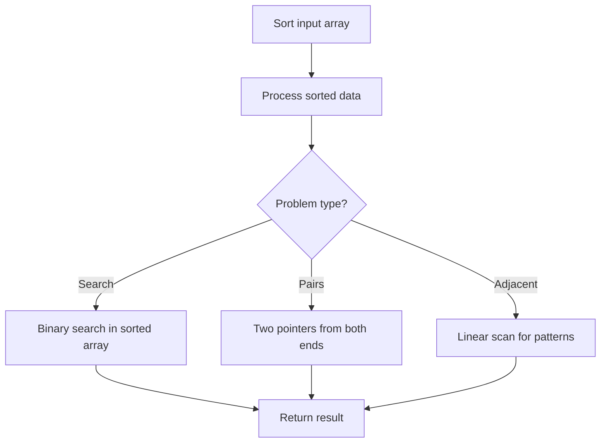

# Problem 891: Sum of Subsequence Widths

**Difficulty:** Hard  
**Tags:** Array, Math, Sorting  
**Pattern:** Sorting  
**Link:** [leetcode.com/problems/sum-of-subsequence-widths](https://leetcode.com/problems/sum-of-subsequence-widths/)

## Description

The **width** of a sequence is the difference between the maximum and minimum elements in the sequence.

Given an array of integers `nums`, return *the sum of the **widths** of all the non-empty **subsequences** of *`nums`. Since the answer may be very large, return it **modulo** `10^9 + 7`.

A **subsequence** is a sequence that can be derived from an array by deleting some or no elements without changing the order of the remaining elements. For example, `[3,6,2,7]` is a subsequence of the array `[0,3,1,6,2,2,7]`.

 

Example 1:

```

**Input:** nums = [2,1,3]
**Output:** 6
Explanation: The subsequences are [1], [2], [3], [2,1], [2,3], [1,3], [2,1,3].
The corresponding widths are 0, 0, 0, 1, 1, 2, 2.
The sum of these widths is 6.

```

Example 2:

```

**Input:** nums = [2]
**Output:** 0

```

 

**Constraints:**

	- `1 <= nums.length <= 10^5`
	- `1 <= nums[i] <= 10^5`

## Approach: Sorting

Sort the data to enable efficient processing. After sorting, use techniques like binary search, two pointers, or linear scan to solve the problem.

## Pseudocode

```
1. Sort the input array
2. Process sorted data:
   - Use binary search for lookups
   - Use two pointers for pair finding
   - Scan for adjacent patterns
3. Return result
```

## Algorithm Flow



## Complexity Analysis

- **Time:** O(n log n)
- **Space:** O(n)

## Solution (Python3)

```python
class Solution:
    def sumSubseqWidths(self, nums: List[int]) -> int:
        # Sort-based approach - O(n log n) time
        nums.sort(key=lambda x: x[0] if isinstance(x, (list, tuple)) else x)
        result = [nums[0]]
        for i in range(1, len(nums)):
            curr = nums[i]
            if isinstance(curr, (list, tuple)) and isinstance(result[-1], (list, tuple)):
                if curr[0] <= result[-1][1]:
                    result[-1] = [result[-1][0], max(result[-1][1], curr[1])]
                else:
                    result.append(curr)
            else:
                result.append(curr)
        return result
```

## Solution (C++)

```cpp
#include <algorithm>
#include <string>
#include <vector>
using namespace std;

class Solution {
public:
    int sumSubseqWidths(vector<int>& nums) {
        // Sort-based approach - O(n log n) time
        sort(nums.begin(), nums.end());
        vector<vector<int>> result;
        result.push_back(nums[0]);
        for (int i = 1; i < (int)nums.size(); i++) {
            if (nums[i][0] <= result.back()[1]) {
                result.back()[1] = max(result.back()[1], nums[i][1]);
            } else {
                result.push_back(nums[i]);
            }
        }
        return result;
    }
};
```
