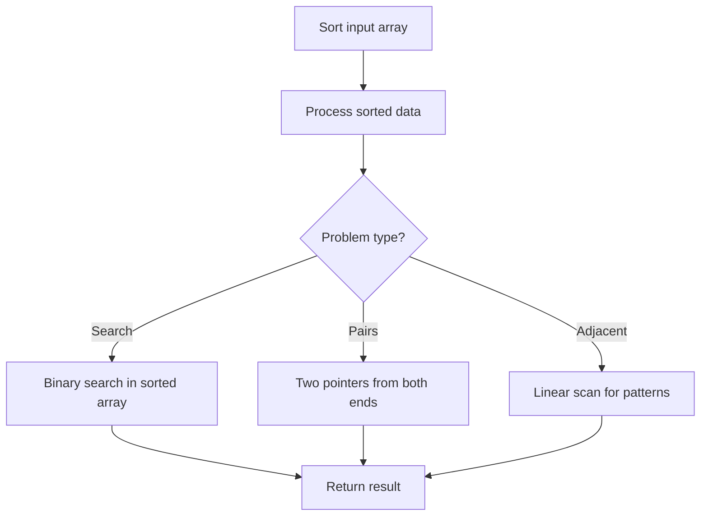

# Problem 893: Groups of Special-Equivalent Strings

**Difficulty:** Medium  
**Tags:** Array, Hash Table, String, Sorting  
**Pattern:** Sorting  
**Link:** [leetcode.com/problems/groups-of-special-equivalent-strings](https://leetcode.com/problems/groups-of-special-equivalent-strings/)

## Description

You are given an array of strings of the same length `words`.

In one **move**, you can swap any two even indexed characters or any two odd indexed characters of a string `words[i]`.

Two strings `words[i]` and `words[j]` are **special-equivalent** if after any number of moves, `words[i] == words[j]`.

	- For example, `words[i] = "zzxy"` and `words[j] = "xyzz"` are **special-equivalent** because we may make the moves `"zzxy" -> "xzzy" -> "xyzz"`.

A **group of special-equivalent strings** from `words` is a non-empty subset of words such that:

	- Every pair of strings in the group are special equivalent, and
	- The group is the largest size possible (i.e., there is not a string `words[i]` not in the group such that `words[i]` is special-equivalent to every string in the group).

Return *the number of **groups of special-equivalent strings** from *`words`.

 

Example 1:

```

**Input:** words = ["abcd","cdab","cbad","xyzz","zzxy","zzyx"]
**Output:** 3
**Explanation:** 
One group is ["abcd", "cdab", "cbad"], since they are all pairwise special equivalent, and none of the other strings is all pairwise special equivalent to these.
The other two groups are ["xyzz", "zzxy"] and ["zzyx"].
Note that in particular, "zzxy" is not special equivalent to "zzyx".

```

Example 2:

```

**Input:** words = ["abc","acb","bac","bca","cab","cba"]
**Output:** 3

```

 

**Constraints:**

	- `1 <= words.length <= 1000`
	- `1 <= words[i].length <= 20`
	- `words[i]` consist of lowercase English letters.
	- All the strings are of the same length.

## Approach: Sorting

Sort the data to enable efficient processing. After sorting, use techniques like binary search, two pointers, or linear scan to solve the problem.

## Pseudocode

```
1. Sort the input array
2. Process sorted data:
   - Use binary search for lookups
   - Use two pointers for pair finding
   - Scan for adjacent patterns
3. Return result
```

## Algorithm Flow



## Complexity Analysis

- **Time:** O(n log n)
- **Space:** O(n)

## Solution (Python3)

```python
class Solution:
    def numSpecialEquivGroups(self, words: List[str]) -> int:
        # Sort-based approach - O(n log n) time
        words.sort(key=lambda x: x[0] if isinstance(x, (list, tuple)) else x)
        result = [words[0]]
        for i in range(1, len(words)):
            curr = words[i]
            if isinstance(curr, (list, tuple)) and isinstance(result[-1], (list, tuple)):
                if curr[0] <= result[-1][1]:
                    result[-1] = [result[-1][0], max(result[-1][1], curr[1])]
                else:
                    result.append(curr)
            else:
                result.append(curr)
        return result
```

## Solution (C++)

```cpp
#include <algorithm>
#include <string>
#include <vector>
using namespace std;

class Solution {
public:
    int numSpecialEquivGroups(vector<string>& words) {
        // Sort-based approach - O(n log n) time
        sort(words.begin(), words.end());
        vector<vector<int>> result;
        result.push_back(words[0]);
        for (int i = 1; i < (int)words.size(); i++) {
            if (words[i][0] <= result.back()[1]) {
                result.back()[1] = max(result.back()[1], words[i][1]);
            } else {
                result.push_back(words[i]);
            }
        }
        return result;
    }
};
```
