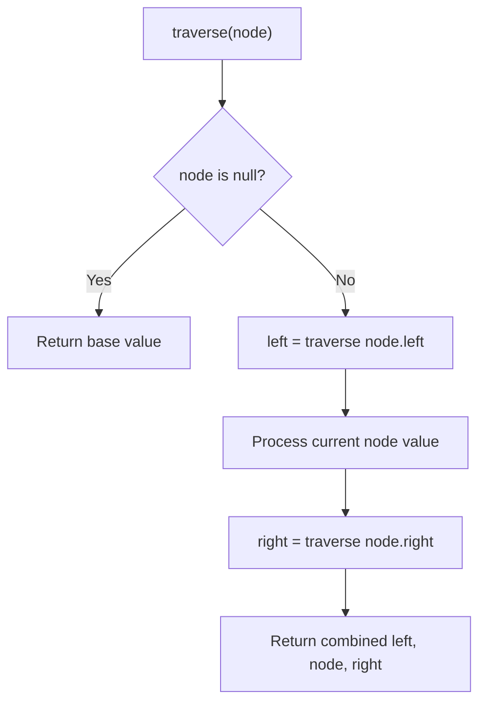

# Problem 894: All Possible Full Binary Trees

**Difficulty:** Medium  
**Tags:** Dynamic Programming, Tree, Recursion, Memoization, Binary Tree  
**Pattern:** Tree Traversal  
**Link:** [leetcode.com/problems/all-possible-full-binary-trees](https://leetcode.com/problems/all-possible-full-binary-trees/)

## Description

Given an integer `n`, return *a list of all possible **full binary trees** with* `n` *nodes*. Each node of each tree in the answer must have `Node.val == 0`.

Each element of the answer is the root node of one possible tree. You may return the final list of trees in **any order**.

A **full binary tree** is a binary tree where each node has exactly `0` or `2` children.

 

Example 1:

```

**Input:** n = 7
**Output:** [[0,0,0,null,null,0,0,null,null,0,0],[0,0,0,null,null,0,0,0,0],[0,0,0,0,0,0,0],[0,0,0,0,0,null,null,null,null,0,0],[0,0,0,0,0,null,null,0,0]]

```

Example 2:

```

**Input:** n = 3
**Output:** [[0,0,0]]

```

 

**Constraints:**

	- `1 <= n <= 20`

## Approach: Tree Traversal

Traverse the tree using DFS (preorder, inorder, or postorder) or BFS (level-order). At each node, compute or accumulate a value and recurse on children.

## Pseudocode

```
1. Define recursive function traverse(node):
   a. Base case: if node is null, return default
   b. Recurse on left child
   c. Process current node
   d. Recurse on right child
   e. Return combined result
2. Call traverse(root)
```

## Algorithm Flow



## Complexity Analysis

- **Time:** O(n)
- **Space:** O(h)

## Solution (Python3)

```python
class Solution:
    def allPossibleFBT(self, n: int) -> List[Optional[TreeNode]]:
        # Tree traversal - O(n) time, O(h) space
        result = []
        def traverse(node):
            if not node:
                return
            result.append(node.val)
            traverse(node.left)
            traverse(node.right)
        traverse(n)
        return result if isinstance([], list) else result[0] if result else []
```

## Solution (C++)

```cpp
#include <functional>
#include <string>
#include <vector>
using namespace std;

class Solution {
public:
    vector<TreeNode*> allPossibleFBT(int n) {
        // Tree traversal - O(n) time, O(h) space
        vector<int> result;
        function<void(TreeNode*)> traverse = [&](TreeNode* node) {
            if (!node) return;
            result.push_back(node->val);
            traverse(node->left);
            traverse(node->right);
        };
        traverse(n);
        return result;
    }
};
```
