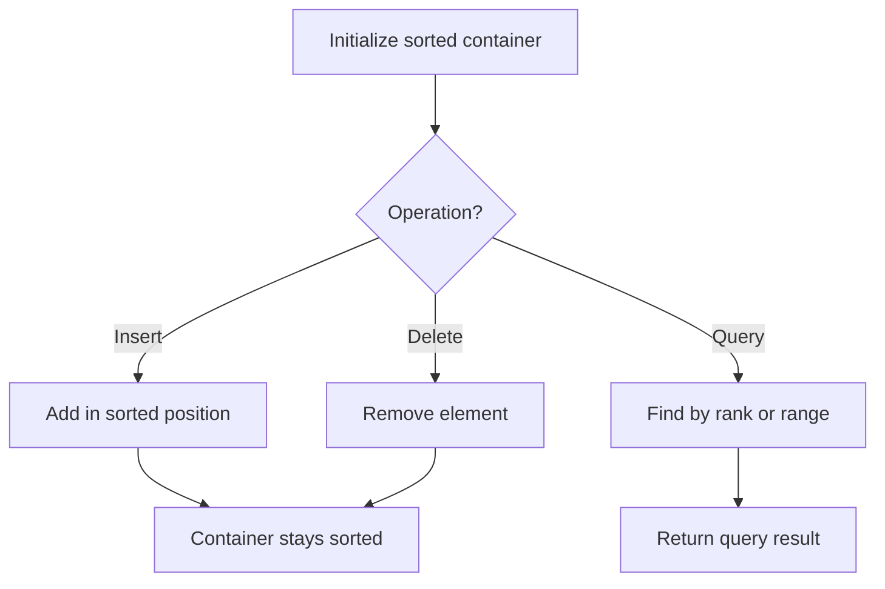

# Problem 895: Maximum Frequency Stack

**Difficulty:** Hard  
**Tags:** Hash Table, Stack, Design, Ordered Set  
**Pattern:** Stack + Hash Map / Design  
**Link:** [leetcode.com/problems/maximum-frequency-stack](https://leetcode.com/problems/maximum-frequency-stack/)

## Description

Design a stack-like data structure to push elements to the stack and pop the most frequent element from the stack.

Implement the `FreqStack` class:

	- `FreqStack()` constructs an empty frequency stack.
	- `void push(int val)` pushes an integer `val` onto the top of the stack.
	- `int pop()` removes and returns the most frequent element in the stack.
	
		If there is a tie for the most frequent element, the element closest to the stack's top is removed and returned.
	
	

 

Example 1:

```

**Input**
["FreqStack", "push", "push", "push", "push", "push", "push", "pop", "pop", "pop", "pop"]
[[], [5], [7], [5], [7], [4], [5], [], [], [], []]
**Output**
[null, null, null, null, null, null, null, 5, 7, 5, 4]

**Explanation**
FreqStack freqStack = new FreqStack();
freqStack.push(5); // The stack is [5]
freqStack.push(7); // The stack is [5,7]
freqStack.push(5); // The stack is [5,7,5]
freqStack.push(7); // The stack is [5,7,5,7]
freqStack.push(4); // The stack is [5,7,5,7,4]
freqStack.push(5); // The stack is [5,7,5,7,4,5]
freqStack.pop();   // return 5, as 5 is the most frequent. The stack becomes [5,7,5,7,4].
freqStack.pop();   // return 7, as 5 and 7 is the most frequent, but 7 is closest to the top. The stack becomes [5,7,5,4].
freqStack.pop();   // return 5, as 5 is the most frequent. The stack becomes [5,7,4].
freqStack.pop();   // return 4, as 4, 5 and 7 is the most frequent, but 4 is closest to the top. The stack becomes [5,7].

```

 

**Constraints:**

	- `0 <= val <= 10^9`
	- At most `2 * 10^4` calls will be made to `push` and `pop`.
	- It is guaranteed that there will be at least one element in the stack before calling `pop`.

## Approach: Stack + Hash Map / Design

Group elements by frequency in stacks. Pop from the highest frequency group.

## Pseudocode

```
1. Initialize sorted container
2. For each operation:
   - Insert: add element in sorted position O(log n)
   - Delete: remove element O(log n)
   - Query: find kth element, count, or range O(log n)
3. Return results
```

## Algorithm Flow



## Complexity Analysis

- **Time:** O(1) per operation
- **Space:** O(n)

## Solution (Python3)

```python
from collections import defaultdict

class FreqStack:
    def __init__(self):
        self.freq = defaultdict(int)
        self.group = defaultdict(list)
        self.maxfreq = 0

    def push(self, val: int) -> None:
        self.freq[val] += 1
        f = self.freq[val]
        self.maxfreq = max(self.maxfreq, f)
        self.group[f].append(val)

    def pop(self) -> int:
        val = self.group[self.maxfreq].pop()
        self.freq[val] -= 1
        if not self.group[self.maxfreq]:
            self.maxfreq -= 1
        return val
```

## Solution (C++)

```cpp
#include <algorithm>
#include <set>
#include <string>
#include <vector>
using namespace std;

class FreqStack {
public:
    FreqStack() {
        // Initialize
    }

    void push(int val) {
        return ;
    }

    int pop() {
        return 0;
    }

};
```
