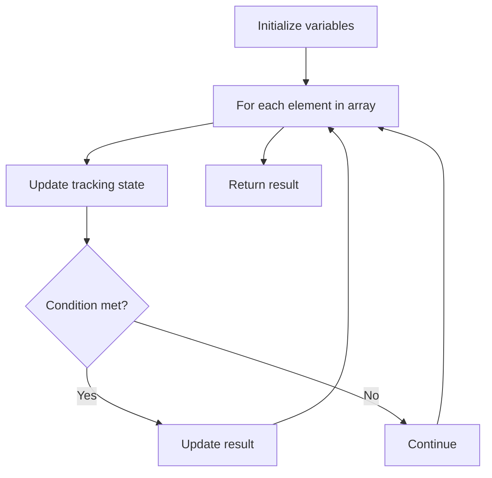

# Problem 896: Monotonic Array

**Difficulty:** Easy  
**Tags:** Array  
**Pattern:** Array Processing  
**Link:** [leetcode.com/problems/monotonic-array](https://leetcode.com/problems/monotonic-array/)

## Description

An array is **monotonic** if it is either monotone increasing or monotone decreasing.

An array `nums` is monotone increasing if for all `i <= j`, `nums[i] <= nums[j]`. An array `nums` is monotone decreasing if for all `i <= j`, `nums[i] >= nums[j]`.

Given an integer array `nums`, return `true`* if the given array is monotonic, or *`false`* otherwise*.

 

Example 1:

```

**Input:** nums = [1,2,2,3]
**Output:** true

```

Example 2:

```

**Input:** nums = [6,5,4,4]
**Output:** true

```

Example 3:

```

**Input:** nums = [1,3,2]
**Output:** false

```

 

**Constraints:**

	- `1 <= nums.length <= 10^5`
	- `-10^5 <= nums[i] <= 10^5`

## Approach: Array Processing

Process the array with a linear scan, tracking state variables. Look for patterns: running maximum/minimum, counting, or transformations.

## Pseudocode

```
1. Initialize tracking variables
2. Iterate through array:
   a. Update tracking state
   b. Check conditions
   c. Update result
3. Return result
```

## Algorithm Flow



## Complexity Analysis

- **Time:** O(n)
- **Space:** O(1)

## Solution (Python3)

```python
class Solution:
    def isMonotonic(self, nums: List[int]) -> bool:
        # Array processing - O(n) time
        result = False
        for i in range(len(nums)):
            # Process element
            pass
        return result
```

## Solution (C++)

```cpp
#include <string>
#include <vector>
using namespace std;

class Solution {
public:
    bool isMonotonic(vector<int>& nums) {
        // Array processing - O(n) time
        for (int i = 0; i < (int)nums.size(); i++) {
            // Process element
        }
        return false;
    }
};
```
