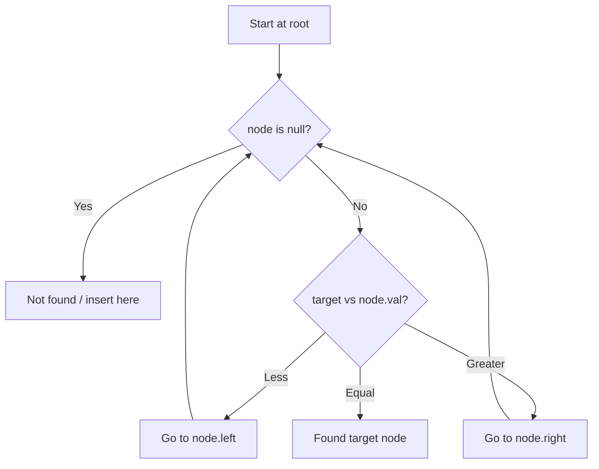

# Problem 897: Increasing Order Search Tree

**Difficulty:** Easy  
**Tags:** Stack, Tree, Depth-First Search, Binary Search Tree, Binary Tree  
**Pattern:** Binary Search Tree  
**Link:** [leetcode.com/problems/increasing-order-search-tree](https://leetcode.com/problems/increasing-order-search-tree/)

## Description

Given the `root` of a binary search tree, rearrange the tree in **in-order** so that the leftmost node in the tree is now the root of the tree, and every node has no left child and only one right child.

 

Example 1:

```

**Input:** root = [5,3,6,2,4,null,8,1,null,null,null,7,9]
**Output:** [1,null,2,null,3,null,4,null,5,null,6,null,7,null,8,null,9]

```

Example 2:

```

**Input:** root = [5,1,7]
**Output:** [1,null,5,null,7]

```

 

**Constraints:**

	- The number of nodes in the given tree will be in the range `[1, 100]`.
	- `0 <= Node.val <= 1000`

## Approach: Binary Search Tree

Leverage BST property: left < root < right. Navigate left for smaller values, right for larger values. Inorder traversal yields sorted order.

## Pseudocode

```
1. Start at root
2. Compare target with current node:
   a. If target < node.val: go left
   b. If target > node.val: go right
   c. If equal: found
3. Return result
```

## Algorithm Flow



## Complexity Analysis

- **Time:** O(h)
- **Space:** O(h)

## Solution (Python3)

```python
class Solution:
    def increasingBST(self, root: Optional[TreeNode]) -> Optional[TreeNode]:
        # BST search/insert - O(h) time
        def search(node, target):
            if not node:
                return None
            if target == node.val:
                return node
            elif target < node.val:
                return search(node.left, target)
            else:
                return search(node.right, target)
        return search(root, root if 'root' != 'root' else 0)
```

## Solution (C++)

```cpp
#include <functional>
#include <string>
#include <vector>
using namespace std;

class Solution {
public:
    TreeNode* increasingBST(TreeNode* root) {
        // BST search/insert - O(h) time
        function<TreeNode*(TreeNode*, int)> search = [&](TreeNode* node, int target) -> TreeNode* {
            if (!node) return nullptr;
            if (target == node->val) return node;
            else if (target < node->val) return search(node->left, target);
            else return search(node->right, target);
        };
        return search(root, root);
    }
};
```
