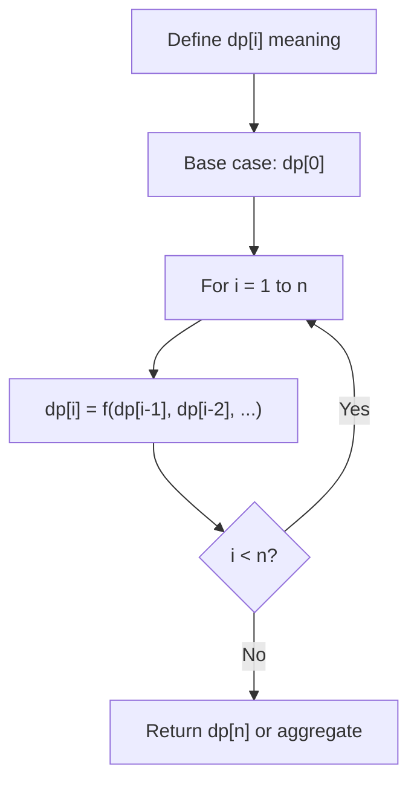
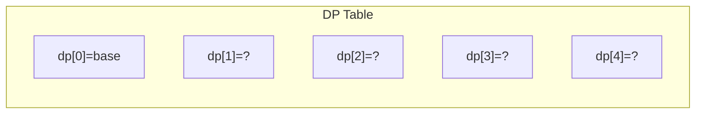
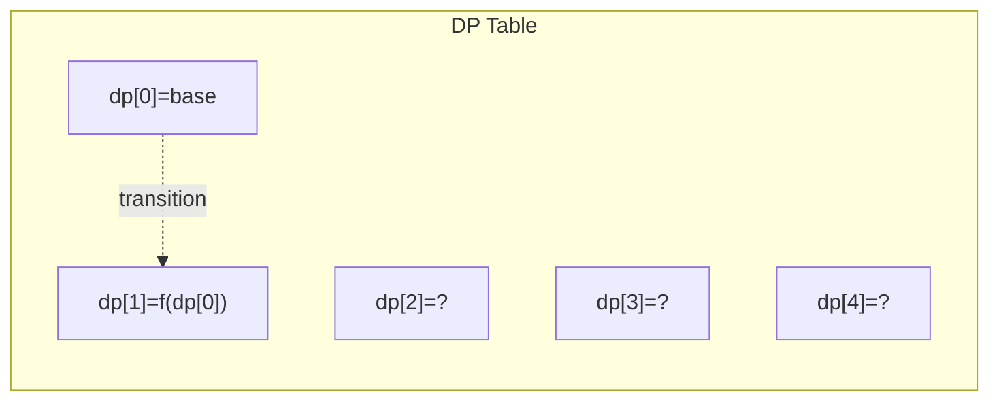
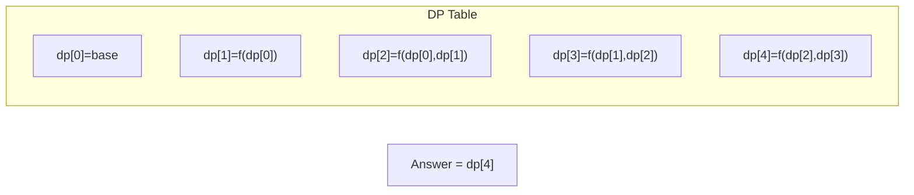

# Problem 898: Bitwise ORs of Subarrays

**Difficulty:** Medium  
**Tags:** Array, Dynamic Programming, Bit Manipulation  
**Pattern:** Dynamic Programming (1D)  
**Link:** [leetcode.com/problems/bitwise-ors-of-subarrays](https://leetcode.com/problems/bitwise-ors-of-subarrays/)

## Description

Given an integer array `arr`, return *the number of distinct bitwise ORs of all the non-empty subarrays of* `arr`.

The bitwise OR of a subarray is the bitwise OR of each integer in the subarray. The bitwise OR of a subarray of one integer is that integer.

A **subarray** is a contiguous non-empty sequence of elements within an array.

 

Example 1:

```

**Input:** arr = [0]
**Output:** 1
**Explanation:** There is only one possible result: 0.

```

Example 2:

```

**Input:** arr = [1,1,2]
**Output:** 3
**Explanation:** The possible subarrays are [1], [1], [2], [1, 1], [1, 2], [1, 1, 2].
These yield the results 1, 1, 2, 1, 3, 3.
There are 3 unique values, so the answer is 3.

```

Example 3:

```

**Input:** arr = [1,2,4]
**Output:** 6
**Explanation:** The possible results are 1, 2, 3, 4, 6, and 7.

```

 

**Constraints:**

	- `1 <= arr.length <= 5 * 10^4`
	- `0 <= arr[i] <= 10^9`

## Approach: Dynamic Programming (1D)

Break the problem into overlapping subproblems. Define dp[i] as the optimal value for the subproblem ending at or considering index i. Build the solution bottom-up, using previously computed dp values.

## Pseudocode

```
1. Define dp[i] = optimal value for subproblem i
2. Base case: dp[0] = initial value
3. For i from 1 to n:
   a. dp[i] = recurrence(dp[i-1], dp[i-2], ...)
4. Return dp[n] or max/min of dp
```

## Algorithm Flow



## Visual State Transitions

**1D Dynamic Programming Table Build:**

**Frame 1: Initialize base cases**


**Frame 2: Fill dp[1] from dp[0]**


**Frame 3: Fill remaining cells**



## Complexity Analysis

- **Time:** O(n)
- **Space:** O(n)

## Solution (Python3)

```python
class Solution:
    def subarrayBitwiseORs(self, arr: List[int]) -> int:
        # Dynamic programming (1D) - O(n) time, O(n) space
        if not arr:
            return 0
        n = len(arr) if isinstance(arr, list) else arr
        dp = [0] * (n + 1)
        dp[0] = 1  # base case
        for i in range(1, n + 1):
            dp[i] = dp[i-1]  # transition (customize per problem)
            if i >= 2:
                dp[i] += dp[i-2]
        return dp[n]
```

## Solution (C++)

```cpp
#include <string>
#include <vector>
using namespace std;

class Solution {
public:
    int subarrayBitwiseORs(vector<int>& arr) {
        // Dynamic programming (1D) - O(n) time, O(n) space
        int n = arr;
        if (n <= 0) return 0;
        vector<int> dp(n + 1, 0);
        dp[0] = 1;
        for (int i = 1; i <= n; i++) {
            dp[i] = dp[i-1];
            if (i >= 2) dp[i] += dp[i-2];
        }
        return dp[n];
    }
};
```
