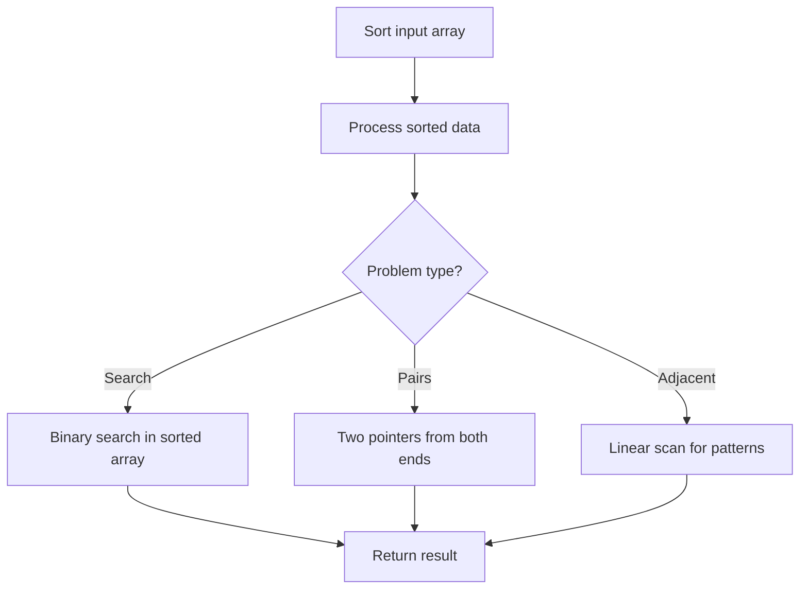

# Problem 899: Orderly Queue

**Difficulty:** Hard  
**Tags:** Math, String, Sorting  
**Pattern:** Sorting  
**Link:** [leetcode.com/problems/orderly-queue](https://leetcode.com/problems/orderly-queue/)

## Description

You are given a string `s` and an integer `k`. You can choose one of the first `k` letters of `s` and append it at the end of the string.

Return *the lexicographically smallest string you could have after applying the mentioned step any number of moves*.

 

Example 1:

```

**Input:** s = "cba", k = 1
**Output:** "acb"
**Explanation:** 
In the first move, we move the 1st character 'c' to the end, obtaining the string "bac".
In the second move, we move the 1st character 'b' to the end, obtaining the final result "acb".

```

Example 2:

```

**Input:** s = "baaca", k = 3
**Output:** "aaabc"
**Explanation:** 
In the first move, we move the 1st character 'b' to the end, obtaining the string "aacab".
In the second move, we move the 3rd character 'c' to the end, obtaining the final result "aaabc".

```

 

**Constraints:**

	- `1 <= k <= s.length <= 1000`
	- `s` consist of lowercase English letters.

## Approach: Sorting

Sort the data to enable efficient processing. After sorting, use techniques like binary search, two pointers, or linear scan to solve the problem.

## Pseudocode

```
1. Sort the input array
2. Process sorted data:
   - Use binary search for lookups
   - Use two pointers for pair finding
   - Scan for adjacent patterns
3. Return result
```

## Algorithm Flow



## Complexity Analysis

- **Time:** O(n log n)
- **Space:** O(n)

## Solution (Python3)

```python
class Solution:
    def orderlyQueue(self, s: str, k: int) -> str:
        # Sort-based approach - O(n log n) time
        s.sort(key=lambda x: x[0] if isinstance(x, (list, tuple)) else x)
        result = [s[0]]
        for i in range(1, len(s)):
            curr = s[i]
            if isinstance(curr, (list, tuple)) and isinstance(result[-1], (list, tuple)):
                if curr[0] <= result[-1][1]:
                    result[-1] = [result[-1][0], max(result[-1][1], curr[1])]
                else:
                    result.append(curr)
            else:
                result.append(curr)
        return result
```

## Solution (C++)

```cpp
#include <algorithm>
#include <string>
#include <vector>
using namespace std;

class Solution {
public:
    string orderlyQueue(string& s, int k) {
        // Sort-based approach - O(n log n) time
        sort(s.begin(), s.end());
        vector<vector<int>> result;
        result.push_back(s[0]);
        for (int i = 1; i < (int)s.size(); i++) {
            if (s[i][0] <= result.back()[1]) {
                result.back()[1] = max(result.back()[1], s[i][1]);
            } else {
                result.push_back(s[i]);
            }
        }
        return result;
    }
};
```
