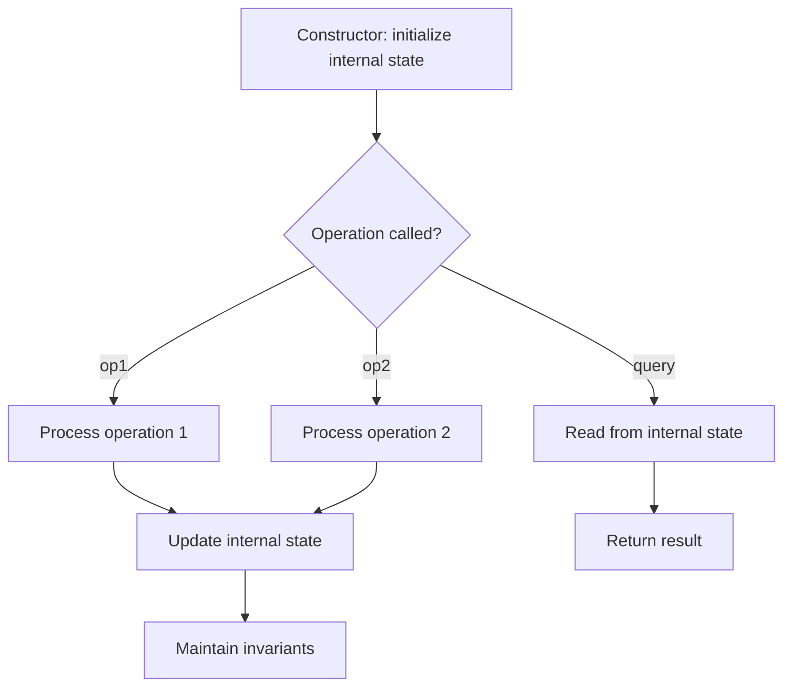

# Problem 900: RLE Iterator

**Difficulty:** Medium  
**Tags:** Array, Design, Counting, Iterator  
**Pattern:** Design  
**Link:** [leetcode.com/problems/rle-iterator](https://leetcode.com/problems/rle-iterator/)

## Description

We can use run-length encoding (i.e., **RLE**) to encode a sequence of integers. In a run-length encoded array of even length `encoding` (**0-indexed**), for all even `i`, `encoding[i]` tells us the number of times that the non-negative integer value `encoding[i + 1]` is repeated in the sequence.

	- For example, the sequence `arr = [8,8,8,5,5]` can be encoded to be `encoding = [3,8,2,5]`. `encoding = [3,8,0,9,2,5]` and `encoding = [2,8,1,8,2,5]` are also valid **RLE** of `arr`.

Given a run-length encoded array, design an iterator that iterates through it.

Implement the `RLEIterator` class:

	- `RLEIterator(int[] encoded)` Initializes the object with the encoded array `encoded`.
	- `int next(int n)` Exhausts the next `n` elements and returns the last element exhausted in this way. If there is no element left to exhaust, return `-1` instead.

 

Example 1:

```

**Input**
["RLEIterator", "next", "next", "next", "next"]
[[[3, 8, 0, 9, 2, 5]], [2], [1], [1], [2]]
**Output**
[null, 8, 8, 5, -1]

**Explanation**
RLEIterator rLEIterator = new RLEIterator([3, 8, 0, 9, 2, 5]); // This maps to the sequence [8,8,8,5,5].
rLEIterator.next(2); // exhausts 2 terms of the sequence, returning 8. The remaining sequence is now [8, 5, 5].
rLEIterator.next(1); // exhausts 1 term of the sequence, returning 8. The remaining sequence is now [5, 5].
rLEIterator.next(1); // exhausts 1 term of the sequence, returning 5. The remaining sequence is now [5].
rLEIterator.next(2); // exhausts 2 terms, returning -1. This is because the first term exhausted was 5,
but the second term did not exist. Since the last term exhausted does not exist, we return -1.

```

 

**Constraints:**

	- `2 <= encoding.length <= 1000`
	- `encoding.length` is even.
	- `0 <= encoding[i] <= 10^9`
	- `1 <= n <= 10^9`
	- At most `1000` calls will be made to `next`.

## Approach: Design

Design a data structure or system that supports specific operations efficiently. Choose appropriate underlying data structures (hash map, linked list, heap, etc.).

## Pseudocode

```
1. Choose data structures for internal state
2. Implement constructor: initialize state
3. Implement each operation:
   - Maintain invariants
   - Optimize for target time complexity
4. Handle edge cases
```

## Algorithm Flow



## Complexity Analysis

- **Time:** O(1) per operation
- **Space:** O(n)

## Solution (Python3)

```python
class RLEIterator:
    def __init__(self, encoding: List[int]):
        # Initialize data structure
        self.encoding = encoding

    def next(self, n: int) -> int:
        return 0

```

## Solution (C++)

```cpp
#include <string>
#include <vector>
using namespace std;

class RLEIterator {
public:
    RLEIterator(vector<int>& encoding) {
        // Initialize
    }

    int next(int n) {
        return 0;
    }

};
```
