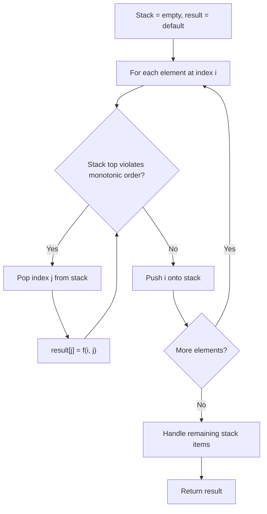
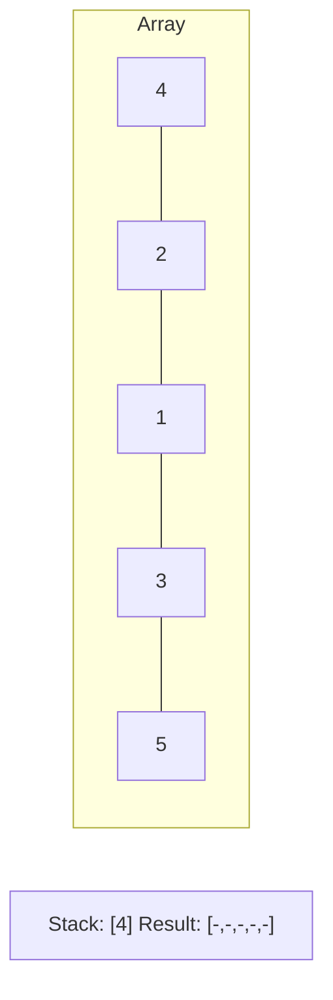
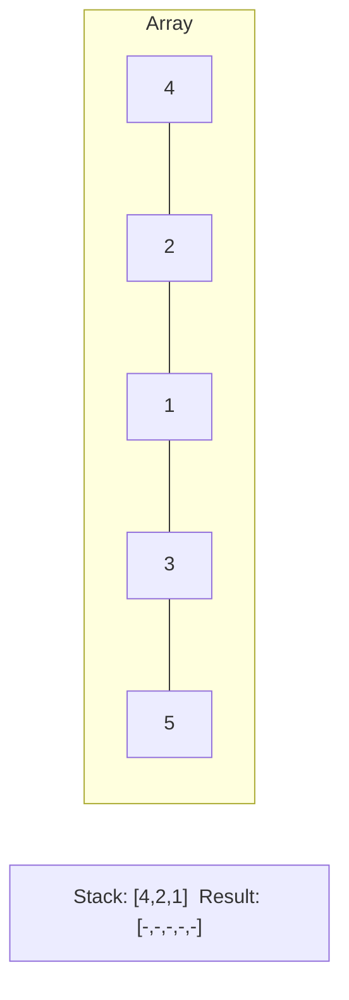
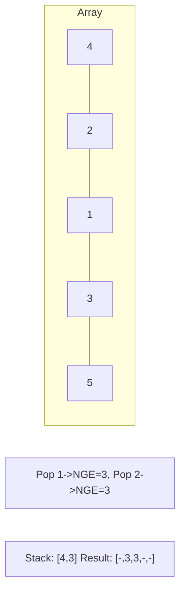
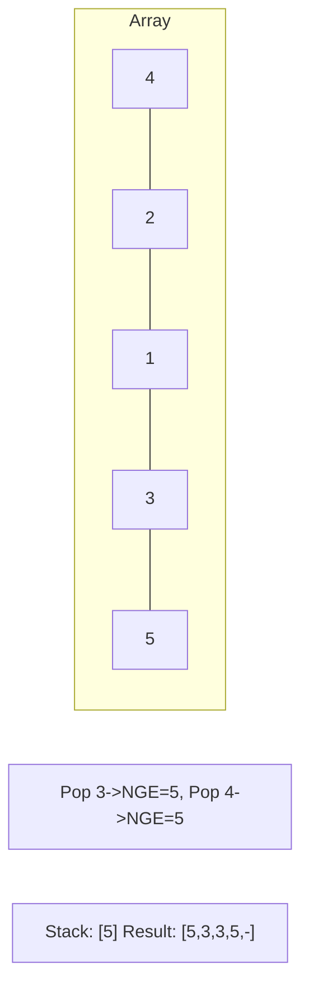

# Problem 901: Online Stock Span

**Difficulty:** Medium  
**Tags:** Stack, Design, Monotonic Stack, Data Stream  
**Pattern:** Monotonic Stack  
**Link:** [leetcode.com/problems/online-stock-span](https://leetcode.com/problems/online-stock-span/)

## Description

Design an algorithm that collects daily price quotes for some stock and returns **the span** of that stock's price for the current day.

The **span** of the stock's price in one day is the maximum number of consecutive days (starting from that day and going backward) for which the stock price was less than or equal to the price of that day.

	- For example, if the prices of the stock in the last four days is `[7,2,1,2]` and the price of the stock today is `2`, then the span of today is `4` because starting from today, the price of the stock was less than or equal `2` for `4` consecutive days.
	- Also, if the prices of the stock in the last four days is `[7,34,1,2]` and the price of the stock today is `8`, then the span of today is `3` because starting from today, the price of the stock was less than or equal `8` for `3` consecutive days.

Implement the `StockSpanner` class:

	- `StockSpanner()` Initializes the object of the class.
	- `int next(int price)` Returns the **span** of the stock's price given that today's price is `price`.

 

Example 1:

```

**Input**
["StockSpanner", "next", "next", "next", "next", "next", "next", "next"]
[[], [100], [80], [60], [70], [60], [75], [85]]
**Output**
[null, 1, 1, 1, 2, 1, 4, 6]

**Explanation**
StockSpanner stockSpanner = new StockSpanner();
stockSpanner.next(100); // return 1
stockSpanner.next(80);  // return 1
stockSpanner.next(60);  // return 1
stockSpanner.next(70);  // return 2
stockSpanner.next(60);  // return 1
stockSpanner.next(75);  // return 4, because the last 4 prices (including today's price of 75) were less than or equal to today's price.
stockSpanner.next(85);  // return 6

```

 

**Constraints:**

	- `1 <= price <= 10^5`
	- At most `10^4` calls will be made to `next`.

## Approach: Monotonic Stack

Maintain a stack where elements are always in monotonic order (increasing or decreasing). When a new element violates the monotonic property, pop elements and compute results (e.g., next greater/smaller element, spans, areas).

## Pseudocode

```
1. Initialize empty stack, result array
2. For each element (index i):
   a. While stack not empty and arr[i] breaks monotonic order:
      - Pop index j from stack
      - result[j] = compute(i, j)
   b. Push i onto stack
3. Handle remaining elements in stack
4. Return result
```

## Algorithm Flow



## Visual State Transitions

**Monotonic Stack (Next Greater Element):**

**Frame 1: Process first elements**


**Frame 2: Push smaller elements**


**Frame 3: Element 3 pops 1 and 2**


**Frame 4: Element 5 pops all**



## Complexity Analysis

- **Time:** O(n)
- **Space:** O(n)

## Solution (Python3)

```python
class StockSpanner:
    def __init__(self):
        # Initialize data structure
        pass

    def next(self, price: int) -> int:
        return 0

```

## Solution (C++)

```cpp
#include <stack>
#include <string>
#include <vector>
using namespace std;

class StockSpanner {
public:
    StockSpanner() {
        // Initialize
    }

    int next(int price) {
        return 0;
    }

};
```
