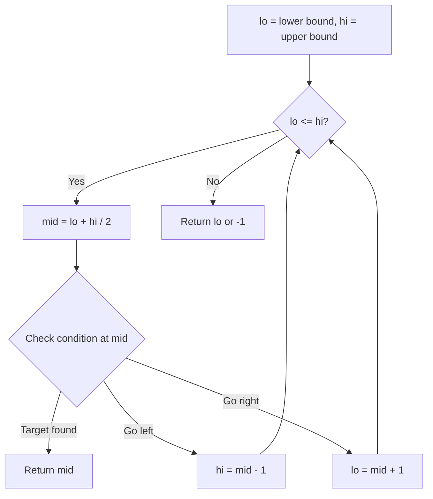
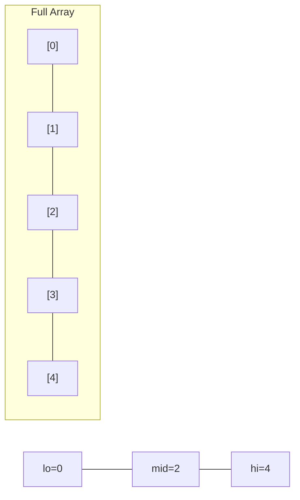
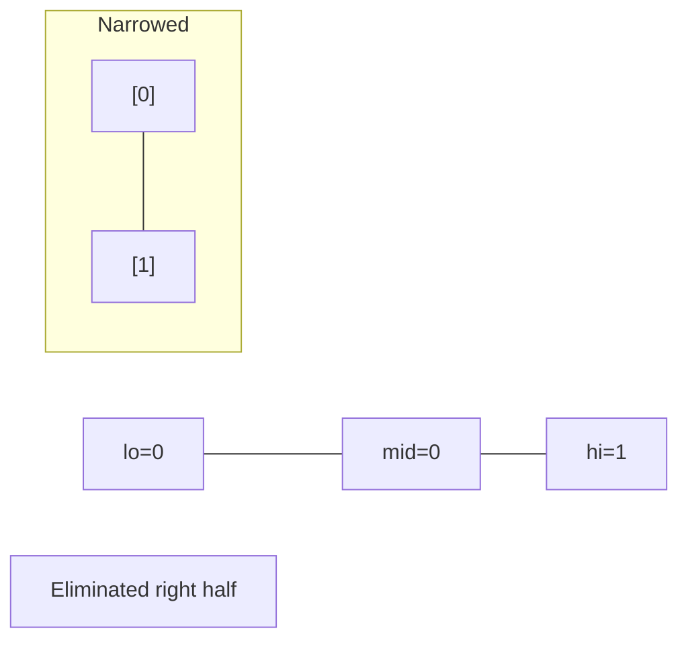
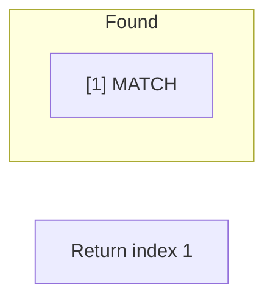

# Problem 902: Numbers At Most N Given Digit Set

**Difficulty:** Hard  
**Tags:** Array, Math, String, Binary Search, Dynamic Programming  
**Pattern:** Binary Search  
**Link:** [leetcode.com/problems/numbers-at-most-n-given-digit-set](https://leetcode.com/problems/numbers-at-most-n-given-digit-set/)

## Description

Given an array of `digits` which is sorted in **non-decreasing** order. You can write numbers using each `digits[i]` as many times as we want. For example, if `digits = ['1','3','5']`, we may write numbers such as `'13'`, `'551'`, and `'1351315'`.

Return *the number of positive integers that can be generated *that are less than or equal to a given integer `n`.

 

Example 1:

```

**Input:** digits = ["1","3","5","7"], n = 100
**Output:** 20
**Explanation: **
The 20 numbers that can be written are:
1, 3, 5, 7, 11, 13, 15, 17, 31, 33, 35, 37, 51, 53, 55, 57, 71, 73, 75, 77.

```

Example 2:

```

**Input:** digits = ["1","4","9"], n = 1000000000
**Output:** 29523
**Explanation: **
We can write 3 one digit numbers, 9 two digit numbers, 27 three digit numbers,
81 four digit numbers, 243 five digit numbers, 729 six digit numbers,
2187 seven digit numbers, 6561 eight digit numbers, and 19683 nine digit numbers.
In total, this is 29523 integers that can be written using the digits array.

```

Example 3:

```

**Input:** digits = ["7"], n = 8
**Output:** 1

```

 

**Constraints:**

	- `1 <= digits.length <= 9`
	- `digits[i].length == 1`
	- `digits[i]` is a digit from `'1'` to `'9'`.
	- All the values in `digits` are **unique**.
	- `digits` is sorted in **non-decreasing** order.
	- `1 <= n <= 10^9`

## Approach: Binary Search

Use binary search to halve the search space each iteration. Define the search range [lo, hi], compute mid, and decide which half to keep based on the problem's monotonic condition.

## Pseudocode

```
1. lo = lower_bound, hi = upper_bound
2. While lo <= hi (or lo < hi):
   a. mid = (lo + hi) // 2
   b. If condition(mid) is satisfied: record answer, search left half
   c. Else: search right half
3. Return answer
```

## Algorithm Flow



## Visual State Transitions

**Binary Search Step-by-Step:**

**Frame 1: Initial search space**


**Frame 2: Compare mid, narrow search**


**Frame 3: Found target**



## Complexity Analysis

- **Time:** O(log n)
- **Space:** O(1)

## Solution (Python3)

```python
class Solution:
    def atMostNGivenDigitSet(self, digits: List[str], n: int) -> int:
        # Binary search - O(log n) time, O(1) space
        lo, hi = 0, len(digits) - 1
        while lo <= hi:
            mid = lo + (hi - lo) // 2
            if digits[mid] == n:
                return mid
            elif digits[mid] < n:
                lo = mid + 1
            else:
                hi = mid - 1
        return 0
```

## Solution (C++)

```cpp
#include <string>
#include <vector>
using namespace std;

class Solution {
public:
    int atMostNGivenDigitSet(vector<string>& digits, int n) {
        // Binary search - O(log n) time, O(1) space
        int lo = 0, hi = digits.size() - 1;
        while (lo <= hi) {
            int mid = lo + (hi - lo) / 2;
            if (digits[mid] == n) {
                return mid;
            } else if (digits[mid] < n) {
                lo = mid + 1;
            } else {
                hi = mid - 1;
            }
        }
        return 0;
    }
};
```
