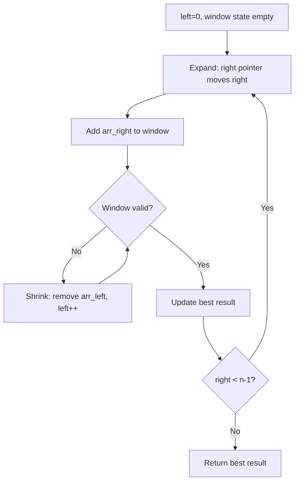
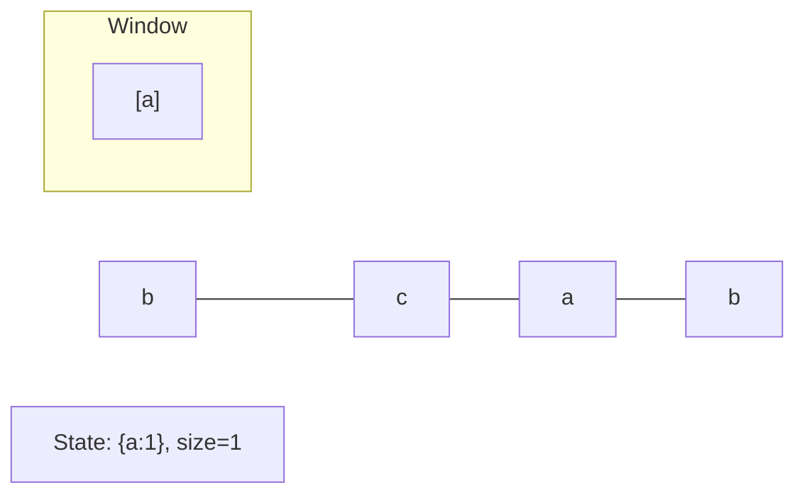
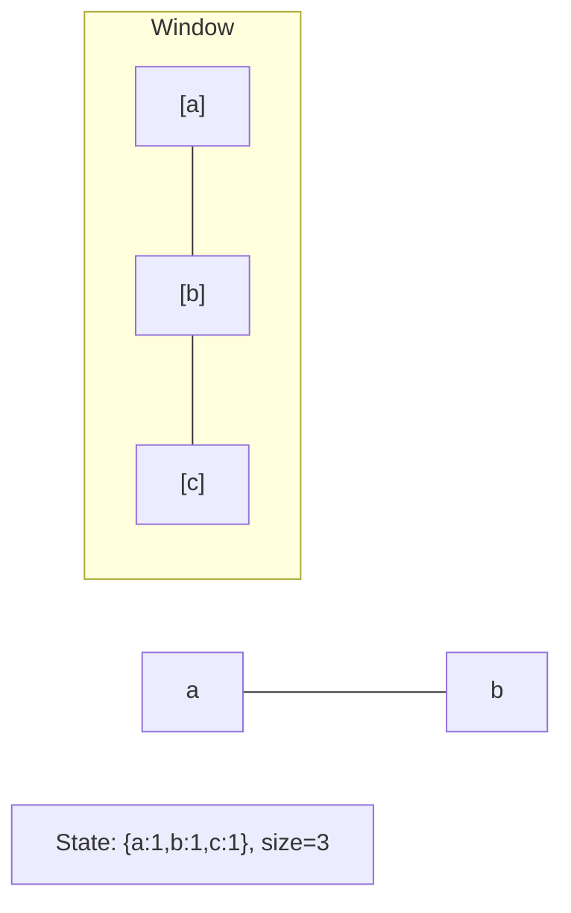
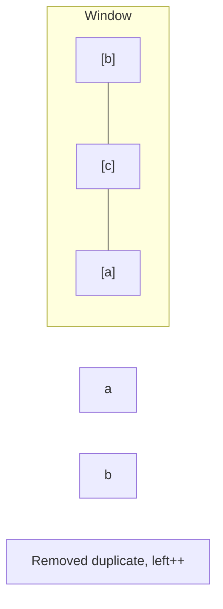
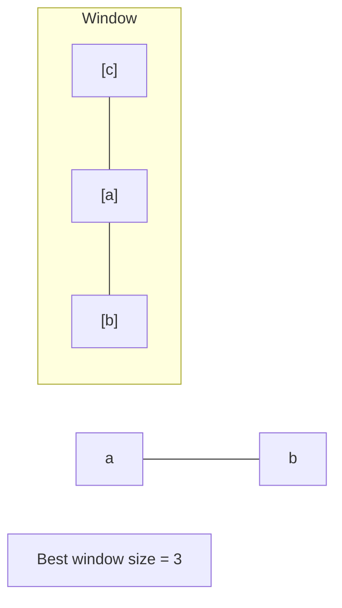

# Problem 904: Fruit Into Baskets

**Difficulty:** Medium  
**Tags:** Array, Hash Table, Sliding Window  
**Pattern:** Sliding Window  
**Link:** [leetcode.com/problems/fruit-into-baskets](https://leetcode.com/problems/fruit-into-baskets/)

## Description

You are visiting a farm that has a single row of fruit trees arranged from left to right. The trees are represented by an integer array `fruits` where `fruits[i]` is the **type** of fruit the `i^th` tree produces.

You want to collect as much fruit as possible. However, the owner has some strict rules that you must follow:

	- You only have **two** baskets, and each basket can only hold a **single type** of fruit. There is no limit on the amount of fruit each basket can hold.
	- Starting from any tree of your choice, you must pick **exactly one fruit** from **every** tree (including the start tree) while moving to the right. The picked fruits must fit in one of your baskets.
	- Once you reach a tree with fruit that cannot fit in your baskets, you must stop.

Given the integer array `fruits`, return *the **maximum** number of fruits you can pick*.

 

Example 1:

```

**Input:** fruits = [1,2,1]
**Output:** 3
**Explanation:** We can pick from all 3 trees.

```

Example 2:

```

**Input:** fruits = [0,1,2,2]
**Output:** 3
**Explanation:** We can pick from trees [1,2,2].
If we had started at the first tree, we would only pick from trees [0,1].

```

Example 3:

```

**Input:** fruits = [1,2,3,2,2]
**Output:** 4
**Explanation:** We can pick from trees [2,3,2,2].
If we had started at the first tree, we would only pick from trees [1,2].

```

 

**Constraints:**

	- `1 <= fruits.length <= 10^5`
	- `0 <= fruits[i] < fruits.length`

## Approach: Sliding Window

Maintain a window over the data using two pointers. Expand the right boundary to include new elements, and shrink the left boundary when the window constraint is violated. Track the optimal window.

## Pseudocode

```
1. Initialize left = 0, result = initial_value
2. For right in range(n):
   a. Add element at right to window state
   b. While window is invalid:
      - Remove element at left from window state
      - left++
   c. Update result = best of (result, window size/value)
3. Return result
```

## Algorithm Flow



## Visual State Transitions

**Sliding Window Step-by-Step:**

**Frame 1: Initial window (left=0, right=0)**


**Frame 2: Expand right (right=2)**


**Frame 3: Violation - shrink left**


**Frame 4: Continue expanding**



## Complexity Analysis

- **Time:** O(n)
- **Space:** O(k)

## Solution (Python3)

```python
class Solution:
    def totalFruit(self, fruits: List[int]) -> int:
        # Sliding window approach - O(n) time, O(k) space
        from collections import defaultdict
        window = defaultdict(int)
        left = 0
        result = 0
        for right in range(len(fruits)):
            window[fruits[right]] += 1
            while len(window) > (fruits if isinstance(fruits, int) else len(fruits)):
                window[fruits[left]] -= 1
                if window[fruits[left]] == 0:
                    del window[fruits[left]]
                left += 1
            result = max(result, right - left + 1)
        return result
```

## Solution (C++)

```cpp
#include <algorithm>
#include <string>
#include <unordered_map>
#include <vector>
using namespace std;

class Solution {
public:
    int totalFruit(vector<int>& fruits) {
        // Sliding window approach - O(n) time, O(k) space
        unordered_map<char, int> window;
        int left = 0, result = 0;
        for (int right = 0; right < fruits.size(); right++) {
            window[fruits[right]]++;
            while ((int)window.size() > fruits) {
                window[fruits[left]]--;
                if (window[fruits[left]] == 0)
                    window.erase(fruits[left]);
                left++;
            }
            result = max(result, right - left + 1);
        }
        return result;
    }
};
```
