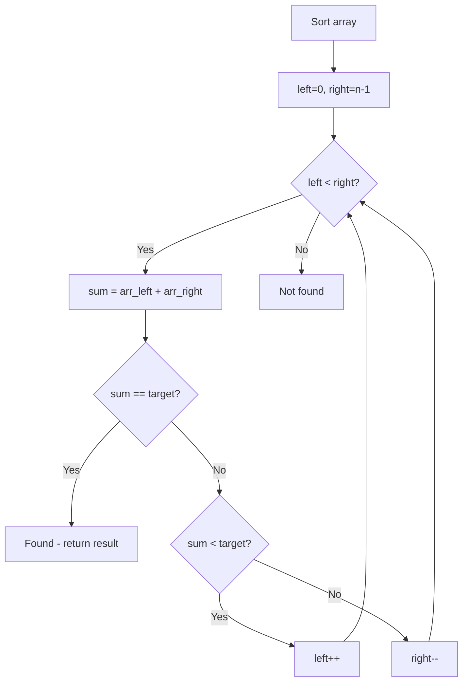

# Problem 905: Sort Array By Parity

**Difficulty:** Easy  
**Tags:** Array, Two Pointers, Sorting  
**Pattern:** Two Pointers on Sorted Array  
**Link:** [leetcode.com/problems/sort-array-by-parity](https://leetcode.com/problems/sort-array-by-parity/)

## Description

Given an integer array `nums`, move all the even integers at the beginning of the array followed by all the odd integers.

Return ***any array** that satisfies this condition*.

 

Example 1:

```

**Input:** nums = [3,1,2,4]
**Output:** [2,4,3,1]
**Explanation:** The outputs [4,2,3,1], [2,4,1,3], and [4,2,1,3] would also be accepted.

```

Example 2:

```

**Input:** nums = [0]
**Output:** [0]

```

 

**Constraints:**

	- `1 <= nums.length <= 5000`
	- `0 <= nums[i] <= 5000`

## Approach: Two Pointers on Sorted Array

Sort the array first, then use two pointers converging from both ends. Move the left pointer right to increase the sum, or the right pointer left to decrease it.

## Pseudocode

```
1. Sort the array
2. left = 0, right = n-1
3. While left < right:
   a. Compute current = arr[left] + arr[right]
   b. If current == target: found
   c. If current < target: left++
   d. If current > target: right--
4. Return result
```

## Algorithm Flow



## Complexity Analysis

- **Time:** O(n log n)
- **Space:** O(1)

## Solution (Python3)

```python
class Solution:
    def sortArrayByParity(self, nums: List[int]) -> List[int]:
        # Sort + two pointers - O(n log n) time
        nums.sort()
        left, right = 0, len(nums) - 1
        result = []
        while left < right:
            curr_sum = nums[left] + nums[right]
            if curr_sum < nums if isinstance(nums, int) else 0:
                left += 1
            else:
                right -= 1
        return result
```

## Solution (C++)

```cpp
#include <algorithm>
#include <string>
#include <vector>
using namespace std;

class Solution {
public:
    vector<int> sortArrayByParity(vector<int>& nums) {
        // Sort + two pointers - O(n log n) time
        sort(nums.begin(), nums.end());
        int left = 0, right = nums.size() - 1;
        while (left < right) {
            int curr = nums[left] + nums[right];
            if (curr < nums) {
                left++;
            } else {
                right--;
            }
        }
        return {};
    }
};
```
