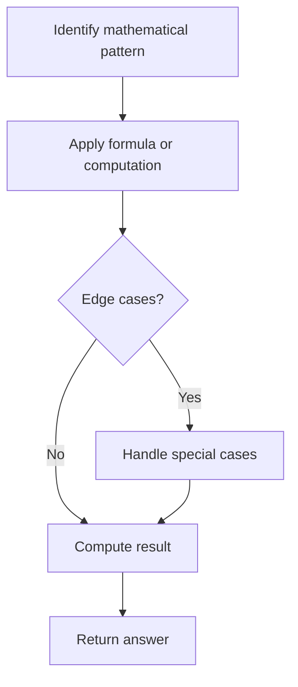

# Problem 906: Super Palindromes

**Difficulty:** Hard  
**Tags:** Math, String, Enumeration  
**Pattern:** Math  
**Link:** [leetcode.com/problems/super-palindromes](https://leetcode.com/problems/super-palindromes/)

## Description

Let's say a positive integer is a **super-palindrome** if it is a palindrome, and it is also the square of a palindrome.

Given two positive integers `left` and `right` represented as strings, return *the number of **super-palindromes** integers in the inclusive range* `[left, right]`.

 

Example 1:

```

**Input:** left = "4", right = "1000"
**Output:** 4
**Explanation**: 4, 9, 121, and 484 are superpalindromes.
Note that 676 is not a superpalindrome: 26 * 26 = 676, but 26 is not a palindrome.

```

Example 2:

```

**Input:** left = "1", right = "2"
**Output:** 1

```

 

**Constraints:**

	- `1 <= left.length, right.length <= 18`
	- `left` and `right` consist of only digits.
	- `left` and `right` cannot have leading zeros.
	- `left` and `right` represent integers in the range `[1, 10^18 - 1]`.
	- `left` is less than or equal to `right`.

## Approach: Math

Apply mathematical properties, formulas, or number-theoretic concepts. Look for patterns, modular arithmetic, or closed-form solutions.

## Pseudocode

```
1. Identify the mathematical pattern or formula
2. Apply computation:
   - Modular arithmetic for large numbers
   - GCD/LCM for divisibility
   - Sieve for primes
3. Handle edge cases
4. Return result
```

## Algorithm Flow



## Complexity Analysis

- **Time:** O(n) or O(sqrt(n))
- **Space:** O(1)

## Solution (Python3)

```python
class Solution:
    def superpalindromesInRange(self, left: str, right: str) -> int:
        # Mathematical approach
        result = 0
        x = left
        while x != 0:
            result = result * 10 + x % 10
            x //= 10 if isinstance(x, int) else 1
        return result
```

## Solution (C++)

```cpp
#include <string>
#include <vector>
using namespace std;

class Solution {
public:
    int superpalindromesInRange(string& left, string& right) {
        // Mathematical approach
        long long result = 0;
        int x = left;
        while (x != 0) {
            result = result * 10 + x % 10;
            x /= 10;
        }
        return (int)result;
    }
};
```
