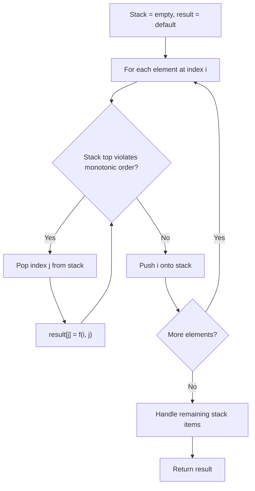
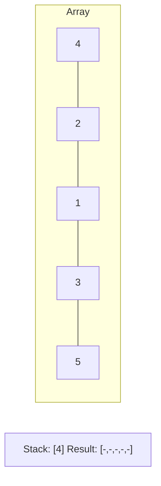
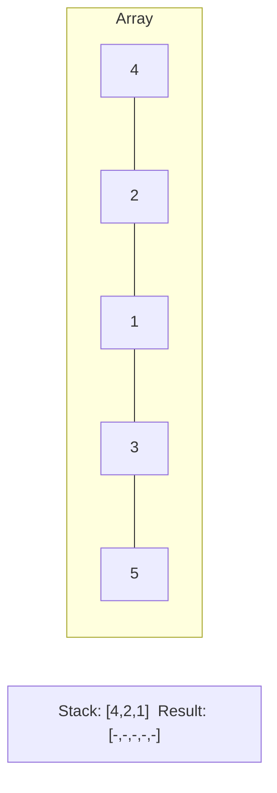
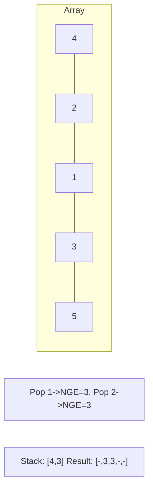
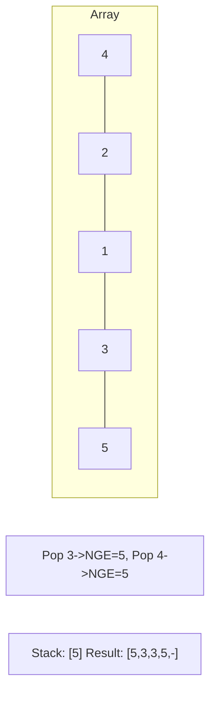

# Problem 907: Sum of Subarray Minimums

**Difficulty:** Medium  
**Tags:** Array, Dynamic Programming, Stack, Monotonic Stack  
**Pattern:** Monotonic Stack  
**Link:** [leetcode.com/problems/sum-of-subarray-minimums](https://leetcode.com/problems/sum-of-subarray-minimums/)

## Description

Given an array of integers arr, find the sum of `min(b)`, where `b` ranges over every (contiguous) subarray of `arr`. Since the answer may be large, return the answer **modulo** `10^9 + 7`.

 

Example 1:

```

**Input:** arr = [3,1,2,4]
**Output:** 17
**Explanation:** 
Subarrays are [3], [1], [2], [4], [3,1], [1,2], [2,4], [3,1,2], [1,2,4], [3,1,2,4]. 
Minimums are 3, 1, 2, 4, 1, 1, 2, 1, 1, 1.
Sum is 17.

```

Example 2:

```

**Input:** arr = [11,81,94,43,3]
**Output:** 444

```

 

**Constraints:**

	- `1 <= arr.length <= 3 * 10^4`
	- `1 <= arr[i] <= 3 * 10^4`

## Approach: Monotonic Stack

For each element, find how many subarrays have it as minimum using left/right boundaries from monotonic stack.

## Pseudocode

```
1. Initialize empty stack, result array
2. For each element (index i):
   a. While stack not empty and arr[i] breaks monotonic order:
      - Pop index j from stack
      - result[j] = compute(i, j)
   b. Push i onto stack
3. Handle remaining elements in stack
4. Return result
```

## Algorithm Flow



## Visual State Transitions

**Monotonic Stack (Next Greater Element):**

**Frame 1: Process first elements**


**Frame 2: Push smaller elements**


**Frame 3: Element 3 pops 1 and 2**


**Frame 4: Element 5 pops all**



## Complexity Analysis

- **Time:** O(n)
- **Space:** O(n)

## Solution (Python3)

```python
class Solution:
    def sumSubarrayMins(self, arr: list[int]) -> int:
        MOD = 10**9 + 7
        n = len(arr)
        left = [0] * n
        right = [0] * n
        stack = []
        for i in range(n):
            while stack and arr[stack[-1]] >= arr[i]:
                stack.pop()
            left[i] = i - stack[-1] if stack else i + 1
            stack.append(i)
        stack = []
        for i in range(n - 1, -1, -1):
            while stack and arr[stack[-1]] > arr[i]:
                stack.pop()
            right[i] = stack[-1] - i if stack else n - i
            stack.append(i)
        return sum(arr[i] * left[i] * right[i] for i in range(n)) % MOD
```

## Solution (C++)

```cpp
#include <stack>
#include <string>
#include <vector>
using namespace std;

class Solution {
public:
    int sumSubarrayMins(vector<int>& arr) {
        // Monotonic stack - O(n) time, O(n) space
        int n = arr.size();
        vector<int> result(n, 0);
        stack<int> st;
        for (int i = 0; i < n; i++) {
            while (!st.empty() && arr[i] > arr[st.top()]) {
                int idx = st.top(); st.pop();
                result[idx] = i - idx;
            }
            st.push(i);
        }
        return result;
    }
};
```
