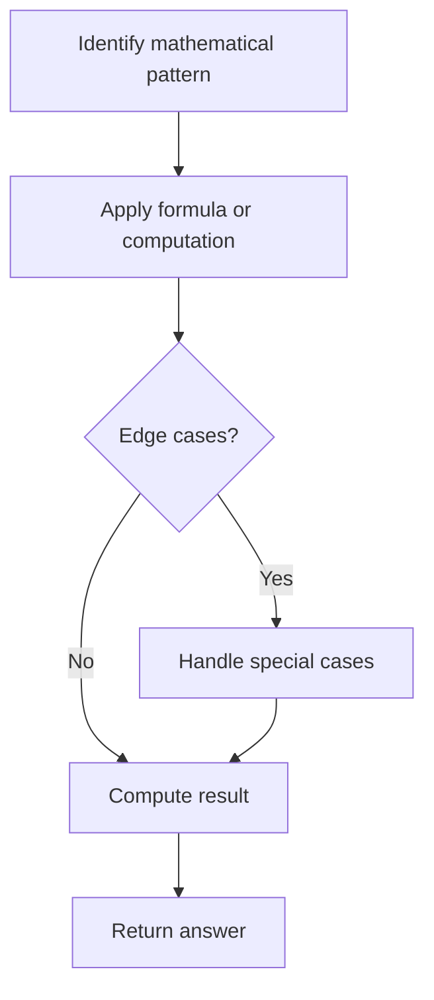

# Problem 908: Smallest Range I

**Difficulty:** Easy  
**Tags:** Array, Math  
**Pattern:** Math  
**Link:** [leetcode.com/problems/smallest-range-i](https://leetcode.com/problems/smallest-range-i/)

## Description

You are given an integer array `nums` and an integer `k`.

In one operation, you can choose any index `i` where `0 <= i < nums.length` and change `nums[i]` to `nums[i] + x` where `x` is an integer from the range `[-k, k]`. You can apply this operation **at most once** for each index `i`.

The **score** of `nums` is the difference between the maximum and minimum elements in `nums`.

Return *the minimum **score** of *`nums`* after applying the mentioned operation at most once for each index in it*.

 

Example 1:

```

**Input:** nums = [1], k = 0
**Output:** 0
**Explanation:** The score is max(nums) - min(nums) = 1 - 1 = 0.

```

Example 2:

```

**Input:** nums = [0,10], k = 2
**Output:** 6
**Explanation:** Change nums to be [2, 8]. The score is max(nums) - min(nums) = 8 - 2 = 6.

```

Example 3:

```

**Input:** nums = [1,3,6], k = 3
**Output:** 0
**Explanation:** Change nums to be [4, 4, 4]. The score is max(nums) - min(nums) = 4 - 4 = 0.

```

 

**Constraints:**

	- `1 <= nums.length <= 10^4`
	- `0 <= nums[i] <= 10^4`
	- `0 <= k <= 10^4`

## Approach: Math

Apply mathematical properties, formulas, or number-theoretic concepts. Look for patterns, modular arithmetic, or closed-form solutions.

## Pseudocode

```
1. Identify the mathematical pattern or formula
2. Apply computation:
   - Modular arithmetic for large numbers
   - GCD/LCM for divisibility
   - Sieve for primes
3. Handle edge cases
4. Return result
```

## Algorithm Flow



## Complexity Analysis

- **Time:** O(n) or O(sqrt(n))
- **Space:** O(1)

## Solution (Python3)

```python
class Solution:
    def smallestRangeI(self, nums: List[int], k: int) -> int:
        # Mathematical approach
        result = 0
        x = nums
        while x != 0:
            result = result * 10 + x % 10
            x //= 10 if isinstance(x, int) else 1
        return result
```

## Solution (C++)

```cpp
#include <string>
#include <vector>
using namespace std;

class Solution {
public:
    int smallestRangeI(vector<int>& nums, int k) {
        // Mathematical approach
        long long result = 0;
        int x = nums;
        while (x != 0) {
            result = result * 10 + x % 10;
            x /= 10;
        }
        return (int)result;
    }
};
```
