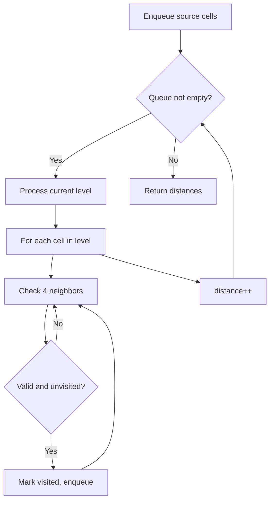
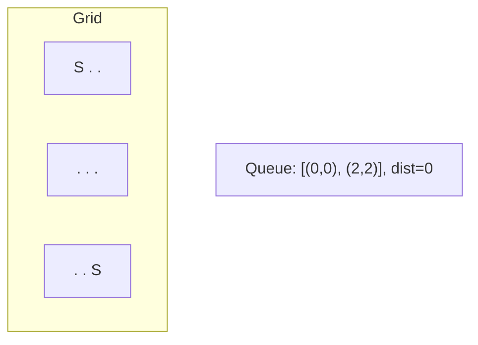
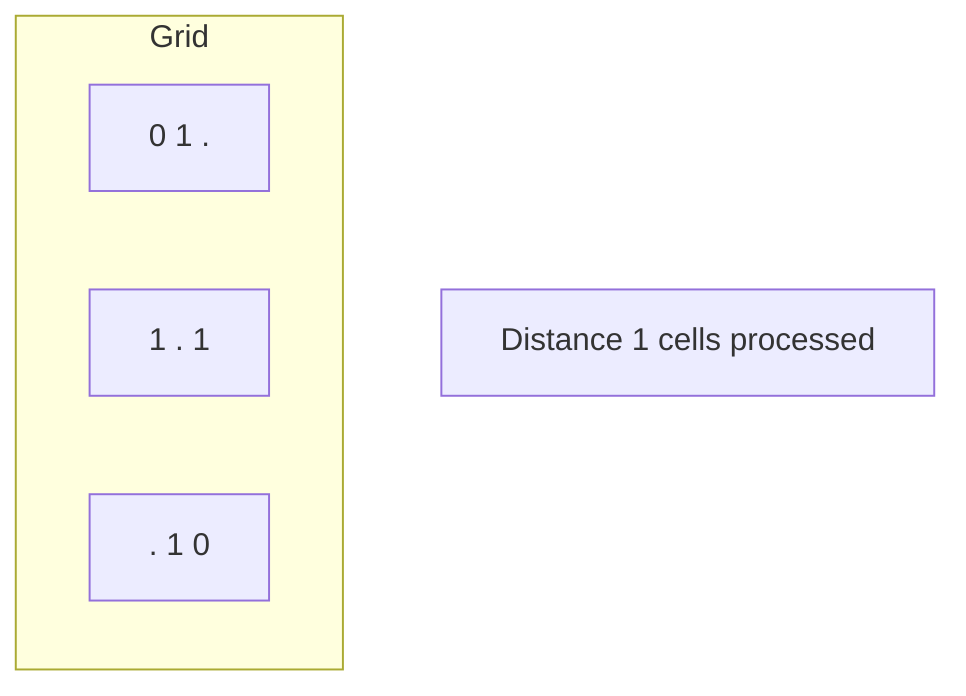
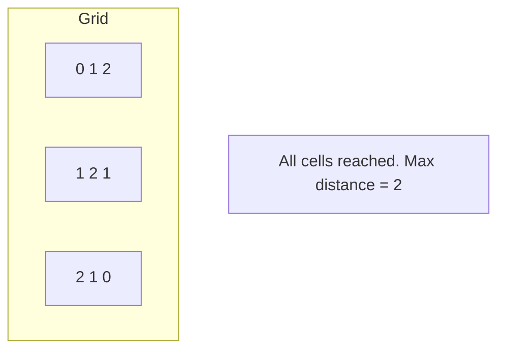

# Problem 909: Snakes and Ladders

**Difficulty:** Medium  
**Tags:** Array, Breadth-First Search, Matrix  
**Pattern:** BFS on Matrix / Grid  
**Link:** [leetcode.com/problems/snakes-and-ladders](https://leetcode.com/problems/snakes-and-ladders/)

## Description

You are given an `n x n` integer matrix `board` where the cells are labeled from `1` to `n^2` in a **Boustrophedon style** starting from the bottom left of the board (i.e. `board[n - 1][0]`) and alternating direction each row.

You start on square `1` of the board. In each move, starting from square `curr`, do the following:

	- Choose a destination square `next` with a label in the range `[curr + 1, min(curr + 6, n^2)]`.

	
		This choice simulates the result of a standard **6-sided die roll**: i.e., there are always at most 6 destinations, regardless of the size of the board.
	
	
	- If `next` has a snake or ladder, you **must** move to the destination of that snake or ladder. Otherwise, you move to `next`.
	- The game ends when you reach the square `n^2`.

A board square on row `r` and column `c` has a snake or ladder if `board[r][c] != -1`. The destination of that snake or ladder is `board[r][c]`. Squares `1` and `n^2` are not the starting points of any snake or ladder.

Note that you only take a snake or ladder at most once per dice roll. If the destination to a snake or ladder is the start of another snake or ladder, you do **not** follow the subsequent snake or ladder.

	- For example, suppose the board is `[[-1,4],[-1,3]]`, and on the first move, your destination square is `2`. You follow the ladder to square `3`, but do **not** follow the subsequent ladder to `4`.

Return *the least number of dice rolls required to reach the square *`n^2`*. If it is not possible to reach the square, return *`-1`.

 

Example 1:

```

**Input:** board = [[-1,-1,-1,-1,-1,-1],[-1,-1,-1,-1,-1,-1],[-1,-1,-1,-1,-1,-1],[-1,35,-1,-1,13,-1],[-1,-1,-1,-1,-1,-1],[-1,15,-1,-1,-1,-1]]
**Output:** 4
**Explanation:** 
In the beginning, you start at square 1 (at row 5, column 0).
You decide to move to square 2 and must take the ladder to square 15.
You then decide to move to square 17 and must take the snake to square 13.
You then decide to move to square 14 and must take the ladder to square 35.
You then decide to move to square 36, ending the game.
This is the lowest possible number of moves to reach the last square, so return 4.

```

Example 2:

```

**Input:** board = [[-1,-1],[-1,3]]
**Output:** 1

```

 

**Constraints:**

	- `n == board.length == board[i].length`
	- `2 <= n <= 20`
	- `board[i][j]` is either `-1` or in the range `[1, n^2]`.
	- The squares labeled `1` and `n^2` are not the starting points of any snake or ladder.

## Approach: BFS on Matrix / Grid

Breadth-first search on the grid. Enqueue all starting cells, then expand level by level. BFS on grids finds shortest distance from source(s).

## Pseudocode

```
1. Enqueue all source cells, mark visited
2. distance = 0
3. While queue not empty:
   a. Process all cells at current distance
   b. For each cell, enqueue unvisited neighbors
   c. distance++
4. Return result
```

## Algorithm Flow



## Visual State Transitions

**Multi-source BFS on Grid:**

**Frame 1: Enqueue all sources**


**Frame 2: Expand distance 1**


**Frame 3: Expand distance 2**



## Complexity Analysis

- **Time:** O(m * n)
- **Space:** O(m * n)

## Solution (Python3)

```python
class Solution:
    def snakesAndLadders(self, board: List[List[int]]) -> int:
        # BFS on grid - O(m*n) time
        from collections import deque
        if not board:
            return 0
        rows, cols = len(board), len(board[0])
        queue = deque()
        visited = set()
        # Initialize BFS sources
        for r in range(rows):
            for c in range(cols):
                if board[r][c] == 1 or board[r][c] == '1':
                    queue.append((r, c, 0))
                    visited.add((r, c))
        steps = 0
        while queue:
            r, c, d = queue.popleft()
            steps = max(steps, d)
            for dr, dc in [(1,0),(-1,0),(0,1),(0,-1)]:
                nr, nc = r+dr, c+dc
                if 0 <= nr < rows and 0 <= nc < cols and (nr,nc) not in visited:
                    visited.add((nr, nc))
                    queue.append((nr, nc, d+1))
        return steps
```

## Solution (C++)

```cpp
#include <algorithm>
#include <queue>
#include <string>
#include <tuple>
#include <vector>
using namespace std;

class Solution {
public:
    int snakesAndLadders(vector<vector<int>>& board) {
        // BFS on grid - O(m*n) time
        if (board.empty()) return 0;
        int rows = board.size(), cols = board[0].size();
        queue<tuple<int,int,int>> q;
        vector<vector<bool>> visited(rows, vector<bool>(cols, false));
        int dirs[4][2] = {{1,0},{-1,0},{0,1},{0,-1}};
        for (int r = 0; r < rows; r++)
            for (int c = 0; c < cols; c++)
                if (board[r][c] == 1) {
                    q.push({r, c, 0});
                    visited[r][c] = true;
                }
        int steps = 0;
        while (!q.empty()) {
            auto [r, c, d] = q.front(); q.pop();
            steps = max(steps, d);
            for (auto& dir : dirs) {
                int nr = r+dir[0], nc = c+dir[1];
                if (nr>=0 && nr<rows && nc>=0 && nc<cols && !visited[nr][nc]) {
                    visited[nr][nc] = true;
                    q.push({nr, nc, d+1});
                }
            }
        }
        return steps;
    }
};
```
