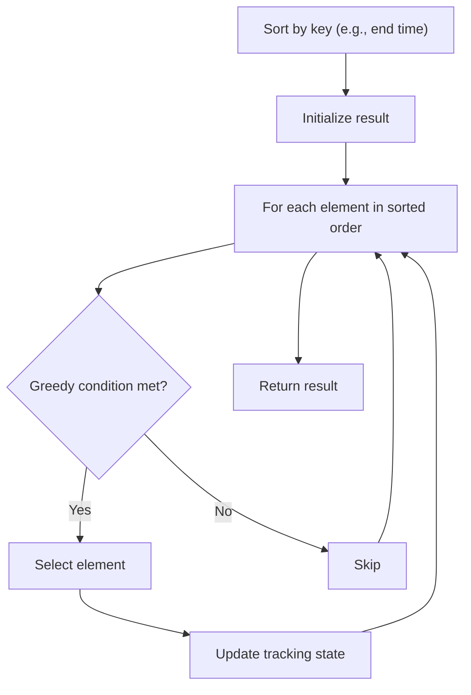

# Problem 910: Smallest Range II

**Difficulty:** Medium  
**Tags:** Array, Math, Greedy, Sorting  
**Pattern:** Greedy with Sorting  
**Link:** [leetcode.com/problems/smallest-range-ii](https://leetcode.com/problems/smallest-range-ii/)

## Description

You are given an integer array `nums` and an integer `k`.

For each index `i` where `0 <= i < nums.length`, change `nums[i]` to be either `nums[i] + k` or `nums[i] - k`.

The **score** of `nums` is the difference between the maximum and minimum elements in `nums`.

Return *the minimum **score** of *`nums`* after changing the values at each index*.

 

Example 1:

```

**Input:** nums = [1], k = 0
**Output:** 0
**Explanation:** The score is max(nums) - min(nums) = 1 - 1 = 0.

```

Example 2:

```

**Input:** nums = [0,10], k = 2
**Output:** 6
**Explanation:** Change nums to be [2, 8]. The score is max(nums) - min(nums) = 8 - 2 = 6.

```

Example 3:

```

**Input:** nums = [1,3,6], k = 3
**Output:** 3
**Explanation:** Change nums to be [4, 6, 3]. The score is max(nums) - min(nums) = 6 - 3 = 3.

```

 

**Constraints:**

	- `1 <= nums.length <= 10^4`
	- `0 <= nums[i] <= 10^4`
	- `0 <= k <= 10^4`

## Approach: Greedy with Sorting

Sort the input by a key criterion, then greedily process elements in sorted order. The sorting ensures the greedy choice is always optimal.

## Pseudocode

```
1. Sort elements by key (start time, weight, etc.)
2. Initialize result, tracking variables
3. For each element in sorted order:
   a. Apply greedy selection rule
   b. Update result
4. Return result
```

## Algorithm Flow



## Complexity Analysis

- **Time:** O(n log n)
- **Space:** O(n)

## Solution (Python3)

```python
class Solution:
    def smallestRangeII(self, nums: List[int], k: int) -> int:
        # Sort + greedy - O(n log n) time
        nums.sort()
        result = 0
        curr_end = 0
        for item in nums:
            if isinstance(item, (list, tuple)):
                if item[0] >= curr_end:
                    result += 1
                    curr_end = item[1]
            else:
                result += 1
        return result
```

## Solution (C++)

```cpp
#include <algorithm>
#include <string>
#include <vector>
using namespace std;

class Solution {
public:
    int smallestRangeII(vector<int>& nums, int k) {
        // Sort + greedy - O(n log n) time
        sort(nums.begin(), nums.end());
        int result = 0, curr_end = 0;
        for (auto& item : nums) {
            result++;
        }
        return result;
    }
};
```
