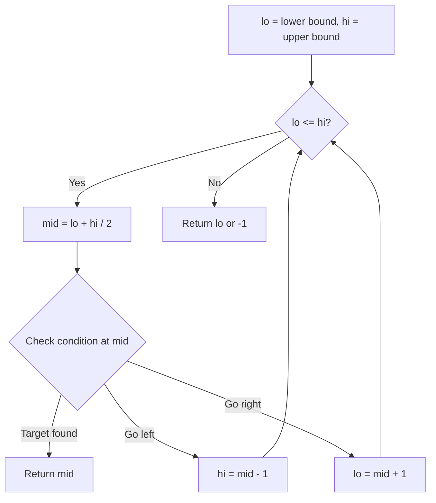
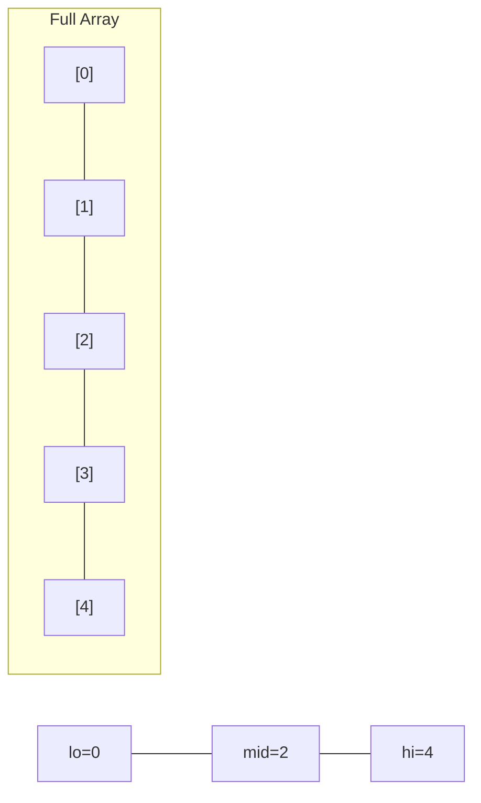
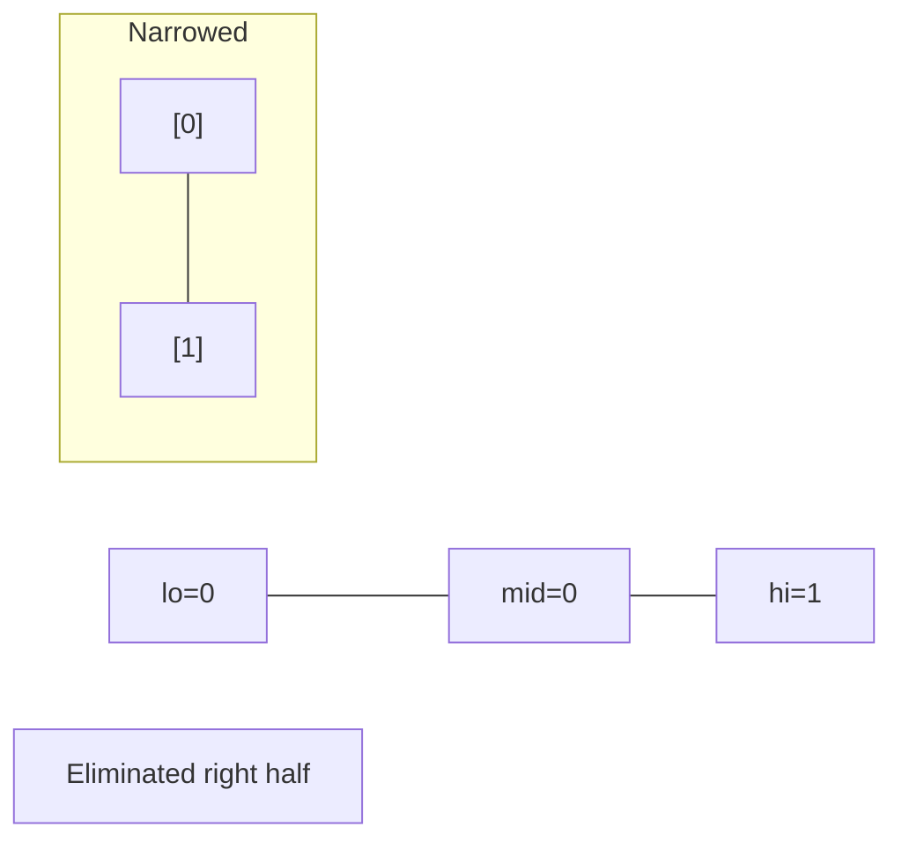
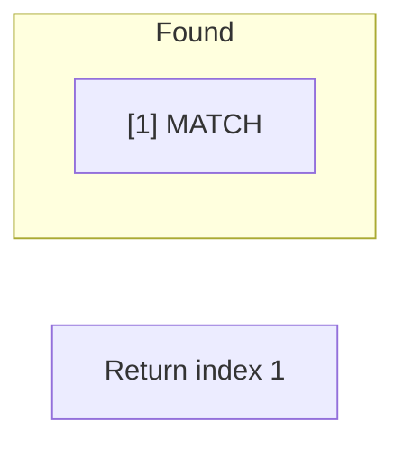

# Problem 911: Online Election

**Difficulty:** Medium  
**Tags:** Array, Hash Table, Binary Search, Design  
**Pattern:** Binary Search  
**Link:** [leetcode.com/problems/online-election](https://leetcode.com/problems/online-election/)

## Description

You are given two integer arrays `persons` and `times`. In an election, the `i^th` vote was cast for `persons[i]` at time `times[i]`.

For each query at a time `t`, find the person that was leading the election at time `t`. Votes cast at time `t` will count towards our query. In the case of a tie, the most recent vote (among tied candidates) wins.

Implement the `TopVotedCandidate` class:

	- `TopVotedCandidate(int[] persons, int[] times)` Initializes the object with the `persons` and `times` arrays.
	- `int q(int t)` Returns the number of the person that was leading the election at time `t` according to the mentioned rules.

 

Example 1:

```

**Input**
["TopVotedCandidate", "q", "q", "q", "q", "q", "q"]
[[[0, 1, 1, 0, 0, 1, 0], [0, 5, 10, 15, 20, 25, 30]], [3], [12], [25], [15], [24], [8]]
**Output**
[null, 0, 1, 1, 0, 0, 1]

**Explanation**
TopVotedCandidate topVotedCandidate = new TopVotedCandidate([0, 1, 1, 0, 0, 1, 0], [0, 5, 10, 15, 20, 25, 30]);
topVotedCandidate.q(3); // return 0, At time 3, the votes are [0], and 0 is leading.
topVotedCandidate.q(12); // return 1, At time 12, the votes are [0,1,1], and 1 is leading.
topVotedCandidate.q(25); // return 1, At time 25, the votes are [0,1,1,0,0,1], and 1 is leading (as ties go to the most recent vote.)
topVotedCandidate.q(15); // return 0
topVotedCandidate.q(24); // return 0
topVotedCandidate.q(8); // return 1

```

 

**Constraints:**

	- `1 <= persons.length <= 5000`
	- `times.length == persons.length`
	- `0 <= persons[i] < persons.length`
	- `0 <= times[i] <= 10^9`
	- `times` is sorted in a strictly increasing order.
	- `times[0] <= t <= 10^9`
	- At most `10^4` calls will be made to `q`.

## Approach: Binary Search

Use binary search to halve the search space each iteration. Define the search range [lo, hi], compute mid, and decide which half to keep based on the problem's monotonic condition.

## Pseudocode

```
1. lo = lower_bound, hi = upper_bound
2. While lo <= hi (or lo < hi):
   a. mid = (lo + hi) // 2
   b. If condition(mid) is satisfied: record answer, search left half
   c. Else: search right half
3. Return answer
```

## Algorithm Flow



## Visual State Transitions

**Binary Search Step-by-Step:**

**Frame 1: Initial search space**


**Frame 2: Compare mid, narrow search**


**Frame 3: Found target**



## Complexity Analysis

- **Time:** O(log n)
- **Space:** O(1)

## Solution (Python3)

```python
class TopVotedCandidate:
    def __init__(self, persons: List[int], times: List[int]):
        # Initialize data structure
        self.persons = persons
        self.times = times

    def q(self, t: int) -> int:
        return 0

```

## Solution (C++)

```cpp
#include <string>
#include <vector>
using namespace std;

class TopVotedCandidate {
public:
    TopVotedCandidate(vector<int>& persons, vector<int>& times) {
        // Initialize
    }

    int q(int t) {
        return 0;
    }

};
```
