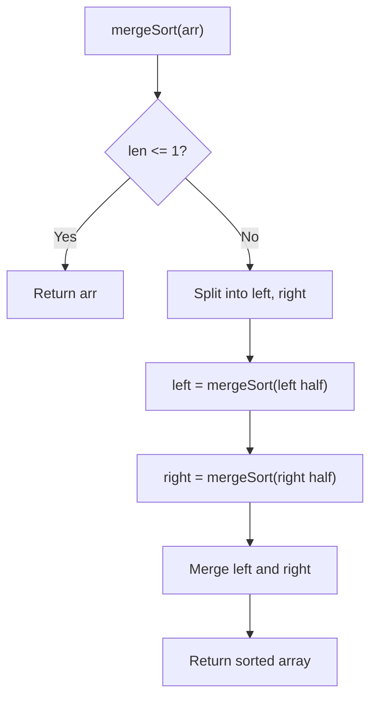

# Problem 912: Sort an Array

**Difficulty:** Medium  
**Tags:** Array, Divide and Conquer, Sorting, Heap (Priority Queue), Merge Sort, Bucket Sort, Radix Sort, Counting Sort  
**Pattern:** Merge Sort  
**Link:** [leetcode.com/problems/sort-an-array](https://leetcode.com/problems/sort-an-array/)

## Description

Given an array of integers `nums`, sort the array in ascending order and return it.

You must solve the problem **without using any built-in** functions in `O(nlog(n))` time complexity and with the smallest space complexity possible.

 

Example 1:

```

**Input:** nums = [5,2,3,1]
**Output:** [1,2,3,5]
**Explanation:** After sorting the array, the positions of some numbers are not changed (for example, 2 and 3), while the positions of other numbers are changed (for example, 1 and 5).

```

Example 2:

```

**Input:** nums = [5,1,1,2,0,0]
**Output:** [0,0,1,1,2,5]
**Explanation:** Note that the values of nums are not necessarily unique.

```

 

**Constraints:**

	- `1 <= nums.length <= 5 * 10^4`
	- `-5 * 10^4 <= nums[i] <= 5 * 10^4`

## Approach: Merge Sort

Recursively split the array into halves until single elements, then merge sorted halves. Also used to count inversions or solve order-dependent problems.

## Pseudocode

```
1. If len <= 1: return arr
2. Split into left, right halves
3. Recursively sort left and right
4. Merge: compare front elements, build sorted result
5. Return merged result
```

## Algorithm Flow



## Complexity Analysis

- **Time:** O(n log n)
- **Space:** O(n)

## Solution (Python3)

```python
class Solution:
    def sortArray(self, nums: List[int]) -> List[int]:
        # Merge sort approach - O(n log n)
        def merge_sort(arr):
            if len(arr) <= 1:
                return arr
            mid = len(arr) // 2
            left = merge_sort(arr[:mid])
            right = merge_sort(arr[mid:])
            return merge(left, right)
        
        def merge(left, right):
            result = []
            i = j = 0
            while i < len(left) and j < len(right):
                if left[i] <= right[j]:
                    result.append(left[i]); i += 1
                else:
                    result.append(right[j]); j += 1
            result.extend(left[i:])
            result.extend(right[j:])
            return result
        
        return merge_sort(nums)
```

## Solution (C++)

```cpp
#include <functional>
#include <string>
#include <vector>
using namespace std;

class Solution {
public:
    vector<int> sortArray(vector<int>& nums) {
        // Merge sort - O(n log n)
        function<void(int, int)> mergeSort = [&](int l, int r) {
            if (l >= r) return;
            int mid = (l + r) / 2;
            mergeSort(l, mid);
            mergeSort(mid + 1, r);
            vector<int> temp;
            int i = l, j = mid + 1;
            while (i <= mid && j <= r) {
                if (nums[i] <= nums[j]) temp.push_back(nums[i++]);
                else temp.push_back(nums[j++]);
            }
            while (i <= mid) temp.push_back(nums[i++]);
            while (j <= r) temp.push_back(nums[j++]);
            for (int k = l; k <= r; k++) nums[k] = temp[k - l];
        };
        mergeSort(0, nums.size() - 1);
        return nums;
    }
};
```
