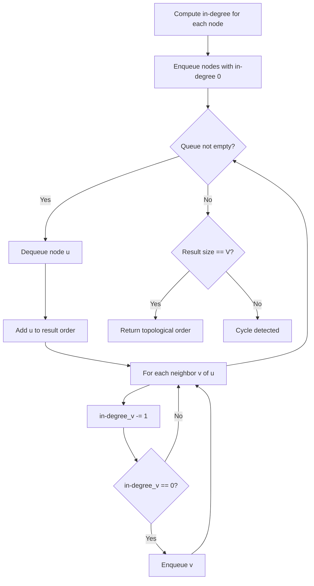
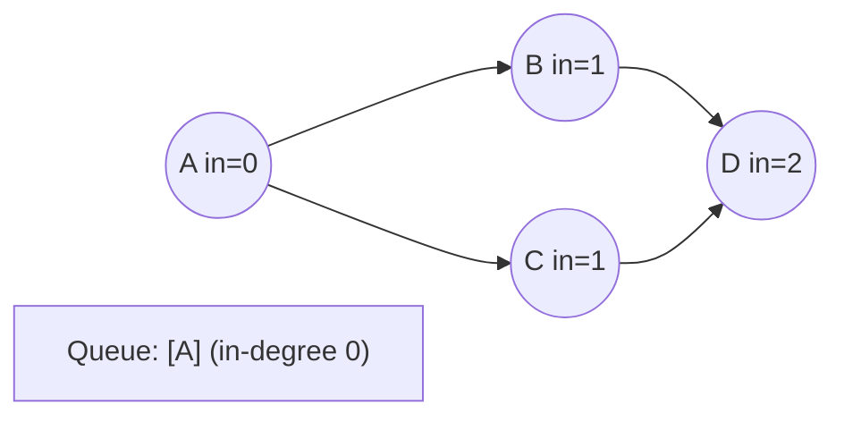
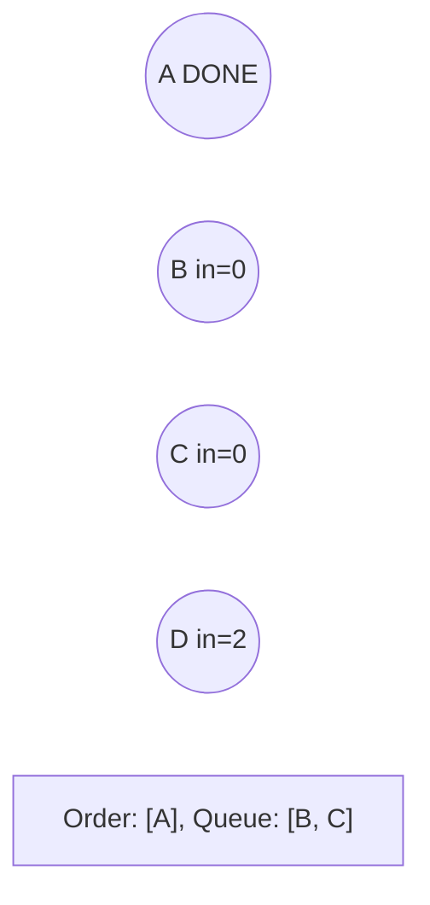
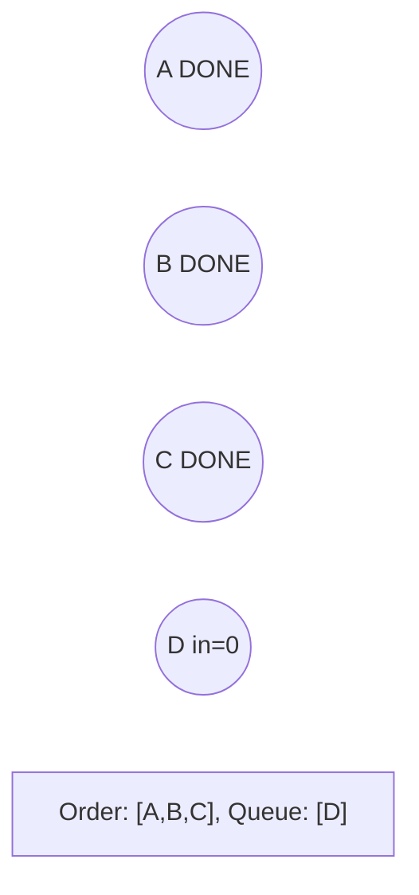
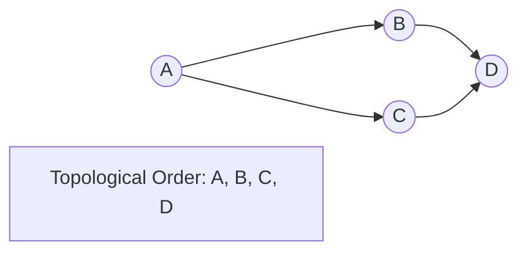

# Problem 913: Cat and Mouse

**Difficulty:** Hard  
**Tags:** Math, Dynamic Programming, Graph Theory, Topological Sort, Memoization, Game Theory  
**Pattern:** Topological Sort  
**Link:** [leetcode.com/problems/cat-and-mouse](https://leetcode.com/problems/cat-and-mouse/)

## Description

A game on an **undirected** graph is played by two players, Mouse and Cat, who alternate turns.

The graph is given as follows: `graph[a]` is a list of all nodes `b` such that `ab` is an edge of the graph.

The mouse starts at node `1` and goes first, the cat starts at node `2` and goes second, and there is a hole at node `0`.

During each player's turn, they **must** travel along one edge of the graph that meets where they are.  For example, if the Mouse is at node 1, it **must** travel to any node in `graph[1]`.

Additionally, it is not allowed for the Cat to travel to the Hole (node `0`).

Then, the game can end in three ways:

	- If ever the Cat occupies the same node as the Mouse, the Cat wins.
	- If ever the Mouse reaches the Hole, the Mouse wins.
	- If ever a position is repeated (i.e., the players are in the same position as a previous turn, and it is the same player's turn to move), the game is a draw.

Given a `graph`, and assuming both players play optimally, return

	- `1` if the mouse wins the game,
	- `2` if the cat wins the game, or
	- `0` if the game is a draw.

 

Example 1:

```

**Input:** graph = [[2,5],[3],[0,4,5],[1,4,5],[2,3],[0,2,3]]
**Output:** 0

```

Example 2:

```

**Input:** graph = [[1,3],[0],[3],[0,2]]
**Output:** 1

```

 

**Constraints:**

	- `3 <= graph.length <= 50`
	- `1 <= graph[i].length < graph.length`
	- `0 <= graph[i][j] < graph.length`
	- `graph[i][j] != i`
	- `graph[i]` is unique.
	- The mouse and the cat can always move.

## Approach: Topological Sort

Order nodes in a DAG so every edge u->v has u before v. Use Kahn's algorithm (BFS with in-degree tracking) or DFS-based ordering.

## Pseudocode

```
1. Compute in-degree for every node
2. Enqueue all nodes with in-degree 0
3. While queue not empty:
   a. Dequeue node u, add to result order
   b. For each neighbor v of u:
      - Decrease in-degree of v
      - If in-degree becomes 0: enqueue v
4. If result size != V: cycle exists
5. Return topological order
```

## Algorithm Flow



## Visual State Transitions

**Topological Sort (Kahn's Algorithm):**

**Frame 1: Compute in-degrees**


**Frame 2: Process A, reduce neighbors**


**Frame 3: Process B and C**


**Frame 4: Complete**



## Complexity Analysis

- **Time:** O(V + E)
- **Space:** O(V + E)

## Solution (Python3)

```python
class Solution:
    def catMouseGame(self, graph: List[List[int]]) -> int:
        # Topological sort (Kahn's algorithm) - O(V+E)
        from collections import deque, defaultdict
        graph = defaultdict(list)
        n = graph if isinstance(graph, int) else len(graph)
        indegree = [0] * n
        # Build graph from prerequisites
        prereqs = graph if isinstance(graph, list) else graph
        for edge in prereqs:
            if isinstance(edge, (list, tuple)) and len(edge) >= 2:
                graph[edge[1]].append(edge[0])
                indegree[edge[0]] += 1
        queue = deque([i for i in range(n) if indegree[i] == 0])
        order = []
        while queue:
            node = queue.popleft()
            order.append(node)
            for neighbor in graph[node]:
                indegree[neighbor] -= 1
                if indegree[neighbor] == 0:
                    queue.append(neighbor)
        return len(order) == n if isinstance(0, bool) else order
```

## Solution (C++)

```cpp
#include <queue>
#include <string>
#include <vector>
using namespace std;

class Solution {
public:
    int catMouseGame(vector<vector<int>>& graph) {
        // Topological sort (Kahn's) - O(V+E)
        int n = graph;
        vector<vector<int>> graph(n);
        vector<int> indegree(n, 0);
        for (auto& edge : graph) {
            graph[edge[1]].push_back(edge[0]);
            indegree[edge[0]]++;
        }
        queue<int> q;
        for (int i = 0; i < n; i++)
            if (indegree[i] == 0) q.push(i);
        vector<int> order;
        while (!q.empty()) {
            int node = q.front(); q.pop();
            order.push_back(node);
            for (int neighbor : graph[node]) {
                if (--indegree[neighbor] == 0) q.push(neighbor);
            }
        }
        return order.size() == n;
    }
};
```
