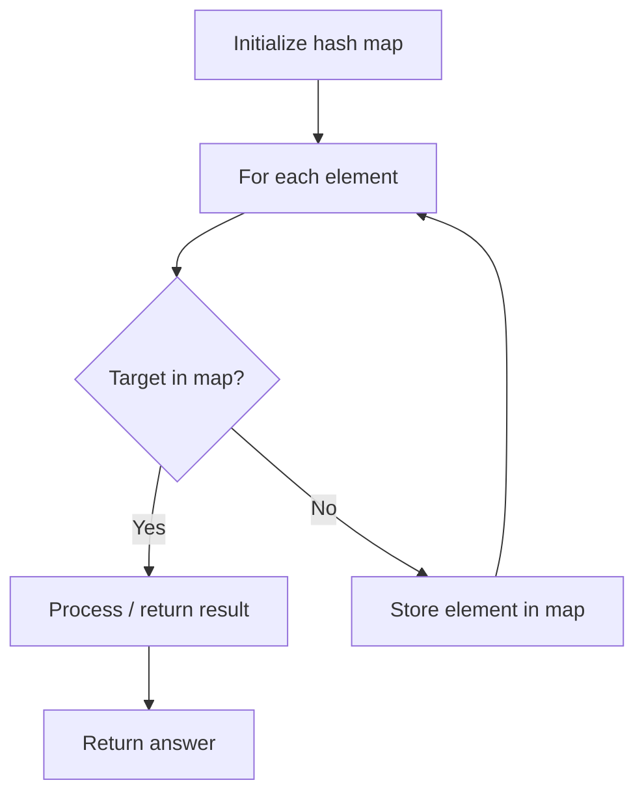

# Problem 914: X of a Kind in a Deck of Cards

**Difficulty:** Easy  
**Tags:** Array, Hash Table, Math, Counting, Number Theory  
**Pattern:** Hash Map Lookup  
**Link:** [leetcode.com/problems/x-of-a-kind-in-a-deck-of-cards](https://leetcode.com/problems/x-of-a-kind-in-a-deck-of-cards/)

## Description

You are given an integer array `deck` where `deck[i]` represents the number written on the `i^th` card.

Partition the cards into **one or more groups** such that:

	- Each group has **exactly** `x` cards where `x > 1`, and
	- All the cards in one group have the same integer written on them.

Return `true`* if such partition is possible, or *`false`* otherwise*.

 

Example 1:

```

**Input:** deck = [1,2,3,4,4,3,2,1]
**Output:** true
**Explanation**: Possible partition [1,1],[2,2],[3,3],[4,4].

```

Example 2:

```

**Input:** deck = [1,1,1,2,2,2,3,3]
**Output:** false
**Explanation**: No possible partition.

```

 

**Constraints:**

	- `1 <= deck.length <= 10^4`
	- `0 <= deck[i] < 10^4`

## Approach: Hash Map Lookup

Use a hash map (dictionary) to store elements for O(1) lookup. Iterate through the input, checking membership or counting frequencies in the map.

## Pseudocode

```
1. Initialize hash map
2. Iterate through elements:
   a. Check if target/complement exists in map
   b. If found: process result
   c. Otherwise: store element in map
3. Return result
```

## Algorithm Flow



## Complexity Analysis

- **Time:** O(n)
- **Space:** O(n)

## Solution (Python3)

```python
class Solution:
    def hasGroupsSizeX(self, deck: List[int]) -> bool:
        # Hash map approach - O(n) time, O(n) space
        seen = {}
        for i, val in enumerate(deck):
            complement = deck - val
            if complement in seen:
                return [seen[complement], i]
            seen[val] = i
        return False
```

## Solution (C++)

```cpp
#include <string>
#include <unordered_map>
#include <vector>
using namespace std;

class Solution {
public:
    bool hasGroupsSizeX(vector<int>& deck) {
        // Hash map approach - O(n) time, O(n) space
        unordered_map<int, int> seen;
        for (int i = 0; i < deck.size(); i++) {
            int complement = deck - deck[i];
            if (seen.count(complement)) {
                return {seen[complement], i};
            }
            seen[deck[i]] = i;
        }
        return false;
    }
};
```
