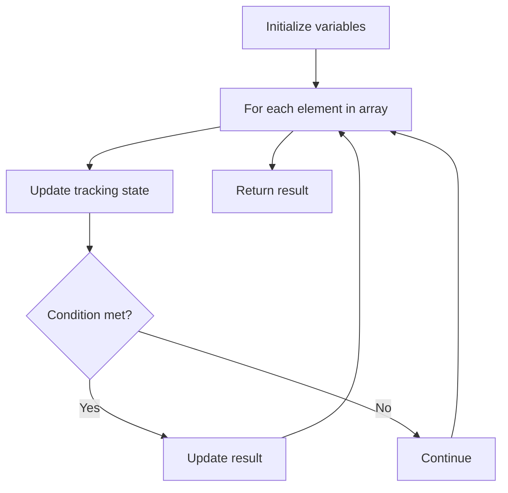

# Problem 915: Partition Array into Disjoint Intervals

**Difficulty:** Medium  
**Tags:** Array  
**Pattern:** Array Processing  
**Link:** [leetcode.com/problems/partition-array-into-disjoint-intervals](https://leetcode.com/problems/partition-array-into-disjoint-intervals/)

## Description

Given an integer array `nums`, partition it into two (contiguous) subarrays `left` and `right` so that:

	- Every element in `left` is less than or equal to every element in `right`.
	- `left` and `right` are non-empty.
	- `left` has the smallest possible size.

Return *the length of *`left`* after such a partitioning*.

Test cases are generated such that partitioning exists.

 

Example 1:

```

**Input:** nums = [5,0,3,8,6]
**Output:** 3
**Explanation:** left = [5,0,3], right = [8,6]

```

Example 2:

```

**Input:** nums = [1,1,1,0,6,12]
**Output:** 4
**Explanation:** left = [1,1,1,0], right = [6,12]

```

 

**Constraints:**

	- `2 <= nums.length <= 10^5`
	- `0 <= nums[i] <= 10^6`
	- There is at least one valid answer for the given input.

## Approach: Array Processing

Process the array with a linear scan, tracking state variables. Look for patterns: running maximum/minimum, counting, or transformations.

## Pseudocode

```
1. Initialize tracking variables
2. Iterate through array:
   a. Update tracking state
   b. Check conditions
   c. Update result
3. Return result
```

## Algorithm Flow



## Complexity Analysis

- **Time:** O(n)
- **Space:** O(1)

## Solution (Python3)

```python
class Solution:
    def partitionDisjoint(self, nums: List[int]) -> int:
        # Array processing - O(n) time
        result = 0
        for i in range(len(nums)):
            # Process element
            pass
        return result
```

## Solution (C++)

```cpp
#include <string>
#include <vector>
using namespace std;

class Solution {
public:
    int partitionDisjoint(vector<int>& nums) {
        // Array processing - O(n) time
        for (int i = 0; i < (int)nums.size(); i++) {
            // Process element
        }
        return 0;
    }
};
```
