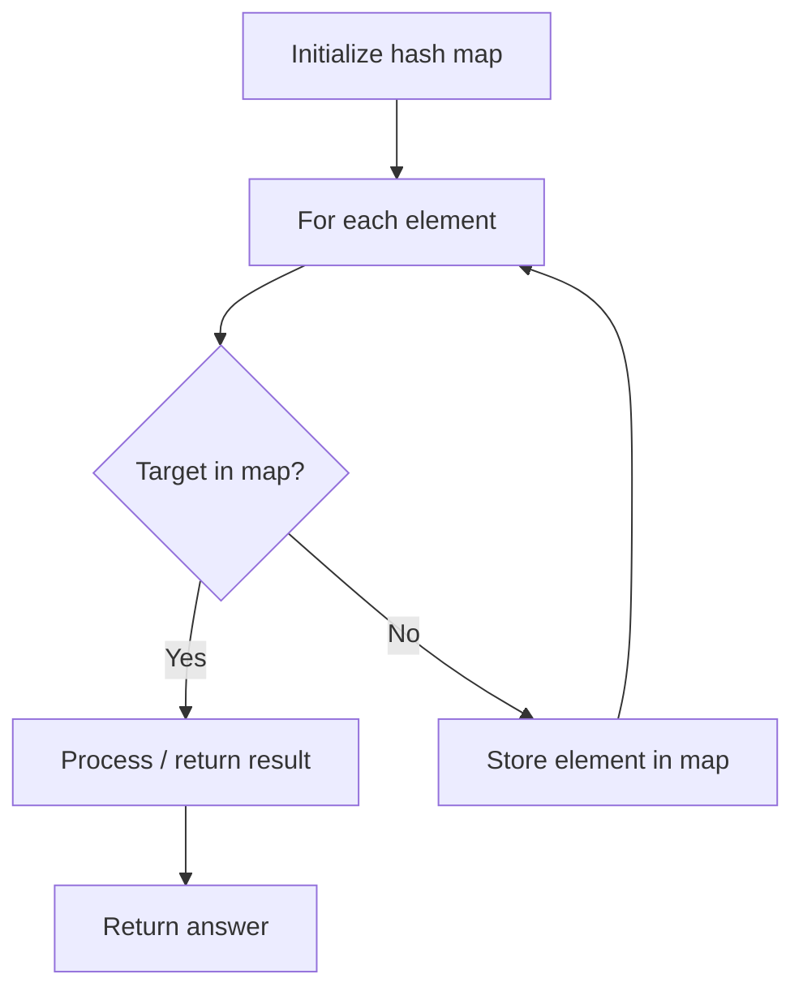

# Problem 916: Word Subsets

**Difficulty:** Medium  
**Tags:** Array, Hash Table, String  
**Pattern:** Hash Map Lookup  
**Link:** [leetcode.com/problems/word-subsets](https://leetcode.com/problems/word-subsets/)

## Description

You are given two string arrays `words1` and `words2`.

A string `b` is a **subset** of string `a` if every letter in `b` occurs in `a` including multiplicity.

	- For example, `"wrr"` is a subset of `"warrior"` but is not a subset of `"world"`.

A string `a` from `words1` is **universal** if for every string `b` in `words2`, `b` is a subset of `a`.

Return an array of all the **universal** strings in `words1`. You may return the answer in **any order**.

 

Example 1:

**Input:** words1 = ["amazon","apple","facebook","google","leetcode"], words2 = ["e","o"]

**Output:** ["facebook","google","leetcode"]

Example 2:

**Input:** words1 = ["amazon","apple","facebook","google","leetcode"], words2 = ["lc","eo"]

**Output:** ["leetcode"]

Example 3:

**Input:** words1 = ["acaac","cccbb","aacbb","caacc","bcbbb"], words2 = ["c","cc","b"]

**Output:** ["cccbb"]

 

**Constraints:**

	- `1 <= words1.length, words2.length <= 10^4`
	- `1 <= words1[i].length, words2[i].length <= 10`
	- `words1[i]` and `words2[i]` consist only of lowercase English letters.
	- All the strings of `words1` are **unique**.

## Approach: Hash Map Lookup

Use a hash map (dictionary) to store elements for O(1) lookup. Iterate through the input, checking membership or counting frequencies in the map.

## Pseudocode

```
1. Initialize hash map
2. Iterate through elements:
   a. Check if target/complement exists in map
   b. If found: process result
   c. Otherwise: store element in map
3. Return result
```

## Algorithm Flow



## Complexity Analysis

- **Time:** O(n)
- **Space:** O(n)

## Solution (Python3)

```python
class Solution:
    def wordSubsets(self, words1: List[str], words2: List[str]) -> List[str]:
        # Hash map approach - O(n) time, O(n) space
        seen = {}
        for i, val in enumerate(words1):
            complement = words2 - val
            if complement in seen:
                return [seen[complement], i]
            seen[val] = i
        return []
```

## Solution (C++)

```cpp
#include <string>
#include <unordered_map>
#include <vector>
using namespace std;

class Solution {
public:
    vector<string> wordSubsets(vector<string>& words1, vector<string>& words2) {
        // Hash map approach - O(n) time, O(n) space
        unordered_map<int, int> seen;
        for (int i = 0; i < words1.size(); i++) {
            int complement = words2 - words1[i];
            if (seen.count(complement)) {
                return {seen[complement], i};
            }
            seen[words1[i]] = i;
        }
        return {};
    }
};
```
