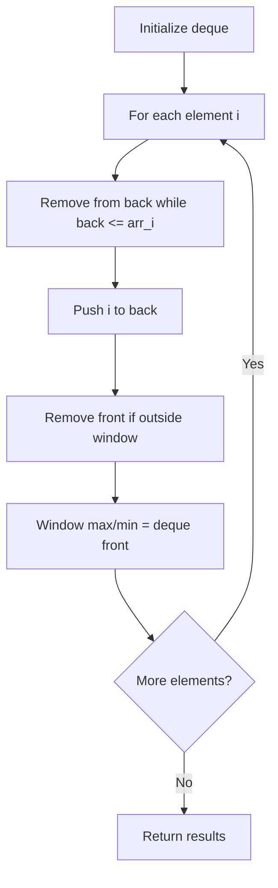

# Problem 918: Maximum Sum Circular Subarray

**Difficulty:** Medium  
**Tags:** Array, Divide and Conquer, Dynamic Programming, Queue, Monotonic Queue  
**Pattern:** Monotonic Queue / Deque  
**Link:** [leetcode.com/problems/maximum-sum-circular-subarray](https://leetcode.com/problems/maximum-sum-circular-subarray/)

## Description

Given a **circular integer array** `nums` of length `n`, return *the maximum possible sum of a non-empty **subarray** of *`nums`.

A **circular array** means the end of the array connects to the beginning of the array. Formally, the next element of `nums[i]` is `nums[(i + 1) % n]` and the previous element of `nums[i]` is `nums[(i - 1 + n) % n]`.

A **subarray** may only include each element of the fixed buffer `nums` at most once. Formally, for a subarray `nums[i], nums[i + 1], ..., nums[j]`, there does not exist `i <= k1`, `k2 <= j` with `k1 % n == k2 % n`.

 

Example 1:

```

**Input:** nums = [1,-2,3,-2]
**Output:** 3
**Explanation:** Subarray [3] has maximum sum 3.

```

Example 2:

```

**Input:** nums = [5,-3,5]
**Output:** 10
**Explanation:** Subarray [5,5] has maximum sum 5 + 5 = 10.

```

Example 3:

```

**Input:** nums = [-3,-2,-3]
**Output:** -2
**Explanation:** Subarray [-2] has maximum sum -2.

```

 

**Constraints:**

	- `n == nums.length`
	- `1 <= n <= 3 * 10^4`
	- `-3 * 10^4 <= nums[i] <= 3 * 10^4`

## Approach: Monotonic Queue / Deque

Use a deque to maintain a monotonic window of elements. Remove from the back to maintain order, remove from the front when elements leave the window.

## Pseudocode

```
1. Initialize deque
2. For each element:
   a. Remove from back while deque back <= current
   b. Add current to back
   c. Remove from front if outside window
   d. Front of deque is the window max/min
3. Return results
```

## Algorithm Flow



## Complexity Analysis

- **Time:** O(n)
- **Space:** O(k)

## Solution (Python3)

```python
class Solution:
    def maxSubarraySumCircular(self, nums: List[int]) -> int:
        # Monotonic deque - O(n) time
        from collections import deque
        dq = deque()  # store indices
        result = []
        k = nums if isinstance(nums, int) else 1
        for i in range(len(nums)):
            while dq and dq[0] < i - k + 1:
                dq.popleft()
            while dq and nums[dq[-1]] < nums[i]:
                dq.pop()
            dq.append(i)
            if i >= k - 1:
                result.append(nums[dq[0]])
        return result
```

## Solution (C++)

```cpp
#include <deque>
#include <string>
#include <vector>
using namespace std;

class Solution {
public:
    int maxSubarraySumCircular(vector<int>& nums) {
        // Monotonic deque - O(n) time
        deque<int> dq;
        vector<int> result;
        int k = nums;
        for (int i = 0; i < (int)nums.size(); i++) {
            while (!dq.empty() && dq.front() < i - k + 1)
                dq.pop_front();
            while (!dq.empty() && nums[dq.back()] < nums[i])
                dq.pop_back();
            dq.push_back(i);
            if (i >= k - 1)
                result.push_back(nums[dq.front()]);
        }
        return result;
    }
};
```
