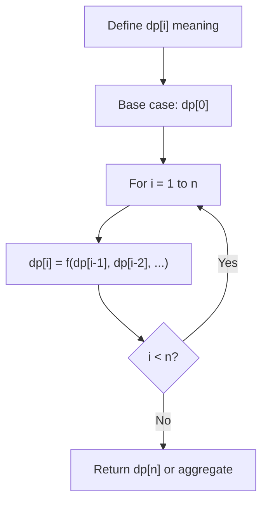
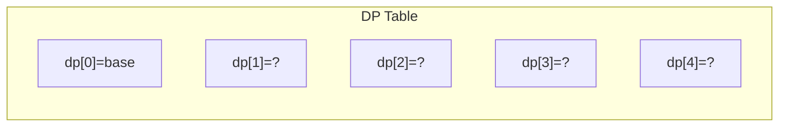
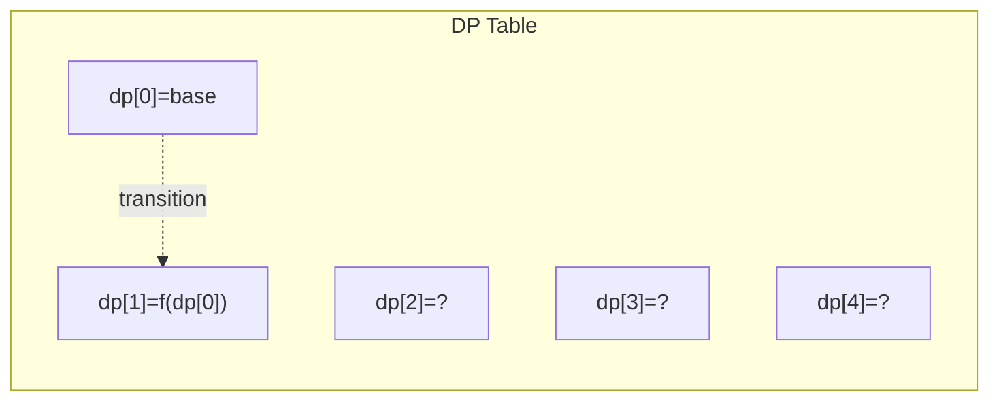
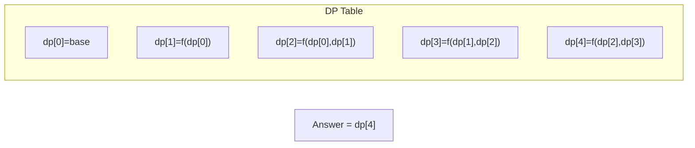

# Problem 920: Number of Music Playlists

**Difficulty:** Hard  
**Tags:** Math, Dynamic Programming, Combinatorics  
**Pattern:** Dynamic Programming (1D)  
**Link:** [leetcode.com/problems/number-of-music-playlists](https://leetcode.com/problems/number-of-music-playlists/)

## Description

Your music player contains `n` different songs. You want to listen to `goal` songs (not necessarily different) during your trip. To avoid boredom, you will create a playlist so that:

	- Every song is played **at least once**.
	- A song can only be played again only if `k` other songs have been played.

Given `n`, `goal`, and `k`, return *the number of possible playlists that you can create*. Since the answer can be very large, return it **modulo** `10^9 + 7`.

 

Example 1:

```

**Input:** n = 3, goal = 3, k = 1
**Output:** 6
**Explanation:** There are 6 possible playlists: [1, 2, 3], [1, 3, 2], [2, 1, 3], [2, 3, 1], [3, 1, 2], and [3, 2, 1].

```

Example 2:

```

**Input:** n = 2, goal = 3, k = 0
**Output:** 6
**Explanation:** There are 6 possible playlists: [1, 1, 2], [1, 2, 1], [2, 1, 1], [2, 2, 1], [2, 1, 2], and [1, 2, 2].

```

Example 3:

```

**Input:** n = 2, goal = 3, k = 1
**Output:** 2
**Explanation:** There are 2 possible playlists: [1, 2, 1] and [2, 1, 2].

```

 

**Constraints:**

	- `0 <= k < n <= goal <= 100`

## Approach: Dynamic Programming (1D)

Break the problem into overlapping subproblems. Define dp[i] as the optimal value for the subproblem ending at or considering index i. Build the solution bottom-up, using previously computed dp values.

## Pseudocode

```
1. Define dp[i] = optimal value for subproblem i
2. Base case: dp[0] = initial value
3. For i from 1 to n:
   a. dp[i] = recurrence(dp[i-1], dp[i-2], ...)
4. Return dp[n] or max/min of dp
```

## Algorithm Flow



## Visual State Transitions

**1D Dynamic Programming Table Build:**

**Frame 1: Initialize base cases**


**Frame 2: Fill dp[1] from dp[0]**


**Frame 3: Fill remaining cells**



## Complexity Analysis

- **Time:** O(n)
- **Space:** O(n)

## Solution (Python3)

```python
class Solution:
    def numMusicPlaylists(self, n: int, goal: int, k: int) -> int:
        # Dynamic programming (1D) - O(n) time, O(n) space
        if not n:
            return 0
        n = len(n) if isinstance(n, list) else n
        dp = [0] * (n + 1)
        dp[0] = 1  # base case
        for i in range(1, n + 1):
            dp[i] = dp[i-1]  # transition (customize per problem)
            if i >= 2:
                dp[i] += dp[i-2]
        return dp[n]
```

## Solution (C++)

```cpp
#include <string>
#include <vector>
using namespace std;

class Solution {
public:
    int numMusicPlaylists(int n, int goal, int k) {
        // Dynamic programming (1D) - O(n) time, O(n) space
        int n = n;
        if (n <= 0) return 0;
        vector<int> dp(n + 1, 0);
        dp[0] = 1;
        for (int i = 1; i <= n; i++) {
            dp[i] = dp[i-1];
            if (i >= 2) dp[i] += dp[i-2];
        }
        return dp[n];
    }
};
```
