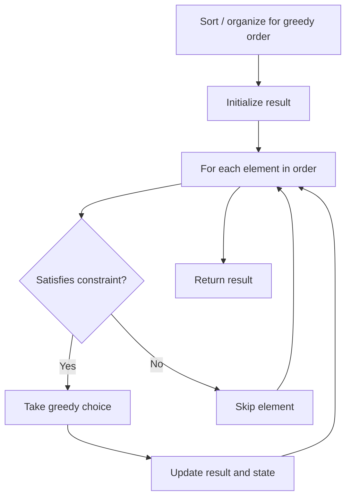

# Problem 921: Minimum Add to Make Parentheses Valid

**Difficulty:** Medium  
**Tags:** String, Stack, Greedy  
**Pattern:** Greedy  
**Link:** [leetcode.com/problems/minimum-add-to-make-parentheses-valid](https://leetcode.com/problems/minimum-add-to-make-parentheses-valid/)

## Description

A parentheses string is valid if and only if:

	- It is the empty string,
	- It can be written as `AB` (`A` concatenated with `B`), where `A` and `B` are valid strings, or
	- It can be written as `(A)`, where `A` is a valid string.

You are given a parentheses string `s`. In one move, you can insert a parenthesis at any position of the string.

	- For example, if `s = "()))"`, you can insert an opening parenthesis to be `"(**(**)))"` or a closing parenthesis to be `"())**)**)"`.

Return *the minimum number of moves required to make *`s`* valid*.

 

Example 1:

```

**Input:** s = "())"
**Output:** 1

```

Example 2:

```

**Input:** s = "((("
**Output:** 3

```

 

**Constraints:**

	- `1 <= s.length <= 1000`
	- `s[i]` is either `'('` or `')'`.

## Approach: Greedy

Make the locally optimal choice at each step, trusting it leads to a global optimum. Greedy works when the problem has the greedy-choice property and optimal substructure.

## Pseudocode

```
1. Sort or organize data for greedy ordering
2. Initialize result
3. For each element in greedy order:
   a. If element satisfies constraint:
      - Take the greedy choice
      - Update result and state
4. Return result
```

## Algorithm Flow



## Complexity Analysis

- **Time:** O(n log n)
- **Space:** O(1)

## Solution (Python3)

```python
class Solution:
    def minAddToMakeValid(self, s: str) -> int:
        # Greedy approach - O(n) time
        result = 0
        curr_max = 0
        for i in range(len(s)):
            if isinstance(s[i], int):
                curr_max = max(curr_max, s[i])
                result = max(result, curr_max)
            else:
                result += 1
        return result
```

## Solution (C++)

```cpp
#include <algorithm>
#include <string>
#include <vector>
using namespace std;

class Solution {
public:
    int minAddToMakeValid(string& s) {
        // Greedy approach - O(n) time
        int result = 0, curr_max = 0;
        for (int i = 0; i < (int)s.size(); i++) {
            curr_max = max(curr_max, s[i]);
            result = max(result, curr_max);
        }
        return result;
    }
};
```
