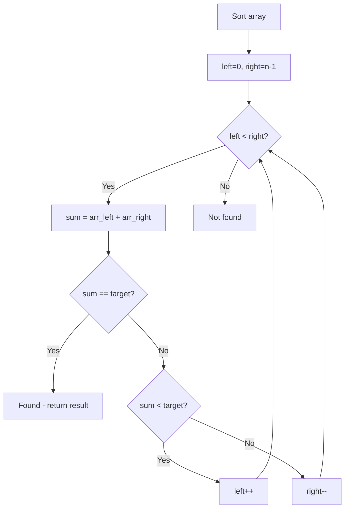

# Problem 922: Sort Array By Parity II

**Difficulty:** Easy  
**Tags:** Array, Two Pointers, Sorting  
**Pattern:** Two Pointers on Sorted Array  
**Link:** [leetcode.com/problems/sort-array-by-parity-ii](https://leetcode.com/problems/sort-array-by-parity-ii/)

## Description

Given an array of integers `nums`, half of the integers in `nums` are **odd**, and the other half are **even**.

Sort the array so that whenever `nums[i]` is odd, `i` is **odd**, and whenever `nums[i]` is even, `i` is **even**.

Return *any answer array that satisfies this condition*.

 

Example 1:

```

**Input:** nums = [4,2,5,7]
**Output:** [4,5,2,7]
**Explanation:** [4,7,2,5], [2,5,4,7], [2,7,4,5] would also have been accepted.

```

Example 2:

```

**Input:** nums = [2,3]
**Output:** [2,3]

```

 

**Constraints:**

	- `2 <= nums.length <= 2 * 10^4`
	- `nums.length` is even.
	- Half of the integers in `nums` are even.
	- `0 <= nums[i] <= 1000`

 

**Follow Up:** Could you solve it in-place?

## Approach: Two Pointers on Sorted Array

Sort the array first, then use two pointers converging from both ends. Move the left pointer right to increase the sum, or the right pointer left to decrease it.

## Pseudocode

```
1. Sort the array
2. left = 0, right = n-1
3. While left < right:
   a. Compute current = arr[left] + arr[right]
   b. If current == target: found
   c. If current < target: left++
   d. If current > target: right--
4. Return result
```

## Algorithm Flow



## Complexity Analysis

- **Time:** O(n log n)
- **Space:** O(1)

## Solution (Python3)

```python
class Solution:
    def sortArrayByParityII(self, nums: List[int]) -> List[int]:
        # Sort + two pointers - O(n log n) time
        nums.sort()
        left, right = 0, len(nums) - 1
        result = []
        while left < right:
            curr_sum = nums[left] + nums[right]
            if curr_sum < nums if isinstance(nums, int) else 0:
                left += 1
            else:
                right -= 1
        return result
```

## Solution (C++)

```cpp
#include <algorithm>
#include <string>
#include <vector>
using namespace std;

class Solution {
public:
    vector<int> sortArrayByParityII(vector<int>& nums) {
        // Sort + two pointers - O(n log n) time
        sort(nums.begin(), nums.end());
        int left = 0, right = nums.size() - 1;
        while (left < right) {
            int curr = nums[left] + nums[right];
            if (curr < nums) {
                left++;
            } else {
                right--;
            }
        }
        return {};
    }
};
```
