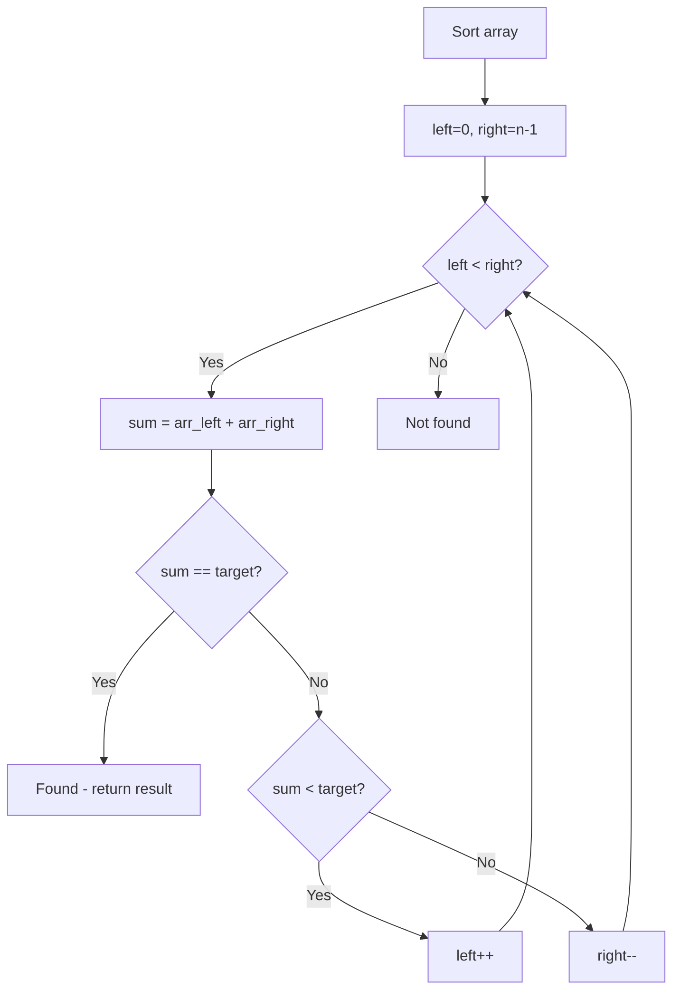

# Problem 923: 3Sum With Multiplicity

**Difficulty:** Medium  
**Tags:** Array, Hash Table, Two Pointers, Sorting, Counting  
**Pattern:** Two Pointers on Sorted Array  
**Link:** [leetcode.com/problems/3sum-with-multiplicity](https://leetcode.com/problems/3sum-with-multiplicity/)

## Description

Given an integer array `arr`, and an integer `target`, return the number of tuples `i, j, k` such that `i < j < k` and `arr[i] + arr[j] + arr[k] == target`.

As the answer can be very large, return it **modulo** `10^9 + 7`.

 

Example 1:

```

**Input:** arr = [1,1,2,2,3,3,4,4,5,5], target = 8
**Output:** 20
**Explanation: **
Enumerating by the values (arr[i], arr[j], arr[k]):
(1, 2, 5) occurs 8 times;
(1, 3, 4) occurs 8 times;
(2, 2, 4) occurs 2 times;
(2, 3, 3) occurs 2 times.

```

Example 2:

```

**Input:** arr = [1,1,2,2,2,2], target = 5
**Output:** 12
**Explanation: **
arr[i] = 1, arr[j] = arr[k] = 2 occurs 12 times:
We choose one 1 from [1,1] in 2 ways,
and two 2s from [2,2,2,2] in 6 ways.

```

Example 3:

```

**Input:** arr = [2,1,3], target = 6
**Output:** 1
**Explanation:** (1, 2, 3) occured one time in the array so we return 1.

```

 

**Constraints:**

	- `3 <= arr.length <= 3000`
	- `0 <= arr[i] <= 100`
	- `0 <= target <= 300`

## Approach: Two Pointers on Sorted Array

Sort the array first, then use two pointers converging from both ends. Move the left pointer right to increase the sum, or the right pointer left to decrease it.

## Pseudocode

```
1. Sort the array
2. left = 0, right = n-1
3. While left < right:
   a. Compute current = arr[left] + arr[right]
   b. If current == target: found
   c. If current < target: left++
   d. If current > target: right--
4. Return result
```

## Algorithm Flow



## Complexity Analysis

- **Time:** O(n log n)
- **Space:** O(1)

## Solution (Python3)

```python
class Solution:
    def threeSumMulti(self, arr: List[int], target: int) -> int:
        # Sort + two pointers - O(n log n) time
        arr.sort()
        left, right = 0, len(arr) - 1
        result = 0
        while left < right:
            curr_sum = arr[left] + arr[right]
            if curr_sum < target if isinstance(target, int) else 0:
                left += 1
            else:
                right -= 1
        return result
```

## Solution (C++)

```cpp
#include <algorithm>
#include <string>
#include <vector>
using namespace std;

class Solution {
public:
    int threeSumMulti(vector<int>& arr, int target) {
        // Sort + two pointers - O(n log n) time
        sort(arr.begin(), arr.end());
        int left = 0, right = arr.size() - 1;
        while (left < right) {
            int curr = arr[left] + arr[right];
            if (curr < target) {
                left++;
            } else {
                right--;
            }
        }
        return 0;
    }
};
```
