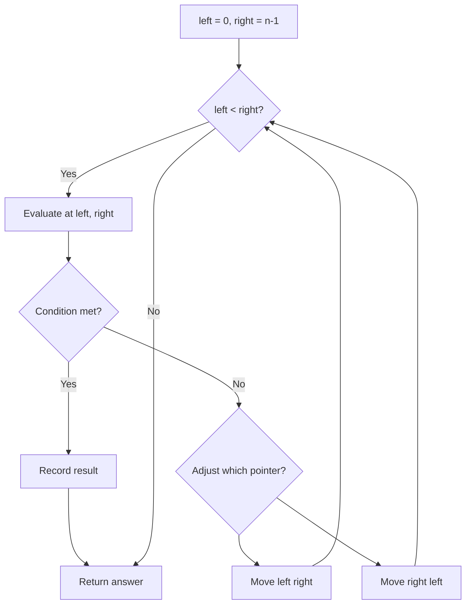
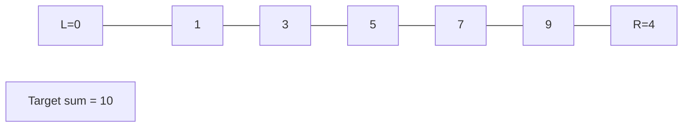
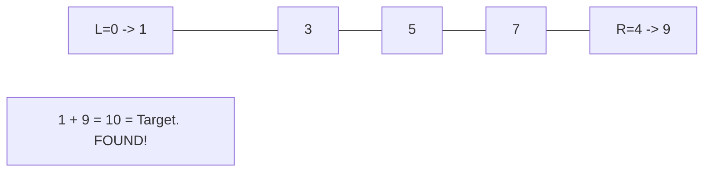

# Problem 925: Long Pressed Name

**Difficulty:** Easy  
**Tags:** Two Pointers, String  
**Pattern:** Two Pointers  
**Link:** [leetcode.com/problems/long-pressed-name](https://leetcode.com/problems/long-pressed-name/)

## Description

Your friend is typing his `name` into a keyboard. Sometimes, when typing a character `c`, the key might get *long pressed*, and the character will be typed 1 or more times.

You examine the `typed` characters of the keyboard. Return `True` if it is possible that it was your friends name, with some characters (possibly none) being long pressed.

 

Example 1:

```

**Input:** name = "alex", typed = "aaleex"
**Output:** true
**Explanation: **'a' and 'e' in 'alex' were long pressed.

```

Example 2:

```

**Input:** name = "saeed", typed = "ssaaedd"
**Output:** false
**Explanation: **'e' must have been pressed twice, but it was not in the typed output.

```

 

**Constraints:**

	- `1 <= name.length, typed.length <= 1000`
	- `name` and `typed` consist of only lowercase English letters.

## Approach: Two Pointers

Use two pointers moving through the data structure. Depending on the problem, pointers may move toward each other (converging), in the same direction (fast/slow), or independently.

## Pseudocode

```
1. Initialize left = 0, right = n-1 (or two independent pointers)
2. While pointers haven't crossed:
   a. Evaluate condition at pointer positions
   b. Move left pointer right or right pointer left
3. Return result
```

## Algorithm Flow



## Visual State Transitions

**Two Pointer Convergence:**

**Frame 1: Initialize pointers**


**Frame 2: Sum = 1+9 = 10, found!**



## Complexity Analysis

- **Time:** O(n)
- **Space:** O(1)

## Solution (Python3)

```python
class Solution:
    def isLongPressedName(self, name: str, typed: str) -> bool:
        # Two pointer approach - O(n) time, O(1) space
        left, right = 0, len(name) - 1
        while left < right:
            curr = name[left] + name[right]
            if curr == typed:
                return [left, right]
            elif curr < typed:
                left += 1
            else:
                right -= 1
        return False
```

## Solution (C++)

```cpp
#include <string>
#include <vector>
using namespace std;

class Solution {
public:
    bool isLongPressedName(string& name, string& typed) {
        // Two pointer approach - O(n) time, O(1) space
        int left = 0, right = name.size() - 1;
        while (left < right) {
            int curr = name[left] + name[right];
            if (curr == typed) {
                return {left, right};
            } else if (curr < typed) {
                left++;
            } else {
                right--;
            }
        }
        return false;
    }
};
```
