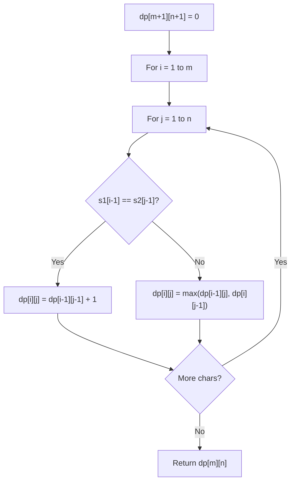

# Problem 926: Flip String to Monotone Increasing

**Difficulty:** Medium  
**Tags:** String, Dynamic Programming  
**Pattern:** Dynamic Programming (String)  
**Link:** [leetcode.com/problems/flip-string-to-monotone-increasing](https://leetcode.com/problems/flip-string-to-monotone-increasing/)

## Description

A binary string is monotone increasing if it consists of some number of `0`'s (possibly none), followed by some number of `1`'s (also possibly none).

You are given a binary string `s`. You can flip `s[i]` changing it from `0` to `1` or from `1` to `0`.

Return *the minimum number of flips to make *`s`* monotone increasing*.

 

Example 1:

```

**Input:** s = "00110"
**Output:** 1
**Explanation:** We flip the last digit to get 00111.

```

Example 2:

```

**Input:** s = "010110"
**Output:** 2
**Explanation:** We flip to get 011111, or alternatively 000111.

```

Example 3:

```

**Input:** s = "00011000"
**Output:** 2
**Explanation:** We flip to get 00000000.

```

 

**Constraints:**

	- `1 <= s.length <= 10^5`
	- `s[i]` is either `'0'` or `'1'`.

## Approach: Dynamic Programming (String)

Compare or match two strings using a 2D DP table. dp[i][j] represents the answer for substrings s1[0..i-1] and s2[0..j-1]. Common patterns: LCS, edit distance, regex matching.

## Pseudocode

```
1. Create dp[m+1][n+1]
2. Initialize base cases
3. For i from 1 to m:
   For j from 1 to n:
     If s1[i-1] == s2[j-1]: dp[i][j] = dp[i-1][j-1] + 1
     Else: dp[i][j] = best of (dp[i-1][j], dp[i][j-1], dp[i-1][j-1])
4. Return dp[m][n]
```

## Algorithm Flow



## Complexity Analysis

- **Time:** O(m * n)
- **Space:** O(m * n)

## Solution (Python3)

```python
class Solution:
    def minFlipsMonoIncr(self, s: str) -> int:
        # String DP - O(m*n) time and space
        m, n = len(s), len(s)
        dp = [[0] * (n + 1) for _ in range(m + 1)]
        for i in range(1, m + 1):
            for j in range(1, n + 1):
                if s[i-1] == s[j-1]:
                    dp[i][j] = dp[i-1][j-1] + 1
                else:
                    dp[i][j] = max(dp[i-1][j], dp[i][j-1])
        return dp[m][n]
```

## Solution (C++)

```cpp
#include <algorithm>
#include <string>
#include <vector>
using namespace std;

class Solution {
public:
    int minFlipsMonoIncr(string& s) {
        // String DP - O(m*n) time and space
        int m = s.size(), n = s.size();
        vector<vector<int>> dp(m + 1, vector<int>(n + 1, 0));
        for (int i = 1; i <= m; i++) {
            for (int j = 1; j <= n; j++) {
                if (s[i-1] == s[j-1])
                    dp[i][j] = dp[i-1][j-1] + 1;
                else
                    dp[i][j] = max(dp[i-1][j], dp[i][j-1]);
            }
        }
        return dp[m][n];
    }
};
```
