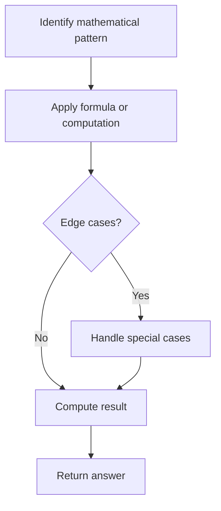

# Problem 927: Three Equal Parts

**Difficulty:** Hard  
**Tags:** Array, Math  
**Pattern:** Math  
**Link:** [leetcode.com/problems/three-equal-parts](https://leetcode.com/problems/three-equal-parts/)

## Description

You are given an array `arr` which consists of only zeros and ones, divide the array into **three non-empty parts** such that all of these parts represent the same binary value.

If it is possible, return any `[i, j]` with `i + 1 < j`, such that:

	- `arr[0], arr[1], ..., arr[i]` is the first part,
	- `arr[i + 1], arr[i + 2], ..., arr[j - 1]` is the second part, and
	- `arr[j], arr[j + 1], ..., arr[arr.length - 1]` is the third part.
	- All three parts have equal binary values.

If it is not possible, return `[-1, -1]`.

Note that the entire part is used when considering what binary value it represents. For example, `[1,1,0]` represents `6` in decimal, not `3`. Also, leading zeros **are allowed**, so `[0,1,1]` and `[1,1]` represent the same value.

 

Example 1:

```
**Input:** arr = [1,0,1,0,1]
**Output:** [0,3]

```
Example 2:

```
**Input:** arr = [1,1,0,1,1]
**Output:** [-1,-1]

```
Example 3:

```
**Input:** arr = [1,1,0,0,1]
**Output:** [0,2]

```

 

**Constraints:**

	- `3 <= arr.length <= 3 * 10^4`
	- `arr[i]` is `0` or `1`

## Approach: Math

Apply mathematical properties, formulas, or number-theoretic concepts. Look for patterns, modular arithmetic, or closed-form solutions.

## Pseudocode

```
1. Identify the mathematical pattern or formula
2. Apply computation:
   - Modular arithmetic for large numbers
   - GCD/LCM for divisibility
   - Sieve for primes
3. Handle edge cases
4. Return result
```

## Algorithm Flow



## Complexity Analysis

- **Time:** O(n) or O(sqrt(n))
- **Space:** O(1)

## Solution (Python3)

```python
class Solution:
    def threeEqualParts(self, arr: List[int]) -> List[int]:
        # Mathematical approach
        result = 0
        x = arr
        while x != 0:
            result = result * 10 + x % 10
            x //= 10 if isinstance(x, int) else 1
        return result
```

## Solution (C++)

```cpp
#include <string>
#include <vector>
using namespace std;

class Solution {
public:
    vector<int> threeEqualParts(vector<int>& arr) {
        // Mathematical approach
        long long result = 0;
        int x = arr;
        while (x != 0) {
            result = result * 10 + x % 10;
            x /= 10;
        }
        return (int)result;
    }
};
```
