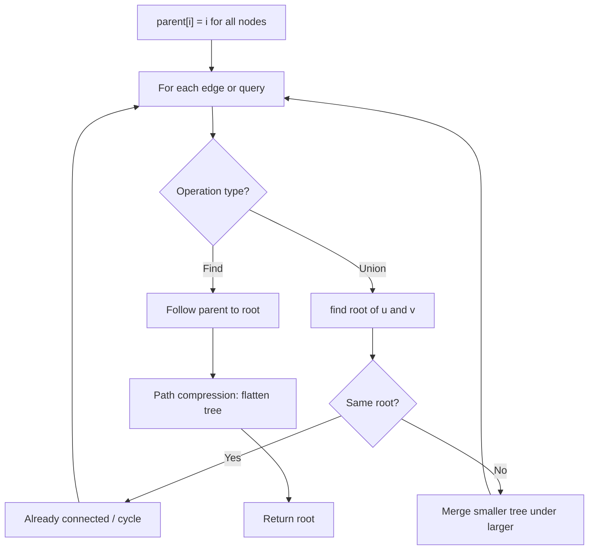
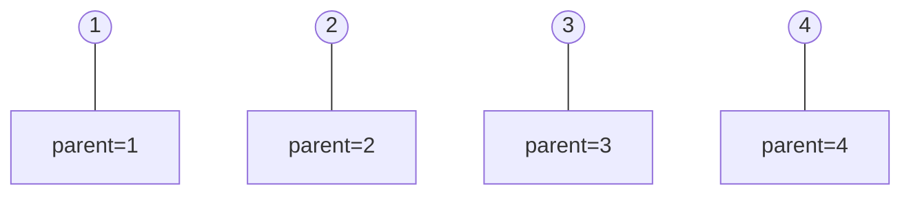
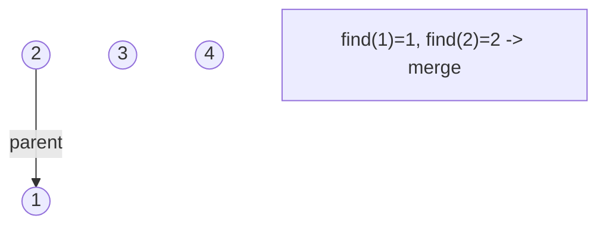
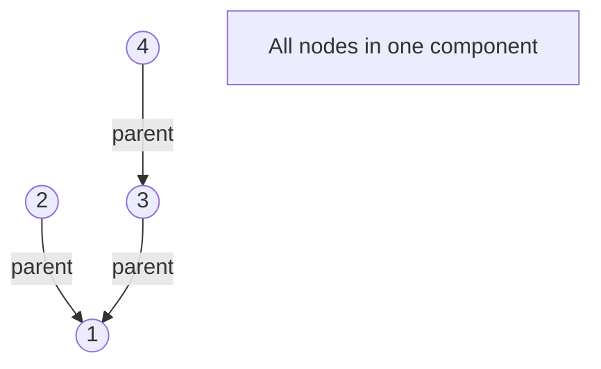
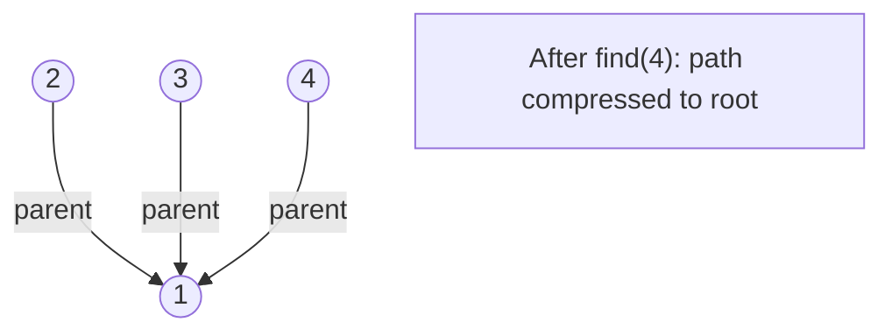

# Problem 928: Minimize Malware Spread II

**Difficulty:** Hard  
**Tags:** Array, Hash Table, Depth-First Search, Breadth-First Search, Union-Find, Graph Theory  
**Pattern:** Union-Find / Disjoint Set  
**Link:** [leetcode.com/problems/minimize-malware-spread-ii](https://leetcode.com/problems/minimize-malware-spread-ii/)

## Description

You are given a network of `n` nodes represented as an `n x n` adjacency matrix `graph`, where the `i^th` node is directly connected to the `j^th` node if `graph[i][j] == 1`.

Some nodes `initial` are initially infected by malware. Whenever two nodes are directly connected, and at least one of those two nodes is infected by malware, both nodes will be infected by malware. This spread of malware will continue until no more nodes can be infected in this manner.

Suppose `M(initial)` is the final number of nodes infected with malware in the entire network after the spread of malware stops.

We will remove **exactly one node** from `initial`, **completely removing it and any connections from this node to any other node**.

Return the node that, if removed, would minimize `M(initial)`. If multiple nodes could be removed to minimize `M(initial)`, return such a node with **the smallest index**.

 

Example 1:

```
**Input:** graph = [[1,1,0],[1,1,0],[0,0,1]], initial = [0,1]
**Output:** 0

```
Example 2:

```
**Input:** graph = [[1,1,0],[1,1,1],[0,1,1]], initial = [0,1]
**Output:** 1

```
Example 3:

```
**Input:** graph = [[1,1,0,0],[1,1,1,0],[0,1,1,1],[0,0,1,1]], initial = [0,1]
**Output:** 1

```

 

**Constraints:**

	- `n == graph.length`
	- `n == graph[i].length`
	- `2 <= n <= 300`
	- `graph[i][j]` is `0` or `1`.
	- `graph[i][j] == graph[j][i]`
	- `graph[i][i] == 1`
	- `1 <= initial.length < n`
	- `0 <= initial[i] <= n - 1`
	- All the integers in `initial` are **unique**.

## Approach: Union-Find / Disjoint Set

Use Union-Find with path compression and union by rank to efficiently manage connected components. Find(x) returns the root of x's component; Union(x,y) merges two components.

## Pseudocode

```
1. parent[i] = i for all nodes (each is its own set)
2. find(x): follow parent pointers to root (with path compression)
3. union(x, y): merge sets of x and y by rank
4. Process edges/operations:
   a. For each edge (u, v): union(u, v)
5. Answer queries using find()
```

## Algorithm Flow



## Visual State Transitions

**Union-Find Step-by-Step:**

**Frame 1: Initial - each node is own parent**


**Frame 2: Union(1,2) - merge components**


**Frame 3: Union(3,4) then Union(2,3)**


**Frame 4: Path compression on find(4)**



## Complexity Analysis

- **Time:** O(n * alpha(n))
- **Space:** O(n)

## Solution (Python3)

```python
class Solution:
    def minMalwareSpread(self, graph: List[List[int]], initial: List[int]) -> int:
        # Union Find (Disjoint Set Union) - O(n * alpha(n))
        parent = list(range(len(graph) + 1 if isinstance(graph, list) else graph + 1))
        rank = [0] * len(parent)
        
        def find(x):
            if parent[x] != x:
                parent[x] = find(parent[x])
            return parent[x]
        
        def union(x, y):
            px, py = find(x), find(y)
            if px == py:
                return False
            if rank[px] < rank[py]:
                px, py = py, px
            parent[py] = px
            if rank[px] == rank[py]:
                rank[px] += 1
            return True
        
        components = len(parent)
        # Process edges/connections
        return components
```

## Solution (C++)

```cpp
#include <functional>
#include <numeric>
#include <string>
#include <vector>
using namespace std;

class Solution {
public:
    int minMalwareSpread(vector<vector<int>>& graph, vector<int>& initial) {
        // Union Find (DSU) - O(n * alpha(n))
        int n = graph.size();
        vector<int> parent(n + 1), rnk(n + 1, 0);
        iota(parent.begin(), parent.end(), 0);
        function<int(int)> find = [&](int x) -> int {
            return parent[x] == x ? x : parent[x] = find(parent[x]);
        };
        auto unite = [&](int x, int y) -> bool {
            int px = find(x), py = find(y);
            if (px == py) return false;
            if (rnk[px] < rnk[py]) swap(px, py);
            parent[py] = px;
            if (rnk[px] == rnk[py]) rnk[px]++;
            return true;
        };
        int components = n;
        return components;
    }
};
```
