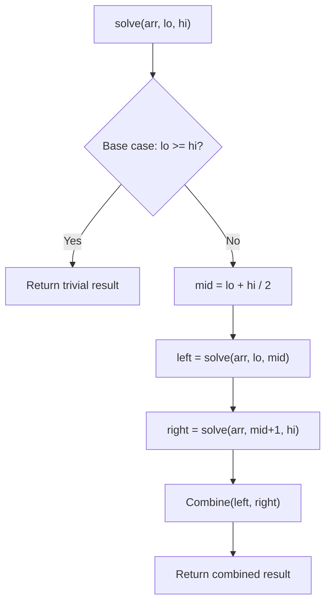

# Problem 932: Beautiful Array

**Difficulty:** Medium  
**Tags:** Array, Math, Divide and Conquer  
**Pattern:** Divide and Conquer  
**Link:** [leetcode.com/problems/beautiful-array](https://leetcode.com/problems/beautiful-array/)

## Description

An array `nums` of length `n` is **beautiful** if:

	- `nums` is a permutation of the integers in the range `[1, n]`.
	- For every `0 <= i < j < n`, there is no index `k` with `i < k < j` where `2 * nums[k] == nums[i] + nums[j]`.

Given the integer `n`, return *any **beautiful** array *`nums`* of length *`n`. There will be at least one valid answer for the given `n`.

 

Example 1:

```
**Input:** n = 4
**Output:** [2,1,4,3]

```
Example 2:

```
**Input:** n = 5
**Output:** [3,1,2,5,4]

```

 

**Constraints:**

	- `1 <= n <= 1000`

## Approach: Divide and Conquer

Split the problem into smaller subproblems, solve them recursively, and combine the results. The key is the merge/combine step.

## Pseudocode

```
1. Base case: if input size <= 1, return trivial answer
2. Divide: split input into two halves
3. Conquer: recursively solve left and right
4. Combine: merge solutions from left and right
5. Return combined result
```

## Algorithm Flow



## Complexity Analysis

- **Time:** O(n log n)
- **Space:** O(n)

## Solution (Python3)

```python
class Solution:
    def beautifulArray(self, n: int) -> List[int]:
        # Divide and conquer approach - O(n log n) time
        def solve(left, right):
            if left >= right:
                return n[left] if left < len(n) else 0
            mid = (left + right) // 2
            left_result = solve(left, mid)
            right_result = solve(mid + 1, right)
            return max(left_result, right_result)  # merge step
        
        return solve(0, len(n) - 1) if n else []
```

## Solution (C++)

```cpp
#include <algorithm>
#include <functional>
#include <string>
#include <vector>
using namespace std;

class Solution {
public:
    vector<int> beautifulArray(int n) {
        // Divide and conquer - O(n log n) time
        function<int(int, int)> solve = [&](int left, int right) -> int {
            if (left >= right) return left < (int)n.size() ? n[left] : 0;
            int mid = (left + right) / 2;
            int leftRes = solve(left, mid);
            int rightRes = solve(mid + 1, right);
            return max(leftRes, rightRes);
        };
        return n.empty() ? {} : solve(0, n.size() - 1);
    }
};
```
