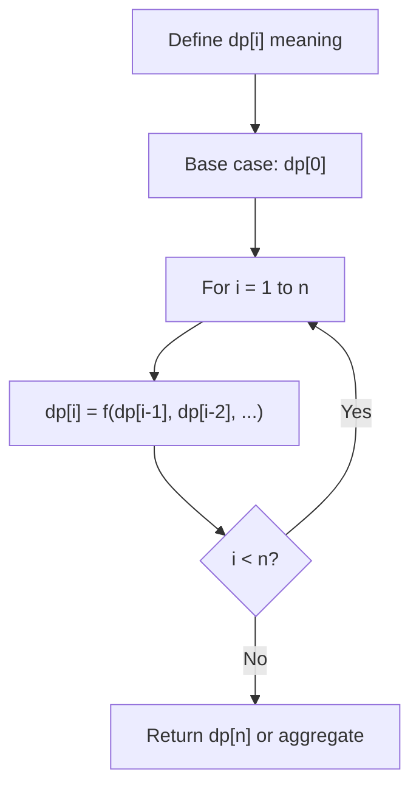
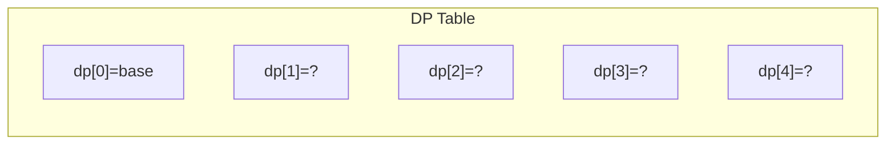
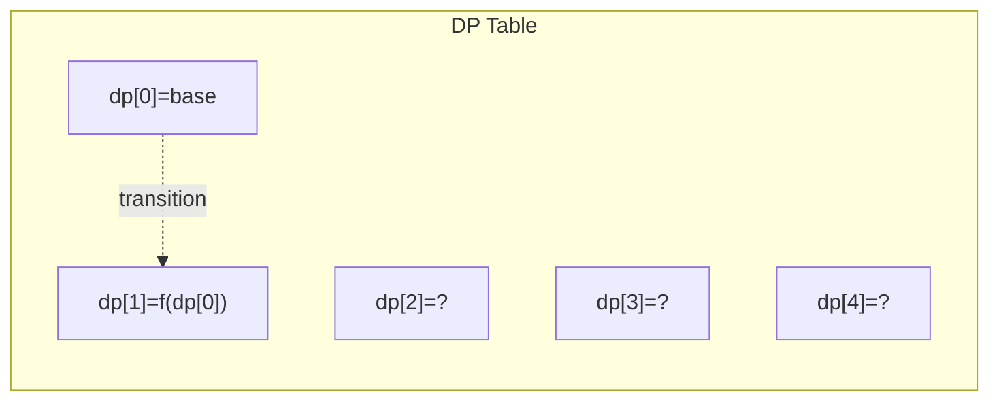
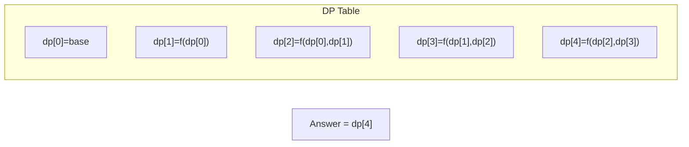

# Problem 935: Knight Dialer

**Difficulty:** Medium  
**Tags:** Dynamic Programming  
**Pattern:** Dynamic Programming (1D)  
**Link:** [leetcode.com/problems/knight-dialer](https://leetcode.com/problems/knight-dialer/)

## Description

The chess knight has a **unique movement**, it may move two squares vertically and one square horizontally, or two squares horizontally and one square vertically (with both forming the shape of an **L**). The possible movements of chess knight are shown in this diagram:

A chess knight can move as indicated in the chess diagram below:

We have a chess knight and a phone pad as shown below, the knight **can only stand on a numeric cell** (i.e. blue cell).

Given an integer `n`, return how many distinct phone numbers of length `n` we can dial.

You are allowed to place the knight **on any numeric cell** initially and then you should perform `n - 1` jumps to dial a number of length `n`. All jumps should be **valid** knight jumps.

As the answer may be very large, **return the answer modulo** `10^9 + 7`.

 

Example 1:

```

**Input:** n = 1
**Output:** 10
**Explanation:** We need to dial a number of length 1, so placing the knight over any numeric cell of the 10 cells is sufficient.

```

Example 2:

```

**Input:** n = 2
**Output:** 20
**Explanation:** All the valid number we can dial are [04, 06, 16, 18, 27, 29, 34, 38, 40, 43, 49, 60, 61, 67, 72, 76, 81, 83, 92, 94]

```

Example 3:

```

**Input:** n = 3131
**Output:** 136006598
**Explanation:** Please take care of the mod.

```

 

**Constraints:**

	- `1 <= n <= 5000`

## Approach: Dynamic Programming (1D)

Break the problem into overlapping subproblems. Define dp[i] as the optimal value for the subproblem ending at or considering index i. Build the solution bottom-up, using previously computed dp values.

## Pseudocode

```
1. Define dp[i] = optimal value for subproblem i
2. Base case: dp[0] = initial value
3. For i from 1 to n:
   a. dp[i] = recurrence(dp[i-1], dp[i-2], ...)
4. Return dp[n] or max/min of dp
```

## Algorithm Flow



## Visual State Transitions

**1D Dynamic Programming Table Build:**

**Frame 1: Initialize base cases**


**Frame 2: Fill dp[1] from dp[0]**


**Frame 3: Fill remaining cells**



## Complexity Analysis

- **Time:** O(n)
- **Space:** O(n)

## Solution (Python3)

```python
class Solution:
    def knightDialer(self, n: int) -> int:
        # Dynamic programming (1D) - O(n) time, O(n) space
        if not n:
            return 0
        n = len(n) if isinstance(n, list) else n
        dp = [0] * (n + 1)
        dp[0] = 1  # base case
        for i in range(1, n + 1):
            dp[i] = dp[i-1]  # transition (customize per problem)
            if i >= 2:
                dp[i] += dp[i-2]
        return dp[n]
```

## Solution (C++)

```cpp
#include <string>
#include <vector>
using namespace std;

class Solution {
public:
    int knightDialer(int n) {
        // Dynamic programming (1D) - O(n) time, O(n) space
        int n = n;
        if (n <= 0) return 0;
        vector<int> dp(n + 1, 0);
        dp[0] = 1;
        for (int i = 1; i <= n; i++) {
            dp[i] = dp[i-1];
            if (i >= 2) dp[i] += dp[i-2];
        }
        return dp[n];
    }
};
```
