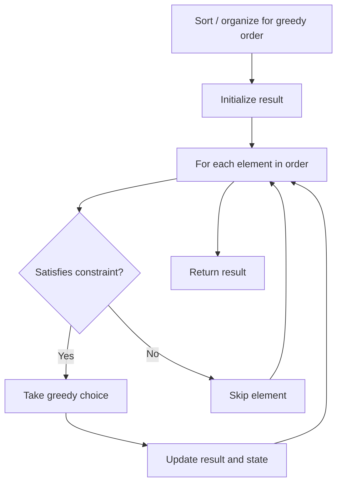

# Problem 936: Stamping The Sequence

**Difficulty:** Hard  
**Tags:** String, Stack, Greedy, Queue  
**Pattern:** Greedy  
**Link:** [leetcode.com/problems/stamping-the-sequence](https://leetcode.com/problems/stamping-the-sequence/)

## Description

You are given two strings `stamp` and `target`. Initially, there is a string `s` of length `target.length` with all `s[i] == '?'`.

In one turn, you can place `stamp` over `s` and replace every letter in the `s` with the corresponding letter from `stamp`.

	- For example, if `stamp = "abc"` and `target = "abcba"`, then `s` is `"?????"` initially. In one turn you can:

	
		place `stamp` at index `0` of `s` to obtain `"abc??"`,
		- place `stamp` at index `1` of `s` to obtain `"?abc?"`, or
		- place `stamp` at index `2` of `s` to obtain `"??abc"`.
	
	Note that `stamp` must be fully contained in the boundaries of `s` in order to stamp (i.e., you cannot place `stamp` at index `3` of `s`).

We want to convert `s` to `target` using **at most** `10 * target.length` turns.

Return *an array of the index of the left-most letter being stamped at each turn*. If we cannot obtain `target` from `s` within `10 * target.length` turns, return an empty array.

 

Example 1:

```

**Input:** stamp = "abc", target = "ababc"
**Output:** [0,2]
**Explanation:** Initially s = "?????".
- Place stamp at index 0 to get "abc??".
- Place stamp at index 2 to get "ababc".
[1,0,2] would also be accepted as an answer, as well as some other answers.

```

Example 2:

```

**Input:** stamp = "abca", target = "aabcaca"
**Output:** [3,0,1]
**Explanation:** Initially s = "???????".
- Place stamp at index 3 to get "???abca".
- Place stamp at index 0 to get "abcabca".
- Place stamp at index 1 to get "aabcaca".

```

 

**Constraints:**

	- `1 <= stamp.length <= target.length <= 1000`
	- `stamp` and `target` consist of lowercase English letters.

## Approach: Greedy

Make the locally optimal choice at each step, trusting it leads to a global optimum. Greedy works when the problem has the greedy-choice property and optimal substructure.

## Pseudocode

```
1. Sort or organize data for greedy ordering
2. Initialize result
3. For each element in greedy order:
   a. If element satisfies constraint:
      - Take the greedy choice
      - Update result and state
4. Return result
```

## Algorithm Flow



## Complexity Analysis

- **Time:** O(n log n)
- **Space:** O(1)

## Solution (Python3)

```python
class Solution:
    def movesToStamp(self, stamp: str, target: str) -> List[int]:
        # Greedy approach - O(n) time
        result = 0
        curr_max = 0
        for i in range(len(stamp)):
            if isinstance(stamp[i], int):
                curr_max = max(curr_max, stamp[i])
                result = max(result, curr_max)
            else:
                result += 1
        return result
```

## Solution (C++)

```cpp
#include <algorithm>
#include <string>
#include <vector>
using namespace std;

class Solution {
public:
    vector<int> movesToStamp(string& stamp, string& target) {
        // Greedy approach - O(n) time
        int result = 0, curr_max = 0;
        for (int i = 0; i < (int)stamp.size(); i++) {
            curr_max = max(curr_max, stamp[i]);
            result = max(result, curr_max);
        }
        return result;
    }
};
```
