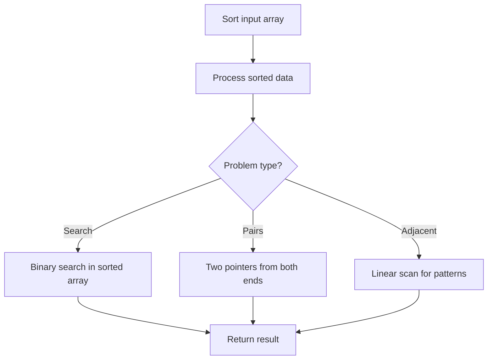

# Problem 937: Reorder Data in Log Files

**Difficulty:** Medium  
**Tags:** Array, String, Sorting  
**Pattern:** Sorting  
**Link:** [leetcode.com/problems/reorder-data-in-log-files](https://leetcode.com/problems/reorder-data-in-log-files/)

## Description

You are given an array of `logs`. Each log is a space-delimited string of words, where the first word is the **identifier**.

There are two types of logs:

	- **Letter-logs**: All words (except the identifier) consist of lowercase English letters.
	- **Digit-logs**: All words (except the identifier) consist of digits.

Reorder these logs so that:

	- The **letter-logs** come before all **digit-logs**.
	- The **letter-logs** are sorted lexicographically by their contents. If their contents are the same, then sort them lexicographically by their identifiers.
	- The **digit-logs** maintain their relative ordering.

Return *the final order of the logs*.

 

Example 1:

```

**Input:** logs = ["dig1 8 1 5 1","let1 art can","dig2 3 6","let2 own kit dig","let3 art zero"]
**Output:** ["let1 art can","let3 art zero","let2 own kit dig","dig1 8 1 5 1","dig2 3 6"]
**Explanation:**
The letter-log contents are all different, so their ordering is "art can", "art zero", "own kit dig".
The digit-logs have a relative order of "dig1 8 1 5 1", "dig2 3 6".

```

Example 2:

```

**Input:** logs = ["a1 9 2 3 1","g1 act car","zo4 4 7","ab1 off key dog","a8 act zoo"]
**Output:** ["g1 act car","a8 act zoo","ab1 off key dog","a1 9 2 3 1","zo4 4 7"]

```

 

**Constraints:**

	- `1 <= logs.length <= 100`
	- `3 <= logs[i].length <= 100`
	- All the tokens of `logs[i]` are separated by a **single** space.
	- `logs[i]` is guaranteed to have an identifier and at least one word after the identifier.

## Approach: Sorting

Sort the data to enable efficient processing. After sorting, use techniques like binary search, two pointers, or linear scan to solve the problem.

## Pseudocode

```
1. Sort the input array
2. Process sorted data:
   - Use binary search for lookups
   - Use two pointers for pair finding
   - Scan for adjacent patterns
3. Return result
```

## Algorithm Flow



## Complexity Analysis

- **Time:** O(n log n)
- **Space:** O(n)

## Solution (Python3)

```python
class Solution:
    def reorderLogFiles(self, logs: List[str]) -> List[str]:
        # Sort-based approach - O(n log n) time
        logs.sort(key=lambda x: x[0] if isinstance(x, (list, tuple)) else x)
        result = [logs[0]]
        for i in range(1, len(logs)):
            curr = logs[i]
            if isinstance(curr, (list, tuple)) and isinstance(result[-1], (list, tuple)):
                if curr[0] <= result[-1][1]:
                    result[-1] = [result[-1][0], max(result[-1][1], curr[1])]
                else:
                    result.append(curr)
            else:
                result.append(curr)
        return result
```

## Solution (C++)

```cpp
#include <algorithm>
#include <string>
#include <vector>
using namespace std;

class Solution {
public:
    vector<string> reorderLogFiles(vector<string>& logs) {
        // Sort-based approach - O(n log n) time
        sort(logs.begin(), logs.end());
        vector<vector<int>> result;
        result.push_back(logs[0]);
        for (int i = 1; i < (int)logs.size(); i++) {
            if (logs[i][0] <= result.back()[1]) {
                result.back()[1] = max(result.back()[1], logs[i][1]);
            } else {
                result.push_back(logs[i]);
            }
        }
        return result;
    }
};
```
