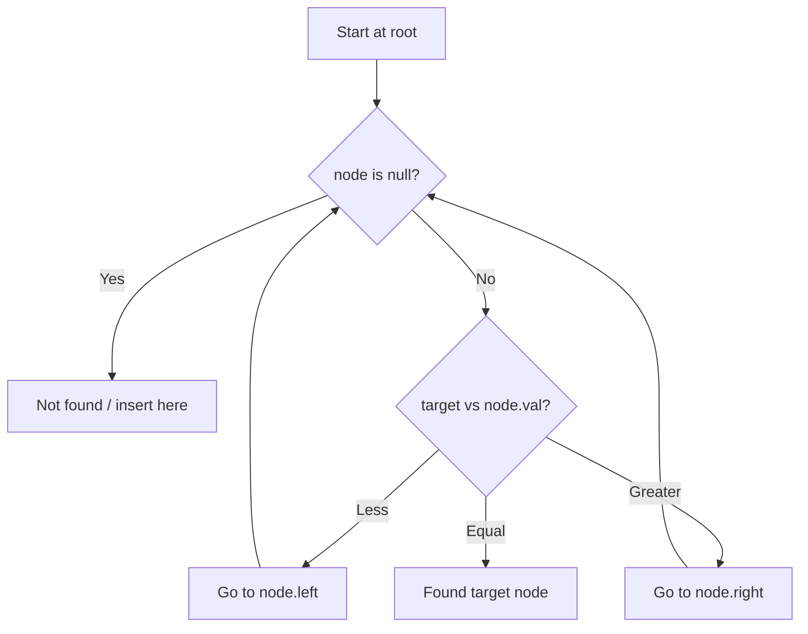

# Problem 938: Range Sum of BST

**Difficulty:** Easy  
**Tags:** Tree, Depth-First Search, Binary Search Tree, Binary Tree  
**Pattern:** Binary Search Tree  
**Link:** [leetcode.com/problems/range-sum-of-bst](https://leetcode.com/problems/range-sum-of-bst/)

## Description

Given the `root` node of a binary search tree and two integers `low` and `high`, return *the sum of values of all nodes with a value in the **inclusive** range *`[low, high]`.

 

Example 1:

```

**Input:** root = [10,5,15,3,7,null,18], low = 7, high = 15
**Output:** 32
**Explanation:** Nodes 7, 10, and 15 are in the range [7, 15]. 7 + 10 + 15 = 32.

```

Example 2:

```

**Input:** root = [10,5,15,3,7,13,18,1,null,6], low = 6, high = 10
**Output:** 23
**Explanation:** Nodes 6, 7, and 10 are in the range [6, 10]. 6 + 7 + 10 = 23.

```

 

**Constraints:**

	- The number of nodes in the tree is in the range `[1, 2 * 10^4]`.
	- `1 <= Node.val <= 10^5`
	- `1 <= low <= high <= 10^5`
	- All `Node.val` are **unique**.

## Approach: Binary Search Tree

Leverage BST property: left < root < right. Navigate left for smaller values, right for larger values. Inorder traversal yields sorted order.

## Pseudocode

```
1. Start at root
2. Compare target with current node:
   a. If target < node.val: go left
   b. If target > node.val: go right
   c. If equal: found
3. Return result
```

## Algorithm Flow



## Complexity Analysis

- **Time:** O(h)
- **Space:** O(h)

## Solution (Python3)

```python
class Solution:
    def rangeSumBST(self, root: Optional[TreeNode], low: int, high: int) -> int:
        # BST search/insert - O(h) time
        def search(node, target):
            if not node:
                return None
            if target == node.val:
                return node
            elif target < node.val:
                return search(node.left, target)
            else:
                return search(node.right, target)
        return search(root, low if 'low' != 'root' else 0)
```

## Solution (C++)

```cpp
#include <functional>
#include <string>
#include <vector>
using namespace std;

class Solution {
public:
    int rangeSumBST(TreeNode* root, int low, int high) {
        // BST search/insert - O(h) time
        function<TreeNode*(TreeNode*, int)> search = [&](TreeNode* node, int target) -> TreeNode* {
            if (!node) return nullptr;
            if (target == node->val) return node;
            else if (target < node->val) return search(node->left, target);
            else return search(node->right, target);
        };
        return search(root, low);
    }
};
```
