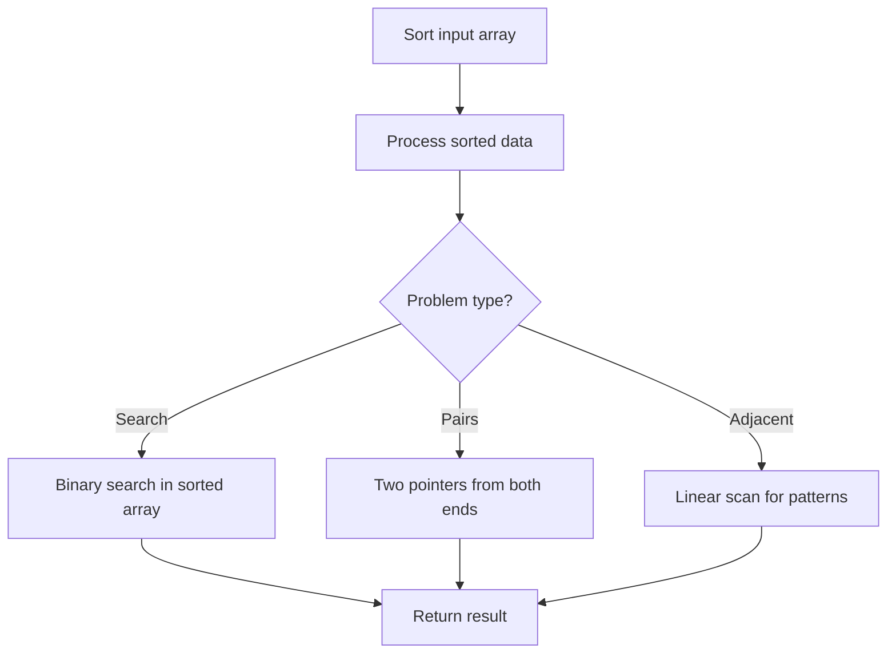

# Problem 939: Minimum Area Rectangle

**Difficulty:** Medium  
**Tags:** Array, Hash Table, Math, Geometry, Sorting  
**Pattern:** Sorting  
**Link:** [leetcode.com/problems/minimum-area-rectangle](https://leetcode.com/problems/minimum-area-rectangle/)

## Description

You are given an array of points in the **X-Y** plane `points` where `points[i] = [xi, yi]`.

Return *the minimum area of a rectangle formed from these points, with sides parallel to the X and Y axes*. If there is not any such rectangle, return `0`.

 

Example 1:

```

**Input:** points = [[1,1],[1,3],[3,1],[3,3],[2,2]]
**Output:** 4

```

Example 2:

```

**Input:** points = [[1,1],[1,3],[3,1],[3,3],[4,1],[4,3]]
**Output:** 2

```

 

**Constraints:**

	- `1 <= points.length <= 500`
	- `points[i].length == 2`
	- `0 <= xi, yi <= 4 * 10^4`
	- All the given points are **unique**.

## Approach: Sorting

Sort the data to enable efficient processing. After sorting, use techniques like binary search, two pointers, or linear scan to solve the problem.

## Pseudocode

```
1. Sort the input array
2. Process sorted data:
   - Use binary search for lookups
   - Use two pointers for pair finding
   - Scan for adjacent patterns
3. Return result
```

## Algorithm Flow



## Complexity Analysis

- **Time:** O(n log n)
- **Space:** O(n)

## Solution (Python3)

```python
class Solution:
    def minAreaRect(self, points: List[List[int]]) -> int:
        # Sort-based approach - O(n log n) time
        points.sort(key=lambda x: x[0] if isinstance(x, (list, tuple)) else x)
        result = [points[0]]
        for i in range(1, len(points)):
            curr = points[i]
            if isinstance(curr, (list, tuple)) and isinstance(result[-1], (list, tuple)):
                if curr[0] <= result[-1][1]:
                    result[-1] = [result[-1][0], max(result[-1][1], curr[1])]
                else:
                    result.append(curr)
            else:
                result.append(curr)
        return result
```

## Solution (C++)

```cpp
#include <algorithm>
#include <string>
#include <vector>
using namespace std;

class Solution {
public:
    int minAreaRect(vector<vector<int>>& points) {
        // Sort-based approach - O(n log n) time
        sort(points.begin(), points.end());
        vector<vector<int>> result;
        result.push_back(points[0]);
        for (int i = 1; i < (int)points.size(); i++) {
            if (points[i][0] <= result.back()[1]) {
                result.back()[1] = max(result.back()[1], points[i][1]);
            } else {
                result.push_back(points[i]);
            }
        }
        return result;
    }
};
```
